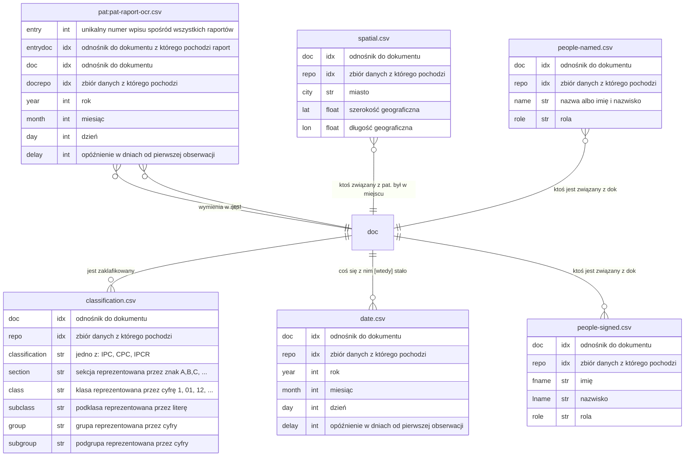

```mermaid
erDiagram

doc ||--o{ "classification.csv" : "jest zaklafikowany"
doc ||--o{ "date.csv" : "coś się z nim [wtedy] stało"
"pat:pat-raport-ocr.csv" }o--|| doc : "wymienia w rap."
"pat:pat-raport-ocr.csv" }o--|| doc : "jest"

"spatial.csv" }o--|| doc : "ktoś związany z pat. był w miejscu"
doc ||--o{ "people-signed.csv" : "ktoś jest związany z dok"
"people-named.csv" }o--|| doc : "ktoś jest związany z dok"

"classification.csv" 
{ doc idx "odnośnik do dokumentu"
  repo idx "zbiór danych z którego pochodzi"
  classification str "jedno z: IPC, CPC, IPCR"
  section str "sekcja reprezentowana przez znak A,B,C, ..."
  class str "klasa reprezentowana przez cyfrę 1, 01, 12, ..."
  subclass str "podklasa reprezentowana przez literę"
  group str "grupa reprezentowana przez cyfry"
  subgroup str "podgrupa reprezentowana przez cyfry" }

"date.csv" 
{ doc idx "odnośnik do dokumentu"
  repo idx "zbiór danych z którego pochodzi"
  year int "rok"
  month int "miesiąc"
  day int "dzień" 
  delay int "opóźnienie w dniach od pierwszej obserwacji" }

"pat:pat-raport-ocr.csv" 
{ entry int "unikalny numer wpisu spośród wszystkich raportów"
  entrydoc idx "odnośnik do dokumentu z którego pochodzi raport"
  doc idx "odnośnik do dokumentu"
  docrepo idx "zbiór danych z którego pochodzi"
  year int "rok"
  month int "miesiąc"
  day int "dzień" 
  delay int "opóźnienie w dniach od pierwszej obserwacji" }

"spatial.csv" 
{ doc idx "odnośnik do dokumentu"
  repo idx "zbiór danych z którego pochodzi"
  city str "miasto"
  lat float "szerokość geograficzna"
  lon float "długość geograficzna" }

"people-named.csv" 
{ doc idx "odnośnik do dokumentu"
  repo idx "zbiór danych z którego pochodzi"
  name str "nazwa albo imię i nazwisko"
  role str "rola" }

"people-signed.csv" 
{ doc idx "odnośnik do dokumentu"
  repo idx "zbiór danych z którego pochodzi"
  fname str "imię"
  lname str "nazwisko"
  role str "rola" }
```