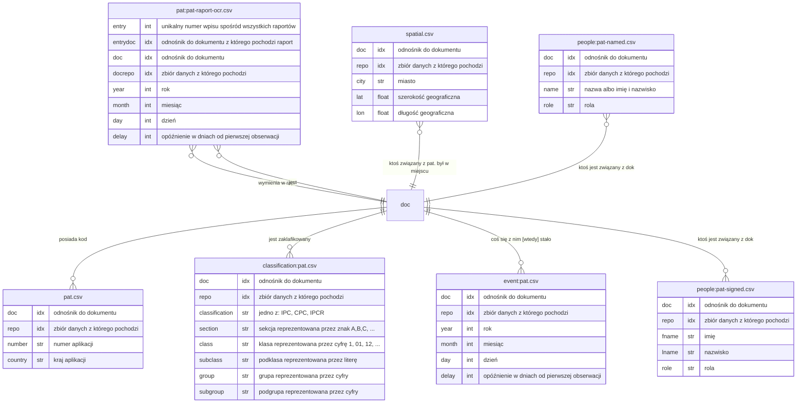

```
python 3.10.12 (main, Nov  6 2024, 20:22:13) [GCC 11.4.0]
pandas 2.2.1
```


```mermaid
graph LR
UPRP.profile --> UPRP.identify
Google.profile --> Google.index
Google.narrow --> UPRPGoogle.query
["Step(Codepull)"]
Lens.profile --> Base.nameread
Google.pull --> All.bundle
Google.profile["Google.profile:<br>Step(Profiling)"]
USPG.narrow --> All.bundle
click UPRP.index "#indexing"
Lens.profile --> Lens.index
UPRP.index --> UPRPLens.narrow
Google.profile --> UPRPGoogle.query
UPRPLens.query["UPRPLens.query:<br>Step(Family)"]
USPG.pull["<lib.step.Trace object at 0x7f29dc1cc970>"]
UPRPGoogle.query --> UPRPGoogle.narrow
USPG.profile["USPG.profile:<br>Step(Profiling)"]
Lens.profile --> UPRPLens.query
All.bundle["All.bundle: Trace(Bundle)"]
click Base.drop "#drop"
Google.pull["<lib.step.Trace object at 0x7f29dc1ccfd0>"]
click All.bundle "#bundle"
click  "#personify"
USPA.narrow["USPA.narrow:<br>Step(Narrow)"]
UPRP.index["UPRP.index:<br>Step(Indexing)"]
UPRP.identify["UPRP.identify:<br>Step(Qdentify)"]
USPG.index["USPG.index:<br>Step(Indexing)"]
UPRP.narrow --> All.bundle
Base.drop --> Google.narrow
UPRP.profile["UPRP.profile:<br>Step(Profiling)"]
click UPRP.pull "#trace"
USPG.index --> USPG.narrow
UPRP.index --> UPRPGoogle.narrow
 --> UPRP.pull
click UPRPGoogle.query "#family"
UPRP.pull --> All.bundle
UPRP.narrow["UPRP.narrow:<br>Step(Narrow)"]
click UPRP.identify "#qdentify"
UPRP.profile --> UPRP.index
click Base.nameread "#nameread"
Lens.profile --> 
click All.query "#parsing"
Lens.index["Lens.index:<br>Step(Indexing)"]
USPA.pull --> All.bundle
UPRPGoogle.narrow --> All.bundle
Google.index --> Google.narrow
click USPA.pull "#trace"
All.query --> UPRP.narrow
Google.profile --> 
Lens.narrow --> All.bundle
USPG.profile --> USPG.index
All.query --> UPRPGoogle.query
click Lens.profile "#profiling"
USPG.narrow["USPG.narrow:<br>Step(Narrow)"]
All.query --> Base.drop
Google.index["Google.index:<br>Step(Indexing)"]
Base.nameread["Base.nameread:<br>Step(Nameread)"]
UPRP.identify --> All.query
click  "#timeloc"
USPA.pull["<lib.step.Trace object at 0x7f29dc1ccca0>"]
USPA.profile --> 
 --> Lens.pull
click UPRP.profile "#profiling"
click USPA.index "#indexing"
Base.nameread --> 
UPRP.narrow --> Base.drop
UPRPLens.query --> UPRPLens.narrow
click Lens.narrow "#narrow"
click UPRP.narrow "#narrow"
USPG.pull --> All.bundle
click Google.pull "#trace"
Google.narrow["Google.narrow:<br>Step(Narrow)"]
click UPRPLens.query "#family"
Lens.narrow["Lens.narrow:<br>Step(Narrow)"]
click Misc.geodata "#geoxlsxload"
click Lens.index "#indexing"
["Step(Personify)"]
USPA.profile["USPA.profile:<br>Step(Profiling)"]
USPG.profile --> 
Lens.narrow --> UPRPLens.query
 --> Google.pull
click  "#geoloc"
click USPG.narrow "#narrow"
click  "#codepull"
click USPG.pull "#trace"
Google.profile --> Base.nameread
["Step(Classify)"]
Lens.pull["<lib.step.Trace object at 0x7f29dc1cc640>"]
All.query["All.query:<br>Step(Parsing)"]
Lens.profile["Lens.profile:<br>Step(Profiling)"]
USPA.index --> USPA.narrow
UPRPGoogle.narrow["UPRPGoogle.narrow:<br>Step(Narrow)"]
Lens.index --> Lens.narrow
All.query --> USPG.narrow
All.query --> USPA.narrow
click USPG.index "#indexing"
USPA.narrow --> All.bundle
Google.narrow --> All.bundle
UPRP.pull["<lib.step.Trace object at 0x7f29dc1cc340>"]
click Google.narrow "#narrow"
Base.drop["Base.drop:<br>Step(Drop)"]
["Step(Timeloc)"]
click  "#classify"
All.query --> Lens.narrow
USPA.index["USPA.index:<br>Step(Indexing)"]
click Google.profile "#profiling"
Lens.narrow --> Base.drop
USPA.profile --> USPA.index
UPRPLens.narrow["UPRPLens.narrow:<br>Step(Narrow)"]
All.query --> UPRPLens.query
UPRPGoogle.query["UPRPGoogle.query:<br>Step(Family)"]
click USPA.narrow "#narrow"
click Google.index "#indexing"
Lens.pull --> All.bundle
click UPRPLens.narrow "#narrow"
 --> USPA.pull
click USPG.profile "#profiling"
click UPRPGoogle.narrow "#narrow"
UPRP.profile --> Base.nameread
click USPA.profile "#profiling"
click Lens.pull "#trace"
Misc.geodata["Misc.geodata:<br>Step(GeoXLSXload)"]
["Step(Geoloc)"]
UPRP.profile --> 
UPRP.index --> UPRP.narrow
UPRPLens.narrow --> All.bundle
Misc.geodata --> 
 --> USPG.pull
```


Family
------

Podmienia kody w zapytaniach na te znalezione w rodzinie patentowej.

Nameread
--------


Odróżnia w danych imiona, nazwiska i nazwy organizacji.
Zwraca zbiór słów imienniczych (imię albo nazwisko), 
samych imion, samych nazwisk, nazw organizacji.
Nazwy bez jednoznacznej klasyfikacji są pomijane.


Drop
----

Usuwa z wyników zapytań te, które już zostały dopasowane w zadowalający sposób.

Classify
--------

Zwraca ramkę z klasyfikacjami.

Geoloc
------


Dopasowanie patentu do punktów geograficznych `(lat, lon)`.
Uwagi:
1. patent ma wiele lokalizacji (inaczej punktów powiązanych);
2. nazwy mogą być zduplikowane; do zaimplementowania: estymacja 
poprawnego miasta przez minimalizację średniej odległości 
do pt.ów powiązanych.


Narrow
------


Wyszukiwanie ograniczone do połączeń kodami patentowymi.
Wyszukiwanie w zależności od parametrów korzysta z dopasowania
kodami patentowymi albo ich częściami. Później w grafie takich
połączeń szuka dodatkowych dowodów na istnienie połączenia:
wspólnych kluczy (np. imion i nazw miast) oraz dat.


Indexing
--------


Indeksowanie danych z profili, jest wymagane do przeprowadzenia
wyszukiwania w optymalny komputacyjnie sposób.
Indeksowanie to etap po profilowaniu, który fragmentuje dane na
ustalone typy: ciągy cyfrowe, daty, słowa kluczowe, n-gramy słów i ciągów.
W zależności od typu, ilości powtórzeń w danych i ich długości posiadaja
inne punktacje, które mogą być dalej wykorzystane w procesie wyszukiwania.


Indeksowanie korzysta z wcześniej przypisanych ról do określenia tego
w jaki sposób przetwarzać dane.
Wartości danych to indeksy i są opisane przez ich źródło, tj.:
repozytorium, ramkę, kolumnę i rolę. Takie przypisanie zapewnia
klarowność wyszukiwania i możliwość określenia poziomu dopasowania.


Timeloc
-------

Wybiera najwcześniejsze daty dla każdego patentu

Parsing
-------


Parsowanie zapytań to proces wyciągania z tekstów
ciągów przypominających daty i numery patentowe.
Proces polega na wstępnym podzieleniu całego napisu na
części spełniające określone wyrażenia regularne. Później,
te są łączone na podstawie tego czy w ich pobliżu są oczekiwane
ciągi takie jak ciągi liczbowe albo skrótowce takie jak "PL".


Personify
---------


Zwraca ramkę z danymi osobowymi.
Identyfikuje imiona osób na podstawie słownika imion o ile
każde słowo w nazwie dłusze niż 2 znaki jest w słowniku.
Działa tylko na wewnętrnzym zbiorze - do porpawnia
Normalizacja nie jest jeszcze poprawnie zaimplementowana


Qdentify
--------


Dopasowanie zapytań do dokumentów na podstawie nazwy pliku.
Rozpoznawanie zapytań odbywa się w zupełnie innym kontekście i
nie zwraca dla zapytań informacji o tym skąd pochodzą.
Identyfikacja korzysta z nazw plików i metadanych samych zapytań
to dopasowania ich do odpowiednich danych w zbiorze.


Profiling
---------


Profilowanie danych, z różnych źródeł, do relacyjnych ramek danych.
Profilowanie składa się z 2 etapów parsowania danych, 
etapu normalizacji nazw oraz etapu manualnego przypisywania ról
dla kolumn w wytworzonych ramkach danych.
Dane wejściowe to heterogeniczna struktura 
zagnieżdżonych obiektów z parametrami, które mogą być zarówno
obiektami, listami obiektów oraz wartościami skalarnymi.
To jak zagnieżdżony jest obiekt jest tutaj nazwane ścieżką,
przykładowo dla obiektu `"krzesła"` w stukturze 
`{ "dom": "pokój": { "krzesła": 3 } }`, ścieżka to "dom/pokój/krzesła".


Heterogeniczność odnosi się do kilku faktów na temat danych:
- istnienie parametru dla danej obserwacji nie jest gwarantowane;
- typ wartości może różnić się po między obserwacjami mimo identycznej ścieżki;
- to samo rzeczywiste zjawisko (np. autorstwo patentu) może być reprezentowane 
w różny sposób: z różnymi parametrami, o różnych ścieżkach.
Różnice w danych wynikają z różnic w wersjach schematu odpowiedniego 
dla danego okresu, albo z braków danych.


**Parsowanie danych** polega na odczytaniu zawartości zadanych plików,
zgodnie z ich formatowaniem. Dane przetworzone na strukturę słowników
są dalej analizowane pod kątem posiadania list podobnych obiektów.
Kolejnym etapem jest tworzenie struktury homogenicznejz możliwymi brakami.
Obiekty w listach są przetwarzane na oddzielne encje w oddzielnej strukturze,
z relacją do obiektu w którym się znajdują. Wszystkie pozostałe wartości są
przypisywane bezpośrednio do obiektu, w którym się znajdują niezależnie od
poziomu zagnieżdżenia.
W obu etapach nazwami danych i encji są ich ścieżki. Są one mało czytelne,
z powodu ich długości dlatego wymagają normalizacji.


**Normalizacja nazw** polega na przypisaniu krótkich, czytelnych nazw dla
ścieżek w danych. Ścieżki zostają podzielone na pojedyncze fragmenty,
czyli kolejne nazwy obiektów w których się znajdują. Z takich ciągów
tworzony jest graf drzewa. W iteracjach po wierzchołkach wyciągane są
nazwy w sposób, który zapewnia ich krótkość i unikalność. Jeśli pierwsza
nazwa nie jest unikalna dodawany jest kolejny wierzchołek od końca, aż
zapewni to unikalność. Jeśli cały proces nie odniesie sukcesu dodawane
są liczby, aby zapewnić unikalność.


**Przypisanie ról** polega na ręcznym przypisaniu nazw kolumnom w ramkach.
Te nazwy są używane na dalszych etapach wyciągania danych.

