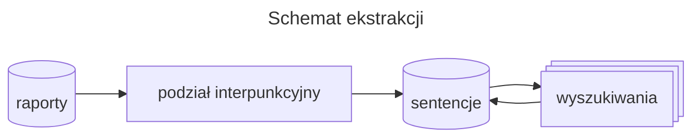

Przeszukiwanie (Ekstrakcja)
===========================

Proces przeszukiwania ma na celu rozdzielenie danych tekstowych
na mniejsze części: sentencje, daty albo pojedyncze słowa - 
kawałki (ang. *chunks*).

