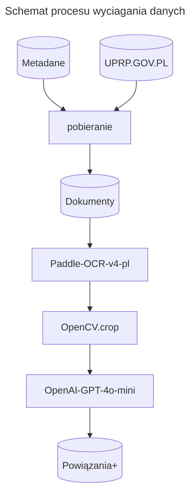

Raporty
=======

Pozyskiwanie danych ze skanów dokumentów
----------------------------------------

Dane z raportów w formacie *PDF* zostają wyciągnięte, za pomocą
multimodalnego modelu językowego, do postaci obserwacji tekstowych.
Wyrażenia regularne wyciągają kody i daty, ~~reszta jest dzielona
na słowa. Późniejsze parowanie w.w. ma na celu walidację 
samych kodów.~~ 🛠

Wyszukiwanie wierzchołków
-------------------------

🛠

Weryfikacja wyszukiwania
------------------------

🛠