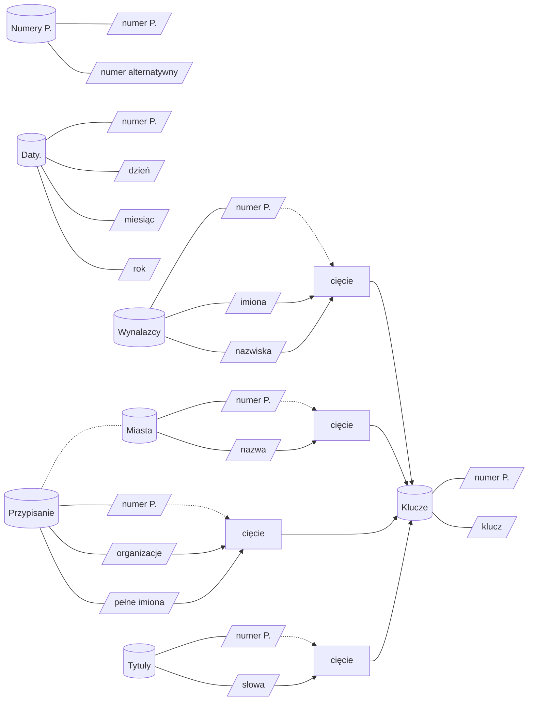

Metadane
--------

Metadane dotyczącec raportów otrzymane w wyniku konwersji 
części danych z `XML` na dane tabelaryczne i dalszej obróbce
na skonkretyzowane dane tabelaryczne.

Struktura
=========

