Dane lens.org
=============

<!-- gen:profile.py -->

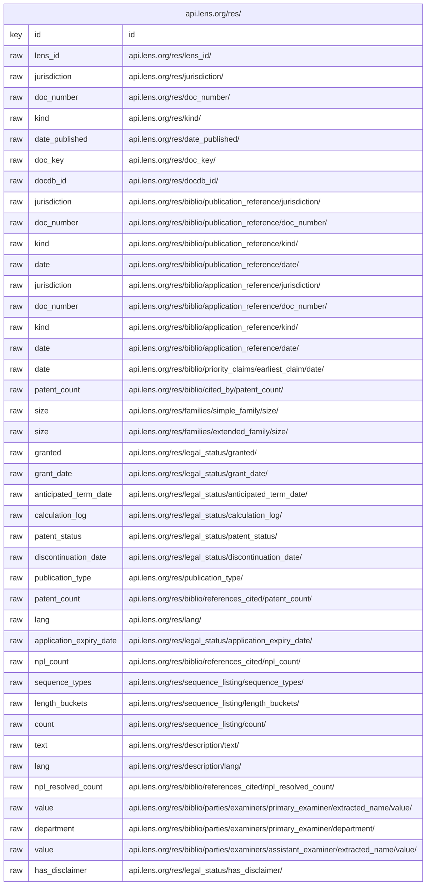
```mermaid
erDiagram

"api.lens.org/res/"{
  key id "id"
  raw lens_id "api.lens.org/res/lens_id/"
  raw jurisdiction "api.lens.org/res/jurisdiction/"
  raw doc_number "api.lens.org/res/doc_number/"
  raw kind "api.lens.org/res/kind/"
  raw date_published "api.lens.org/res/date_published/"
  raw doc_key "api.lens.org/res/doc_key/"
  raw docdb_id "api.lens.org/res/docdb_id/"
  raw jurisdiction "api.lens.org/res/biblio/publication_reference/jurisdiction/"
  raw doc_number "api.lens.org/res/biblio/publication_reference/doc_number/"
  raw kind "api.lens.org/res/biblio/publication_reference/kind/"
  raw date "api.lens.org/res/biblio/publication_reference/date/"
  raw jurisdiction "api.lens.org/res/biblio/application_reference/jurisdiction/"
  raw doc_number "api.lens.org/res/biblio/application_reference/doc_number/"
  raw kind "api.lens.org/res/biblio/application_reference/kind/"
  raw date "api.lens.org/res/biblio/application_reference/date/"
  raw date "api.lens.org/res/biblio/priority_claims/earliest_claim/date/"
  raw patent_count "api.lens.org/res/biblio/cited_by/patent_count/"
  raw size "api.lens.org/res/families/simple_family/size/"
  raw size "api.lens.org/res/families/extended_family/size/"
  raw granted "api.lens.org/res/legal_status/granted/"
  raw grant_date "api.lens.org/res/legal_status/grant_date/"
  raw anticipated_term_date "api.lens.org/res/legal_status/anticipated_term_date/"
  raw calculation_log "api.lens.org/res/legal_status/calculation_log/"
  raw patent_status "api.lens.org/res/legal_status/patent_status/"
  raw discontinuation_date "api.lens.org/res/legal_status/discontinuation_date/"
  raw publication_type "api.lens.org/res/publication_type/"
  raw patent_count "api.lens.org/res/biblio/references_cited/patent_count/"
  raw lang "api.lens.org/res/lang/"
  raw application_expiry_date "api.lens.org/res/legal_status/application_expiry_date/"
  raw npl_count "api.lens.org/res/biblio/references_cited/npl_count/"
  raw sequence_types "api.lens.org/res/sequence_listing/sequence_types/"
  raw length_buckets "api.lens.org/res/sequence_listing/length_buckets/"
  raw count "api.lens.org/res/sequence_listing/count/"
  raw text "api.lens.org/res/description/text/"
  raw lang "api.lens.org/res/description/lang/"
  raw npl_resolved_count "api.lens.org/res/biblio/references_cited/npl_resolved_count/"
  raw value "api.lens.org/res/biblio/parties/examiners/primary_examiner/extracted_name/value/"
  raw department "api.lens.org/res/biblio/parties/examiners/primary_examiner/department/"
  raw value "api.lens.org/res/biblio/parties/examiners/assistant_examiner/extracted_name/value/"
  raw has_disclaimer "api.lens.org/res/legal_status/has_disclaimer/" }

```

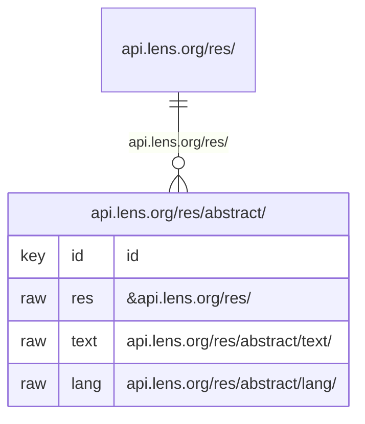
```mermaid
erDiagram

"api.lens.org/res/abstract/"{
  key id "id"
  raw res "&api.lens.org/res/"
  raw text "api.lens.org/res/abstract/text/"
  raw lang "api.lens.org/res/abstract/lang/" }
"api.lens.org/res/" ||--o{ "api.lens.org/res/abstract/" : "api.lens.org/res/"

```

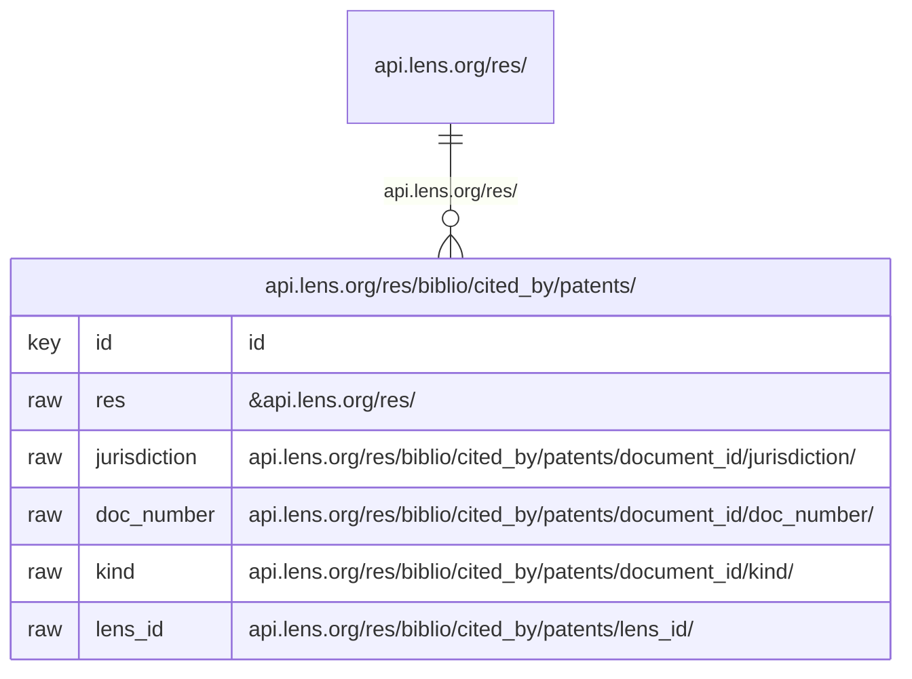
```mermaid
erDiagram

"api.lens.org/res/biblio/cited_by/patents/"{
  key id "id"
  raw res "&api.lens.org/res/"
  raw jurisdiction "api.lens.org/res/biblio/cited_by/patents/document_id/jurisdiction/"
  raw doc_number "api.lens.org/res/biblio/cited_by/patents/document_id/doc_number/"
  raw kind "api.lens.org/res/biblio/cited_by/patents/document_id/kind/"
  raw lens_id "api.lens.org/res/biblio/cited_by/patents/lens_id/" }
"api.lens.org/res/" ||--o{ "api.lens.org/res/biblio/cited_by/patents/" : "api.lens.org/res/"

```

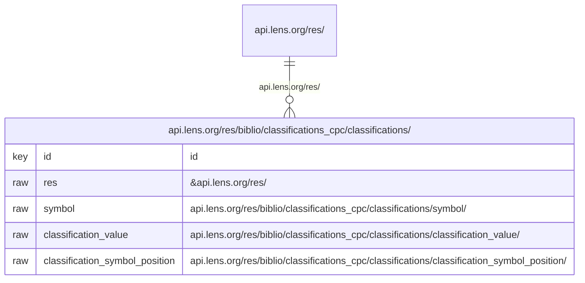
```mermaid
erDiagram

"api.lens.org/res/biblio/classifications_cpc/classifications/"{
  key id "id"
  raw res "&api.lens.org/res/"
  raw symbol "api.lens.org/res/biblio/classifications_cpc/classifications/symbol/"
  raw classification_value "api.lens.org/res/biblio/classifications_cpc/classifications/classification_value/"
  raw classification_symbol_position "api.lens.org/res/biblio/classifications_cpc/classifications/classification_symbol_position/" }
"api.lens.org/res/" ||--o{ "api.lens.org/res/biblio/classifications_cpc/classifications/" : "api.lens.org/res/"

```

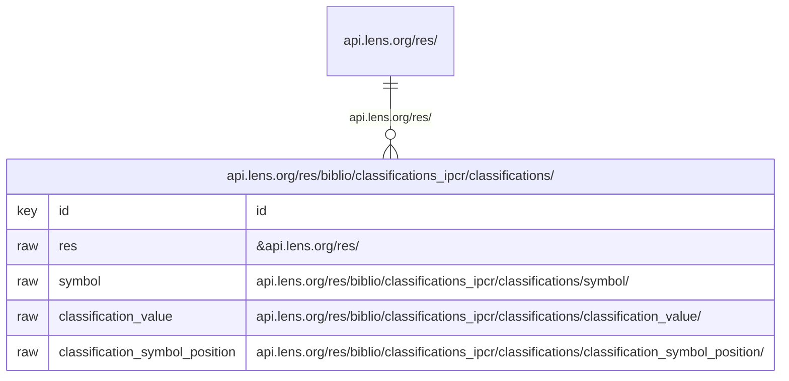
```mermaid
erDiagram

"api.lens.org/res/biblio/classifications_ipcr/classifications/"{
  key id "id"
  raw res "&api.lens.org/res/"
  raw symbol "api.lens.org/res/biblio/classifications_ipcr/classifications/symbol/"
  raw classification_value "api.lens.org/res/biblio/classifications_ipcr/classifications/classification_value/"
  raw classification_symbol_position "api.lens.org/res/biblio/classifications_ipcr/classifications/classification_symbol_position/" }
"api.lens.org/res/" ||--o{ "api.lens.org/res/biblio/classifications_ipcr/classifications/" : "api.lens.org/res/"

```

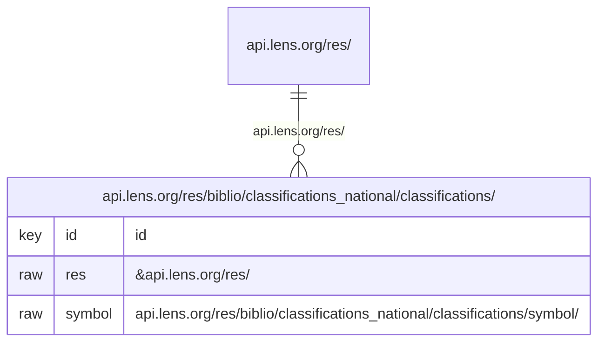
```mermaid
erDiagram

"api.lens.org/res/biblio/classifications_national/classifications/"{
  key id "id"
  raw res "&api.lens.org/res/"
  raw symbol "api.lens.org/res/biblio/classifications_national/classifications/symbol/" }
"api.lens.org/res/" ||--o{ "api.lens.org/res/biblio/classifications_national/classifications/" : "api.lens.org/res/"

```

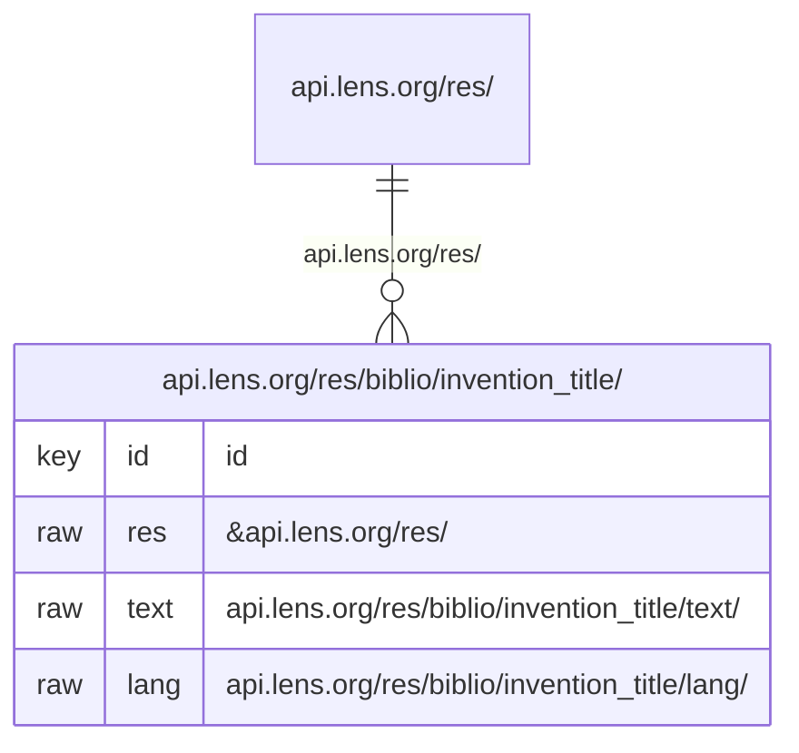
```mermaid
erDiagram

"api.lens.org/res/biblio/invention_title/"{
  key id "id"
  raw res "&api.lens.org/res/"
  raw text "api.lens.org/res/biblio/invention_title/text/"
  raw lang "api.lens.org/res/biblio/invention_title/lang/" }
"api.lens.org/res/" ||--o{ "api.lens.org/res/biblio/invention_title/" : "api.lens.org/res/"

```

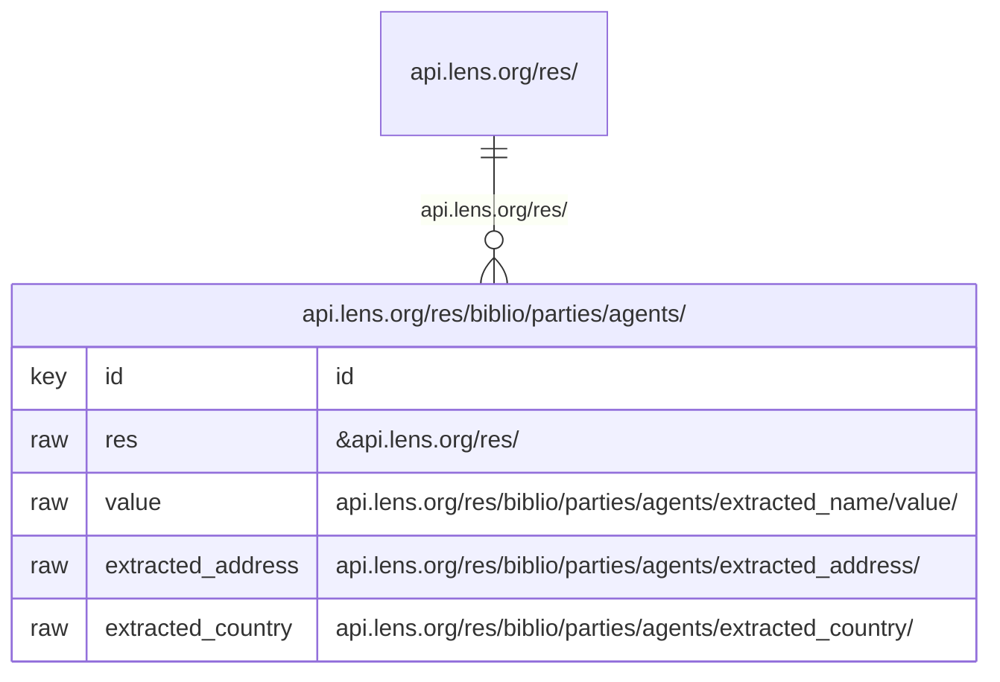
```mermaid
erDiagram

"api.lens.org/res/biblio/parties/agents/"{
  key id "id"
  raw res "&api.lens.org/res/"
  raw value "api.lens.org/res/biblio/parties/agents/extracted_name/value/"
  raw extracted_address "api.lens.org/res/biblio/parties/agents/extracted_address/"
  raw extracted_country "api.lens.org/res/biblio/parties/agents/extracted_country/" }
"api.lens.org/res/" ||--o{ "api.lens.org/res/biblio/parties/agents/" : "api.lens.org/res/"

```

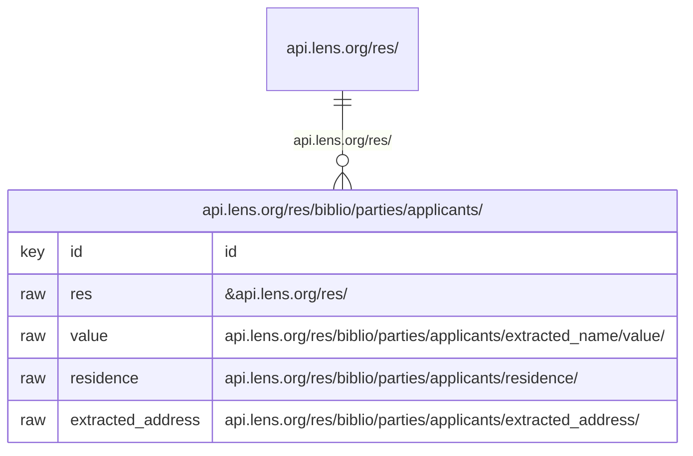
```mermaid
erDiagram

"api.lens.org/res/biblio/parties/applicants/"{
  key id "id"
  raw res "&api.lens.org/res/"
  raw value "api.lens.org/res/biblio/parties/applicants/extracted_name/value/"
  raw residence "api.lens.org/res/biblio/parties/applicants/residence/"
  raw extracted_address "api.lens.org/res/biblio/parties/applicants/extracted_address/" }
"api.lens.org/res/" ||--o{ "api.lens.org/res/biblio/parties/applicants/" : "api.lens.org/res/"

```

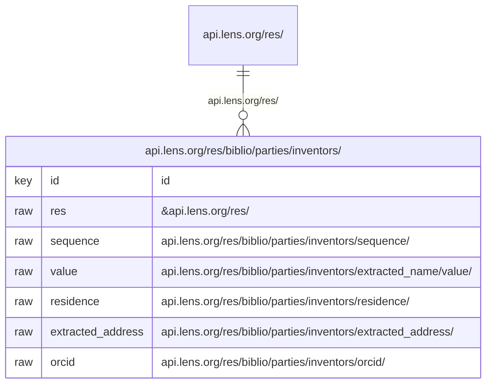
```mermaid
erDiagram

"api.lens.org/res/biblio/parties/inventors/"{
  key id "id"
  raw res "&api.lens.org/res/"
  raw sequence "api.lens.org/res/biblio/parties/inventors/sequence/"
  raw value "api.lens.org/res/biblio/parties/inventors/extracted_name/value/"
  raw residence "api.lens.org/res/biblio/parties/inventors/residence/"
  raw extracted_address "api.lens.org/res/biblio/parties/inventors/extracted_address/"
  raw orcid "api.lens.org/res/biblio/parties/inventors/orcid/" }
"api.lens.org/res/" ||--o{ "api.lens.org/res/biblio/parties/inventors/" : "api.lens.org/res/"

```

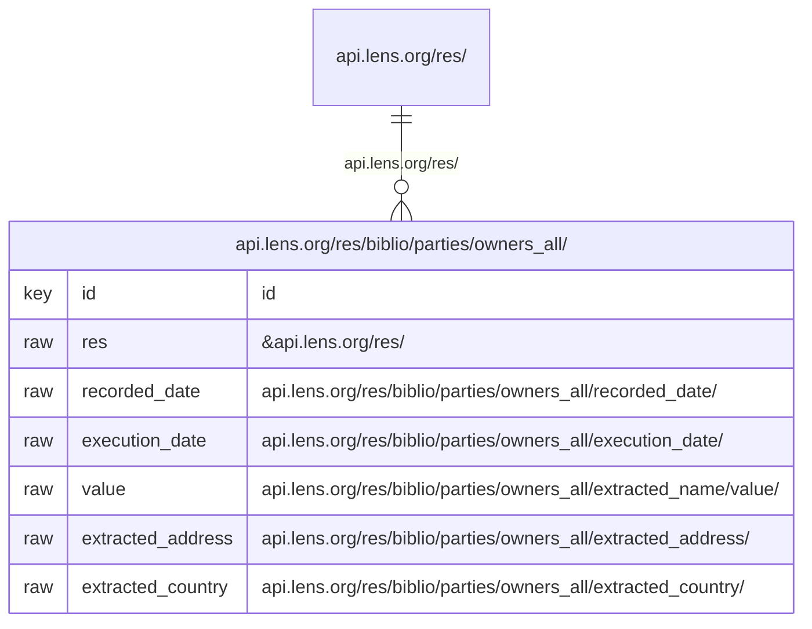
```mermaid
erDiagram

"api.lens.org/res/biblio/parties/owners_all/"{
  key id "id"
  raw res "&api.lens.org/res/"
  raw recorded_date "api.lens.org/res/biblio/parties/owners_all/recorded_date/"
  raw execution_date "api.lens.org/res/biblio/parties/owners_all/execution_date/"
  raw value "api.lens.org/res/biblio/parties/owners_all/extracted_name/value/"
  raw extracted_address "api.lens.org/res/biblio/parties/owners_all/extracted_address/"
  raw extracted_country "api.lens.org/res/biblio/parties/owners_all/extracted_country/" }
"api.lens.org/res/" ||--o{ "api.lens.org/res/biblio/parties/owners_all/" : "api.lens.org/res/"

```

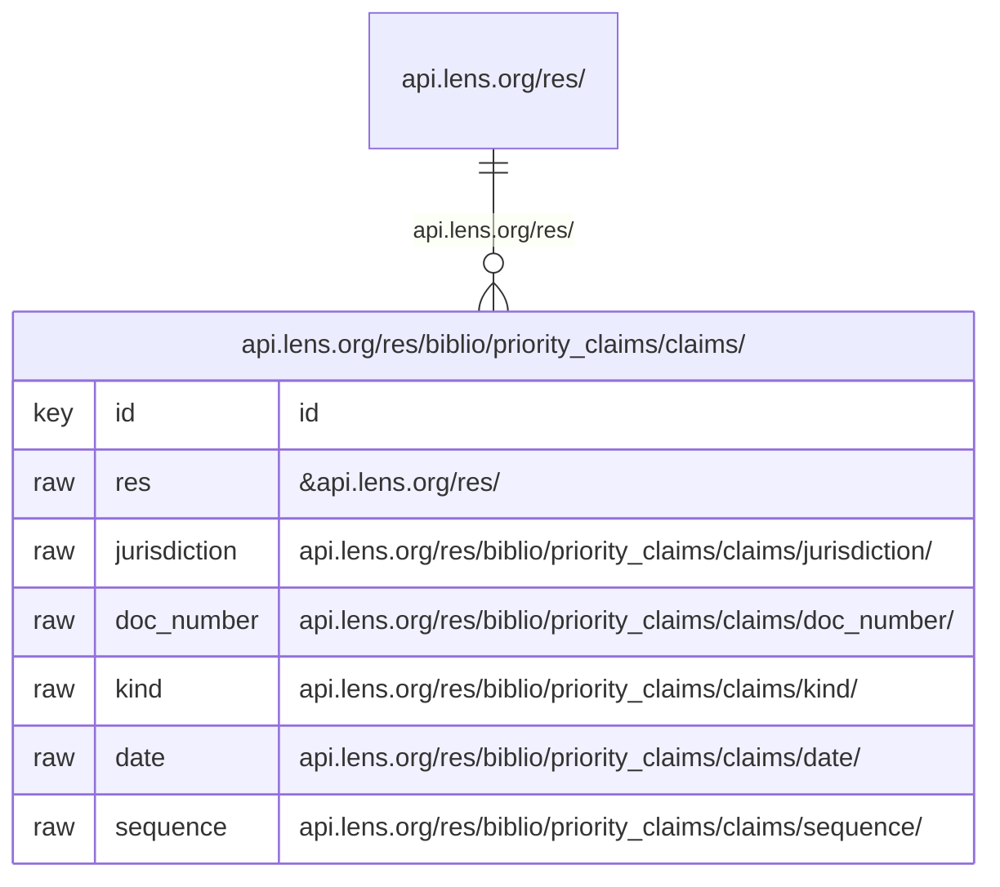
```mermaid
erDiagram

"api.lens.org/res/biblio/priority_claims/claims/"{
  key id "id"
  raw res "&api.lens.org/res/"
  raw jurisdiction "api.lens.org/res/biblio/priority_claims/claims/jurisdiction/"
  raw doc_number "api.lens.org/res/biblio/priority_claims/claims/doc_number/"
  raw kind "api.lens.org/res/biblio/priority_claims/claims/kind/"
  raw date "api.lens.org/res/biblio/priority_claims/claims/date/"
  raw sequence "api.lens.org/res/biblio/priority_claims/claims/sequence/" }
"api.lens.org/res/" ||--o{ "api.lens.org/res/biblio/priority_claims/claims/" : "api.lens.org/res/"

```

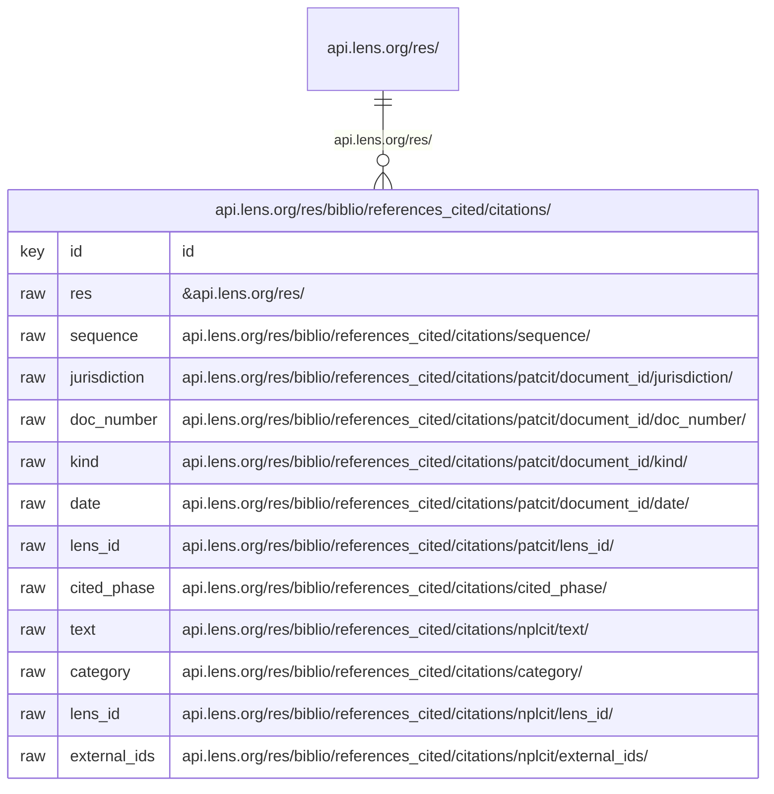
```mermaid
erDiagram

"api.lens.org/res/biblio/references_cited/citations/"{
  key id "id"
  raw res "&api.lens.org/res/"
  raw sequence "api.lens.org/res/biblio/references_cited/citations/sequence/"
  raw jurisdiction "api.lens.org/res/biblio/references_cited/citations/patcit/document_id/jurisdiction/"
  raw doc_number "api.lens.org/res/biblio/references_cited/citations/patcit/document_id/doc_number/"
  raw kind "api.lens.org/res/biblio/references_cited/citations/patcit/document_id/kind/"
  raw date "api.lens.org/res/biblio/references_cited/citations/patcit/document_id/date/"
  raw lens_id "api.lens.org/res/biblio/references_cited/citations/patcit/lens_id/"
  raw cited_phase "api.lens.org/res/biblio/references_cited/citations/cited_phase/"
  raw text "api.lens.org/res/biblio/references_cited/citations/nplcit/text/"
  raw category "api.lens.org/res/biblio/references_cited/citations/category/"
  raw lens_id "api.lens.org/res/biblio/references_cited/citations/nplcit/lens_id/"
  raw external_ids "api.lens.org/res/biblio/references_cited/citations/nplcit/external_ids/" }
"api.lens.org/res/" ||--o{ "api.lens.org/res/biblio/references_cited/citations/" : "api.lens.org/res/"

```

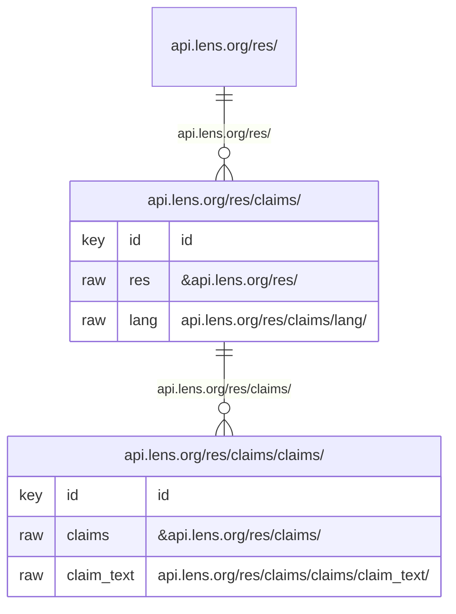
```mermaid
erDiagram

"api.lens.org/res/claims/claims/"{
  key id "id"
  raw claims "&api.lens.org/res/claims/"
  raw claim_text "api.lens.org/res/claims/claims/claim_text/" }
"api.lens.org/res/claims/"{
  key id "id"
  raw res "&api.lens.org/res/"
  raw lang "api.lens.org/res/claims/lang/" }
"api.lens.org/res/claims/" ||--o{ "api.lens.org/res/claims/claims/" : "api.lens.org/res/claims/"
"api.lens.org/res/" ||--o{ "api.lens.org/res/claims/" : "api.lens.org/res/"

```

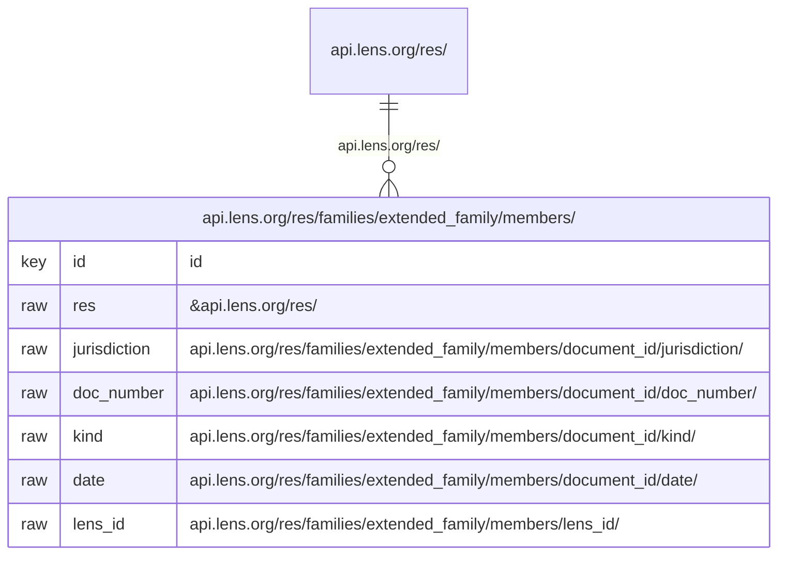
```mermaid
erDiagram

"api.lens.org/res/families/extended_family/members/"{
  key id "id"
  raw res "&api.lens.org/res/"
  raw jurisdiction "api.lens.org/res/families/extended_family/members/document_id/jurisdiction/"
  raw doc_number "api.lens.org/res/families/extended_family/members/document_id/doc_number/"
  raw kind "api.lens.org/res/families/extended_family/members/document_id/kind/"
  raw date "api.lens.org/res/families/extended_family/members/document_id/date/"
  raw lens_id "api.lens.org/res/families/extended_family/members/lens_id/" }
"api.lens.org/res/" ||--o{ "api.lens.org/res/families/extended_family/members/" : "api.lens.org/res/"

```

```mermaid
erDiagram

"api.lens.org/res/families/simple_family/members/"{
  key id "id"
  raw res "&api.lens.org/res/"
  raw jurisdiction "api.lens.org/res/families/simple_family/members/document_id/jurisdiction/"
  raw doc_number "api.lens.org/res/families/simple_family/members/document_id/doc_number/"
  raw kind "api.lens.org/res/families/simple_family/members/document_id/kind/"
  raw date "api.lens.org/res/families/simple_family/members/document_id/date/"
  raw lens_id "api.lens.org/res/families/simple_family/members/lens_id/" }
"api.lens.org/res/" ||--o{ "api.lens.org/res/families/simple_family/members/" : "api.lens.org/res/"

```

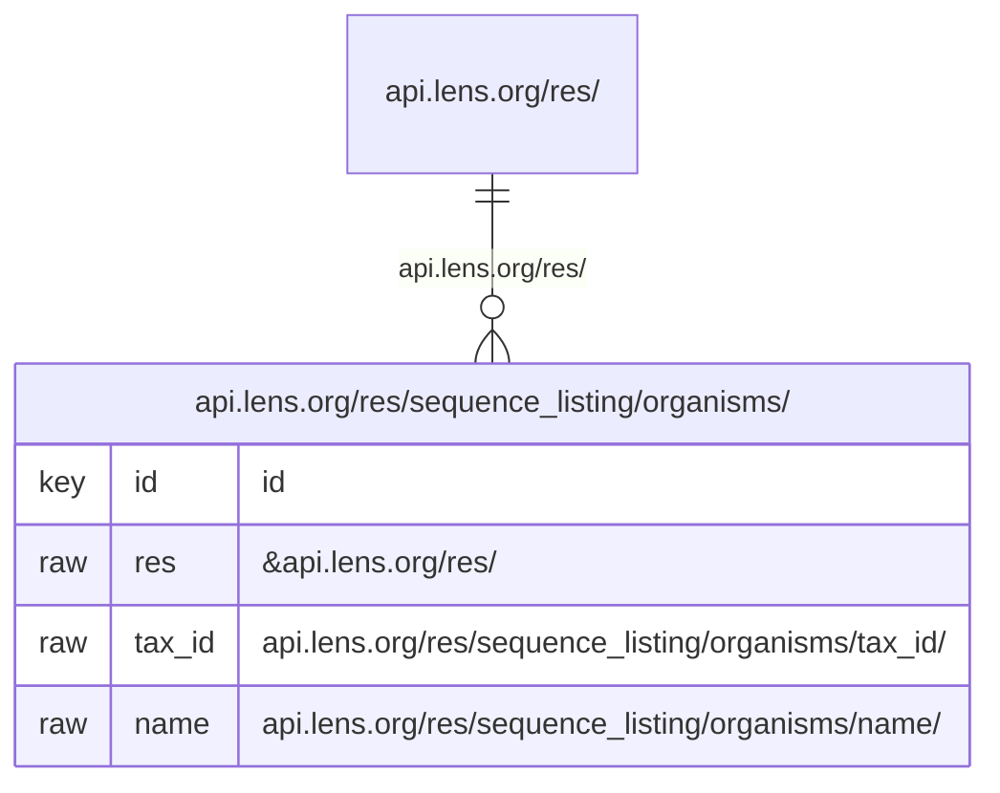
```mermaid
erDiagram

"api.lens.org/res/sequence_listing/organisms/"{
  key id "id"
  raw res "&api.lens.org/res/"
  raw tax_id "api.lens.org/res/sequence_listing/organisms/tax_id/"
  raw name "api.lens.org/res/sequence_listing/organisms/name/" }
"api.lens.org/res/" ||--o{ "api.lens.org/res/sequence_listing/organisms/" : "api.lens.org/res/"

```

<!-- end:profile.py -->