Open alex
=========

<!-- gen:profile.py -->

```mermaid
erDiagram

"api.openalex.org/res/"{
  key id "id"
  key id "api.openalex.org/res/id/"
  raw doi "api.openalex.org/res/doi/"
  raw title "api.openalex.org/res/title/"
  raw display_name "api.openalex.org/res/display_name/"
  raw relevance_score "api.openalex.org/res/relevance_score/"
  raw publication_year "api.openalex.org/res/publication_year/"
  raw publication_date "api.openalex.org/res/publication_date/"
  raw openalex "api.openalex.org/res/ids/openalex/"
  raw language "api.openalex.org/res/language/"
  raw is_oa "api.openalex.org/res/primary_location/is_oa/"
  raw landing_page_url "api.openalex.org/res/primary_location/landing_page_url/"
  raw pdf_url "api.openalex.org/res/primary_location/pdf_url/"
  key id "api.openalex.org/res/primary_location/source/id/"
  raw display_name "api.openalex.org/res/primary_location/source/display_name/"
  raw issn_l "api.openalex.org/res/primary_location/source/issn_l/"
  raw issn "api.openalex.org/res/primary_location/source/issn/"
  raw is_oa "api.openalex.org/res/primary_location/source/is_oa/"
  raw is_in_doaj "api.openalex.org/res/primary_location/source/is_in_doaj/"
  raw is_core "api.openalex.org/res/primary_location/source/is_core/"
  raw host_organization "api.openalex.org/res/primary_location/source/host_organization/"
  raw host_organization_name "api.openalex.org/res/primary_location/source/host_organization_name/"
  raw type "api.openalex.org/res/primary_location/source/type/"
  raw license "api.openalex.org/res/primary_location/license/"
  raw license_id "api.openalex.org/res/primary_location/license_id/"
  raw version "api.openalex.org/res/primary_location/version/"
  raw is_accepted "api.openalex.org/res/primary_location/is_accepted/"
  raw is_published "api.openalex.org/res/primary_location/is_published/"
  raw type "api.openalex.org/res/type/"
  raw type_crossref "api.openalex.org/res/type_crossref/"
  raw indexed_in "api.openalex.org/res/indexed_in/"
  raw is_oa "api.openalex.org/res/open_access/is_oa/"
  raw oa_status "api.openalex.org/res/open_access/oa_status/"
  raw oa_url "api.openalex.org/res/open_access/oa_url/"
  raw any_repository_has_fulltext "api.openalex.org/res/open_access/any_repository_has_fulltext/"
  raw countries_distinct_count "api.openalex.org/res/countries_distinct_count/"
  raw institutions_distinct_count "api.openalex.org/res/institutions_distinct_count/"
  raw fwci "api.openalex.org/res/fwci/"
  raw has_fulltext "api.openalex.org/res/has_fulltext/"
  raw cited_by_count "api.openalex.org/res/cited_by_count/"
  raw value "api.openalex.org/res/citation_normalized_percentile/value/"
  raw is_in_top_1_percent "api.openalex.org/res/citation_normalized_percentile/is_in_top_1_percent/"
  raw is_in_top_10_percent "api.openalex.org/res/citation_normalized_percentile/is_in_top_10_percent/"
  raw min "api.openalex.org/res/cited_by_percentile_year/min/"
  raw max "api.openalex.org/res/cited_by_percentile_year/max/"
  raw volume "api.openalex.org/res/biblio/volume/"
  raw issue "api.openalex.org/res/biblio/issue/"
  raw first_page "api.openalex.org/res/biblio/first_page/"
  raw last_page "api.openalex.org/res/biblio/last_page/"
  raw is_retracted "api.openalex.org/res/is_retracted/"
  raw is_paratext "api.openalex.org/res/is_paratext/"
  key id "api.openalex.org/res/primary_topic/id/"
  raw display_name "api.openalex.org/res/primary_topic/display_name/"
  raw score "api.openalex.org/res/primary_topic/score/"
  key id "api.openalex.org/res/primary_topic/subfield/id/"
  raw display_name "api.openalex.org/res/primary_topic/subfield/display_name/"
  key id "api.openalex.org/res/primary_topic/field/id/"
  raw display_name "api.openalex.org/res/primary_topic/field/display_name/"
  key id "api.openalex.org/res/primary_topic/domain/id/"
  raw display_name "api.openalex.org/res/primary_topic/domain/display_name/"
  raw locations_count "api.openalex.org/res/locations_count/"
  raw referenced_works_count "api.openalex.org/res/referenced_works_count/"
  raw related_works "api.openalex.org/res/related_works/"
  raw cited_by_api_url "api.openalex.org/res/cited_by_api_url/"
  raw updated_date "api.openalex.org/res/updated_date/"
  raw created_date "api.openalex.org/res/created_date/"
  raw host_organization_lineage "api.openalex.org/res/primary_location/source/host_organization_lineage/"
  raw host_organization_lineage_names "api.openalex.org/res/primary_location/source/host_organization_lineage_names/"
  raw corresponding_author_ids "api.openalex.org/res/corresponding_author_ids/"
  raw mag "api.openalex.org/res/ids/mag/"
  raw corresponding_institution_ids "api.openalex.org/res/corresponding_institution_ids/"
  raw doi "api.openalex.org/res/ids/doi/"
  raw pmid "api.openalex.org/res/ids/pmid/"
  raw value "api.openalex.org/res/apc_list/value/"
  raw currency "api.openalex.org/res/apc_list/currency/"
  raw value_usd "api.openalex.org/res/apc_list/value_usd/"
  raw provenance "api.openalex.org/res/apc_list/provenance/"
  raw fulltext_origin "api.openalex.org/res/fulltext_origin/"
  raw referenced_works "api.openalex.org/res/referenced_works/"
  raw value "api.openalex.org/res/apc_paid/value/"
  raw currency "api.openalex.org/res/apc_paid/currency/"
  raw value_usd "api.openalex.org/res/apc_paid/value_usd/"
  raw provenance "api.openalex.org/res/apc_paid/provenance/"
  raw is_oa "api.openalex.org/res/best_oa_location/is_oa/"
  raw landing_page_url "api.openalex.org/res/best_oa_location/landing_page_url/"
  raw pdf_url "api.openalex.org/res/best_oa_location/pdf_url/"
  key id "api.openalex.org/res/best_oa_location/source/id/"
  raw display_name "api.openalex.org/res/best_oa_location/source/display_name/"
  raw issn_l "api.openalex.org/res/best_oa_location/source/issn_l/"
  raw issn "api.openalex.org/res/best_oa_location/source/issn/"
  raw is_oa "api.openalex.org/res/best_oa_location/source/is_oa/"
  raw is_in_doaj "api.openalex.org/res/best_oa_location/source/is_in_doaj/"
  raw is_core "api.openalex.org/res/best_oa_location/source/is_core/"
  raw host_organization "api.openalex.org/res/best_oa_location/source/host_organization/"
  raw host_organization_name "api.openalex.org/res/best_oa_location/source/host_organization_name/"
  raw host_organization_lineage "api.openalex.org/res/best_oa_location/source/host_organization_lineage/"
  raw host_organization_lineage_names "api.openalex.org/res/best_oa_location/source/host_organization_lineage_names/"
  raw type "api.openalex.org/res/best_oa_location/source/type/"
  raw license "api.openalex.org/res/best_oa_location/license/"
  raw license_id "api.openalex.org/res/best_oa_location/license_id/"
  raw version "api.openalex.org/res/best_oa_location/version/"
  raw is_accepted "api.openalex.org/res/best_oa_location/is_accepted/"
  raw is_published "api.openalex.org/res/best_oa_location/is_published/"
  raw pmcid "api.openalex.org/res/ids/pmcid/"
  raw is_authors_truncated "api.openalex.org/res/is_authors_truncated/"
  raw datasets "api.openalex.org/res/datasets/"
  raw versions "api.openalex.org/res/versions/" }

```

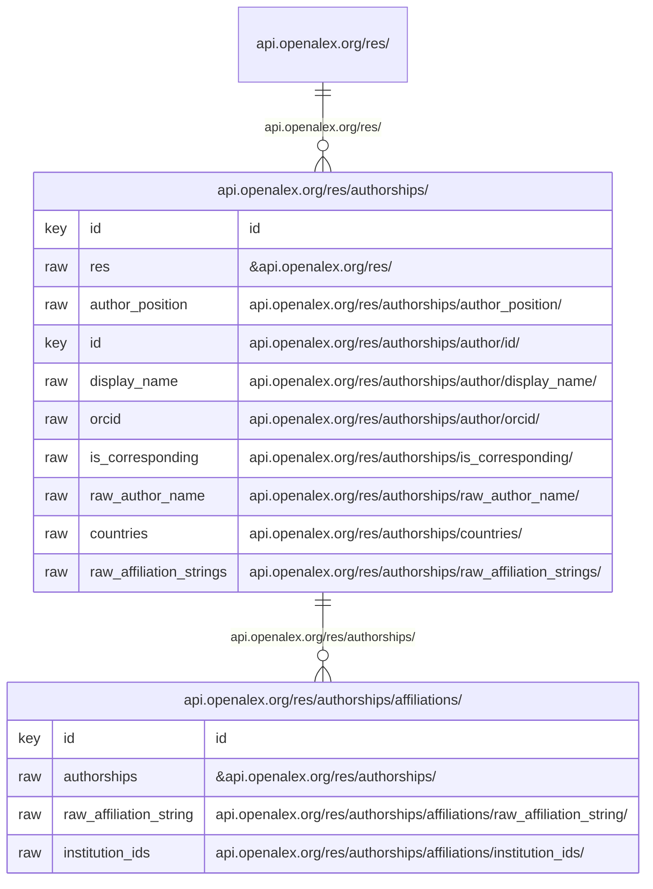
```mermaid
erDiagram

"api.openalex.org/res/authorships/affiliations/"{
  key id "id"
  raw authorships "&api.openalex.org/res/authorships/"
  raw raw_affiliation_string "api.openalex.org/res/authorships/affiliations/raw_affiliation_string/"
  raw institution_ids "api.openalex.org/res/authorships/affiliations/institution_ids/" }
"api.openalex.org/res/authorships/"{
  key id "id"
  raw res "&api.openalex.org/res/"
  raw author_position "api.openalex.org/res/authorships/author_position/"
  key id "api.openalex.org/res/authorships/author/id/"
  raw display_name "api.openalex.org/res/authorships/author/display_name/"
  raw orcid "api.openalex.org/res/authorships/author/orcid/"
  raw is_corresponding "api.openalex.org/res/authorships/is_corresponding/"
  raw raw_author_name "api.openalex.org/res/authorships/raw_author_name/"
  raw countries "api.openalex.org/res/authorships/countries/"
  raw raw_affiliation_strings "api.openalex.org/res/authorships/raw_affiliation_strings/" }
"api.openalex.org/res/authorships/" ||--o{ "api.openalex.org/res/authorships/affiliations/" : "api.openalex.org/res/authorships/"
"api.openalex.org/res/" ||--o{ "api.openalex.org/res/authorships/" : "api.openalex.org/res/"

```

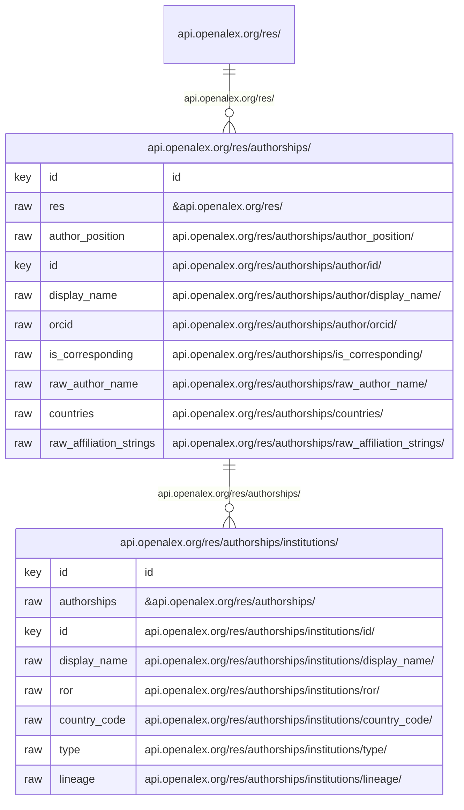
```mermaid
erDiagram

"api.openalex.org/res/authorships/institutions/"{
  key id "id"
  raw authorships "&api.openalex.org/res/authorships/"
  key id "api.openalex.org/res/authorships/institutions/id/"
  raw display_name "api.openalex.org/res/authorships/institutions/display_name/"
  raw ror "api.openalex.org/res/authorships/institutions/ror/"
  raw country_code "api.openalex.org/res/authorships/institutions/country_code/"
  raw type "api.openalex.org/res/authorships/institutions/type/"
  raw lineage "api.openalex.org/res/authorships/institutions/lineage/" }
"api.openalex.org/res/authorships/"{
  key id "id"
  raw res "&api.openalex.org/res/"
  raw author_position "api.openalex.org/res/authorships/author_position/"
  key id "api.openalex.org/res/authorships/author/id/"
  raw display_name "api.openalex.org/res/authorships/author/display_name/"
  raw orcid "api.openalex.org/res/authorships/author/orcid/"
  raw is_corresponding "api.openalex.org/res/authorships/is_corresponding/"
  raw raw_author_name "api.openalex.org/res/authorships/raw_author_name/"
  raw countries "api.openalex.org/res/authorships/countries/"
  raw raw_affiliation_strings "api.openalex.org/res/authorships/raw_affiliation_strings/" }
"api.openalex.org/res/authorships/" ||--o{ "api.openalex.org/res/authorships/institutions/" : "api.openalex.org/res/authorships/"
"api.openalex.org/res/" ||--o{ "api.openalex.org/res/authorships/" : "api.openalex.org/res/"

```

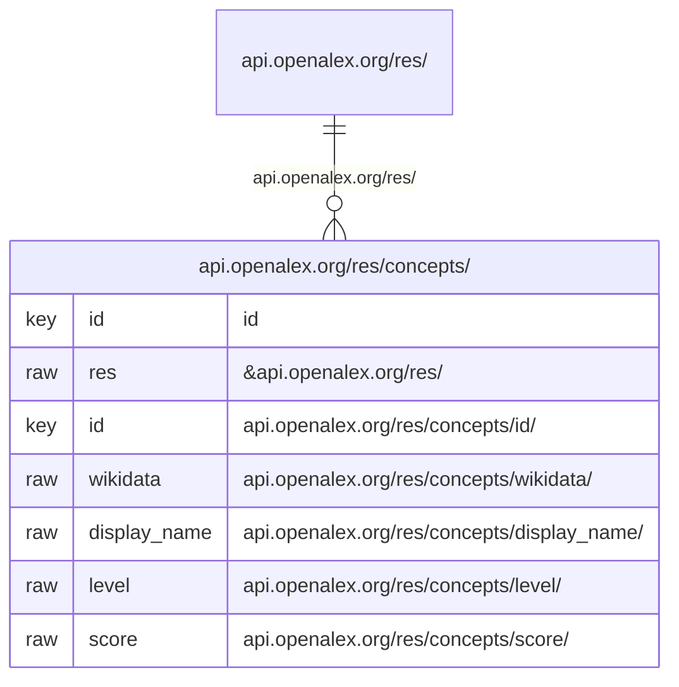
```mermaid
erDiagram

"api.openalex.org/res/concepts/"{
  key id "id"
  raw res "&api.openalex.org/res/"
  key id "api.openalex.org/res/concepts/id/"
  raw wikidata "api.openalex.org/res/concepts/wikidata/"
  raw display_name "api.openalex.org/res/concepts/display_name/"
  raw level "api.openalex.org/res/concepts/level/"
  raw score "api.openalex.org/res/concepts/score/" }
"api.openalex.org/res/" ||--o{ "api.openalex.org/res/concepts/" : "api.openalex.org/res/"

```

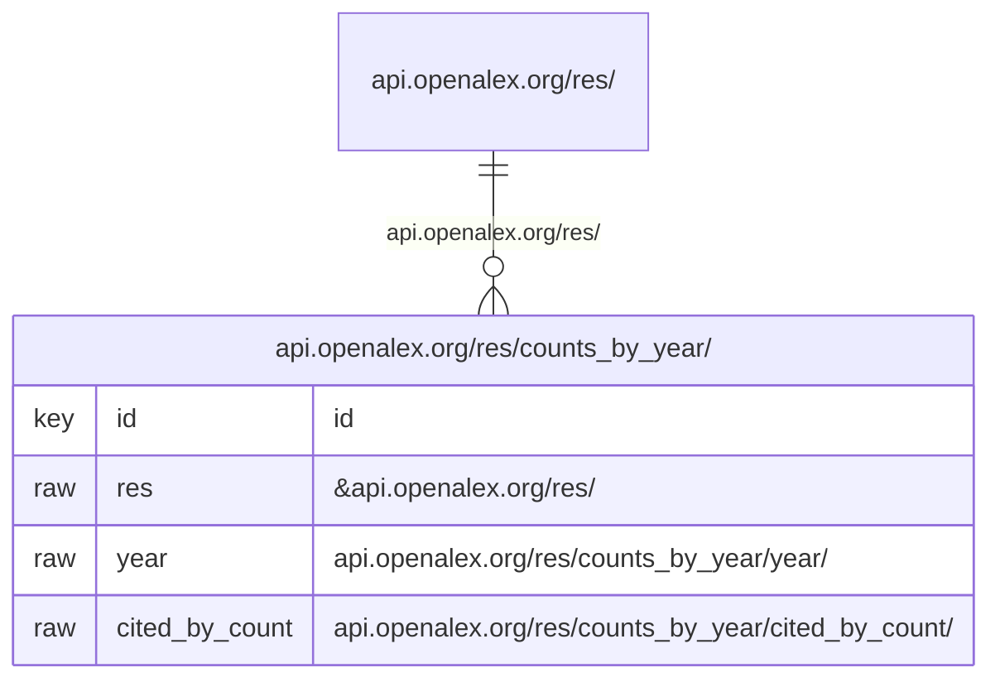
```mermaid
erDiagram

"api.openalex.org/res/counts_by_year/"{
  key id "id"
  raw res "&api.openalex.org/res/"
  raw year "api.openalex.org/res/counts_by_year/year/"
  raw cited_by_count "api.openalex.org/res/counts_by_year/cited_by_count/" }
"api.openalex.org/res/" ||--o{ "api.openalex.org/res/counts_by_year/" : "api.openalex.org/res/"

```

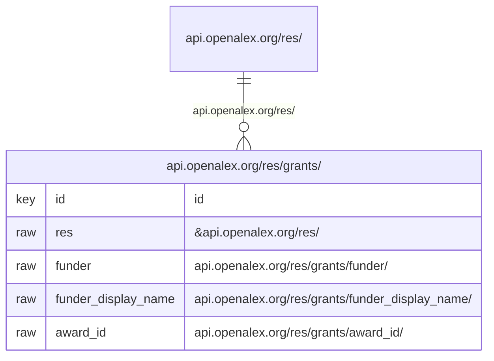
```mermaid
erDiagram

"api.openalex.org/res/grants/"{
  key id "id"
  raw res "&api.openalex.org/res/"
  raw funder "api.openalex.org/res/grants/funder/"
  raw funder_display_name "api.openalex.org/res/grants/funder_display_name/"
  raw award_id "api.openalex.org/res/grants/award_id/" }
"api.openalex.org/res/" ||--o{ "api.openalex.org/res/grants/" : "api.openalex.org/res/"

```

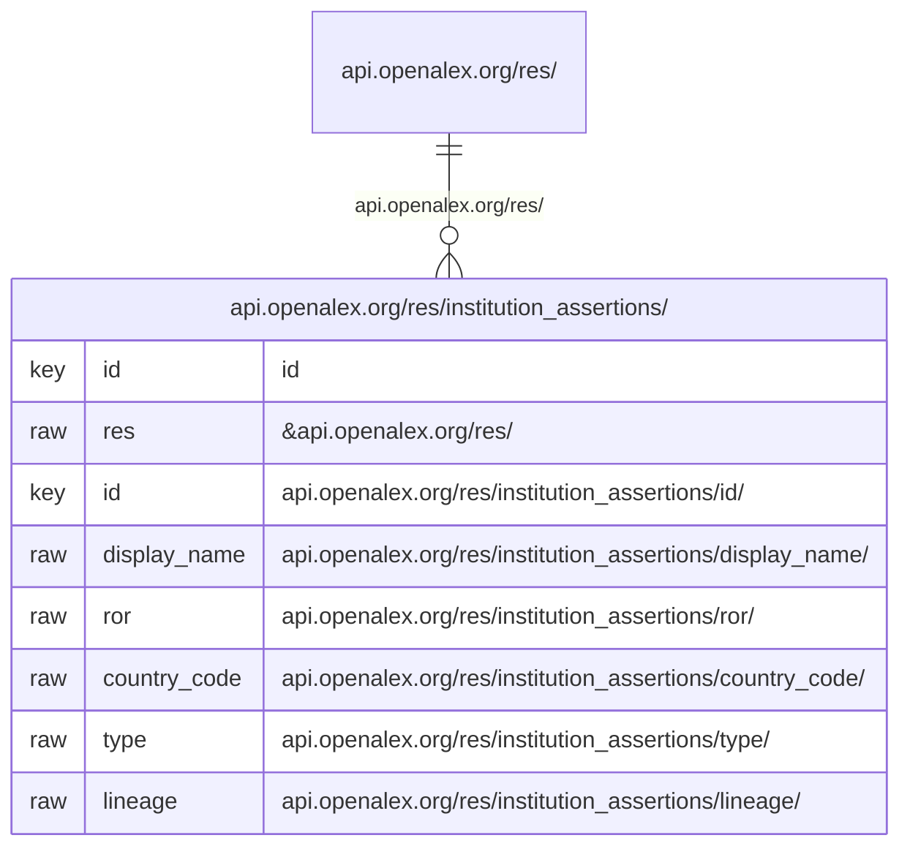
```mermaid
erDiagram

"api.openalex.org/res/institution_assertions/"{
  key id "id"
  raw res "&api.openalex.org/res/"
  key id "api.openalex.org/res/institution_assertions/id/"
  raw display_name "api.openalex.org/res/institution_assertions/display_name/"
  raw ror "api.openalex.org/res/institution_assertions/ror/"
  raw country_code "api.openalex.org/res/institution_assertions/country_code/"
  raw type "api.openalex.org/res/institution_assertions/type/"
  raw lineage "api.openalex.org/res/institution_assertions/lineage/" }
"api.openalex.org/res/" ||--o{ "api.openalex.org/res/institution_assertions/" : "api.openalex.org/res/"

```

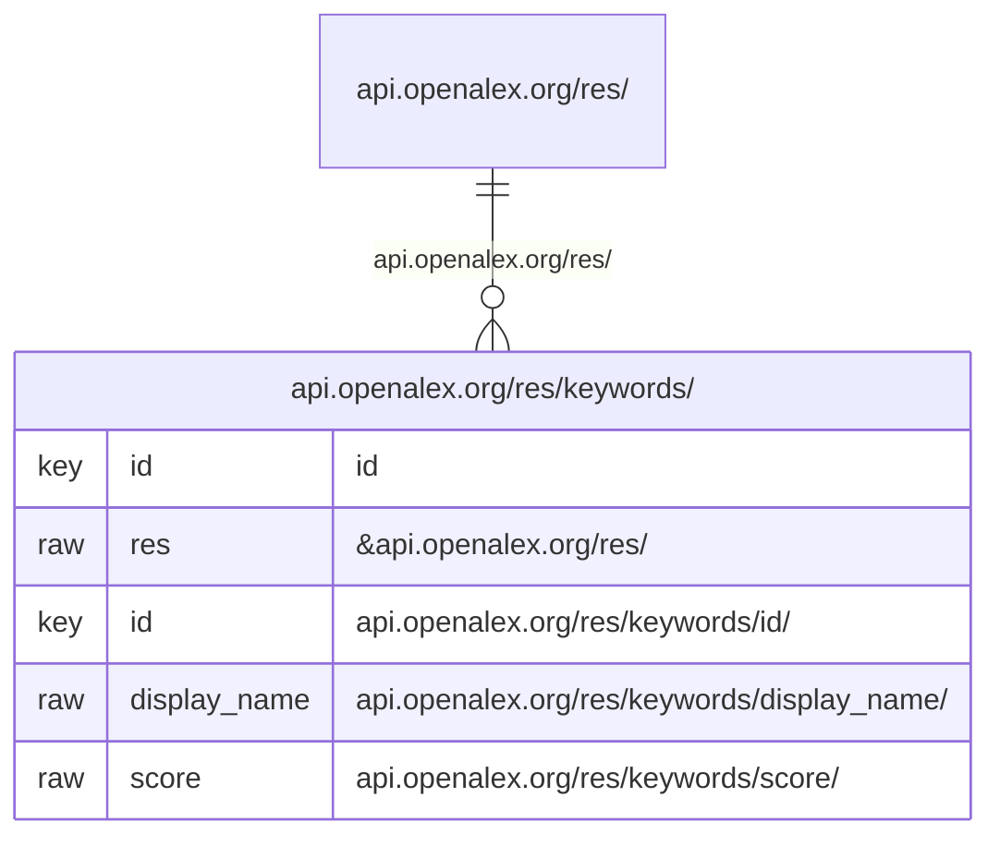
```mermaid
erDiagram

"api.openalex.org/res/keywords/"{
  key id "id"
  raw res "&api.openalex.org/res/"
  key id "api.openalex.org/res/keywords/id/"
  raw display_name "api.openalex.org/res/keywords/display_name/"
  raw score "api.openalex.org/res/keywords/score/" }
"api.openalex.org/res/" ||--o{ "api.openalex.org/res/keywords/" : "api.openalex.org/res/"

```

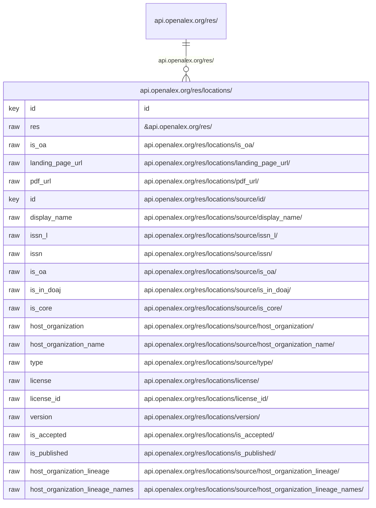
```mermaid
erDiagram

"api.openalex.org/res/locations/"{
  key id "id"
  raw res "&api.openalex.org/res/"
  raw is_oa "api.openalex.org/res/locations/is_oa/"
  raw landing_page_url "api.openalex.org/res/locations/landing_page_url/"
  raw pdf_url "api.openalex.org/res/locations/pdf_url/"
  key id "api.openalex.org/res/locations/source/id/"
  raw display_name "api.openalex.org/res/locations/source/display_name/"
  raw issn_l "api.openalex.org/res/locations/source/issn_l/"
  raw issn "api.openalex.org/res/locations/source/issn/"
  raw is_oa "api.openalex.org/res/locations/source/is_oa/"
  raw is_in_doaj "api.openalex.org/res/locations/source/is_in_doaj/"
  raw is_core "api.openalex.org/res/locations/source/is_core/"
  raw host_organization "api.openalex.org/res/locations/source/host_organization/"
  raw host_organization_name "api.openalex.org/res/locations/source/host_organization_name/"
  raw type "api.openalex.org/res/locations/source/type/"
  raw license "api.openalex.org/res/locations/license/"
  raw license_id "api.openalex.org/res/locations/license_id/"
  raw version "api.openalex.org/res/locations/version/"
  raw is_accepted "api.openalex.org/res/locations/is_accepted/"
  raw is_published "api.openalex.org/res/locations/is_published/"
  raw host_organization_lineage "api.openalex.org/res/locations/source/host_organization_lineage/"
  raw host_organization_lineage_names "api.openalex.org/res/locations/source/host_organization_lineage_names/" }
"api.openalex.org/res/" ||--o{ "api.openalex.org/res/locations/" : "api.openalex.org/res/"

```

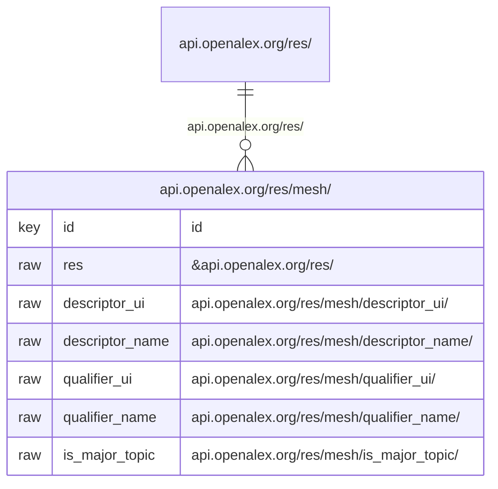
```mermaid
erDiagram

"api.openalex.org/res/mesh/"{
  key id "id"
  raw res "&api.openalex.org/res/"
  raw descriptor_ui "api.openalex.org/res/mesh/descriptor_ui/"
  raw descriptor_name "api.openalex.org/res/mesh/descriptor_name/"
  raw qualifier_ui "api.openalex.org/res/mesh/qualifier_ui/"
  raw qualifier_name "api.openalex.org/res/mesh/qualifier_name/"
  raw is_major_topic "api.openalex.org/res/mesh/is_major_topic/" }
"api.openalex.org/res/" ||--o{ "api.openalex.org/res/mesh/" : "api.openalex.org/res/"

```

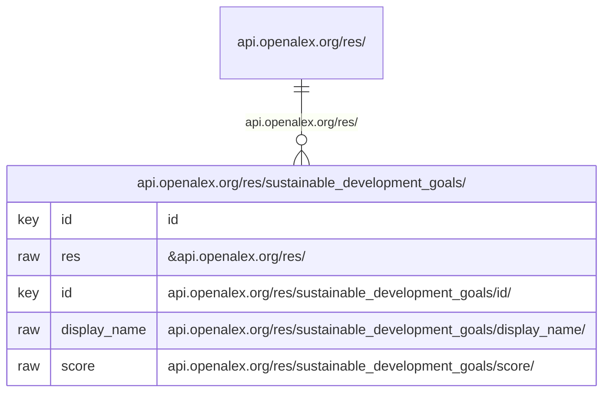
```mermaid
erDiagram

"api.openalex.org/res/sustainable_development_goals/"{
  key id "id"
  raw res "&api.openalex.org/res/"
  key id "api.openalex.org/res/sustainable_development_goals/id/"
  raw display_name "api.openalex.org/res/sustainable_development_goals/display_name/"
  raw score "api.openalex.org/res/sustainable_development_goals/score/" }
"api.openalex.org/res/" ||--o{ "api.openalex.org/res/sustainable_development_goals/" : "api.openalex.org/res/"

```

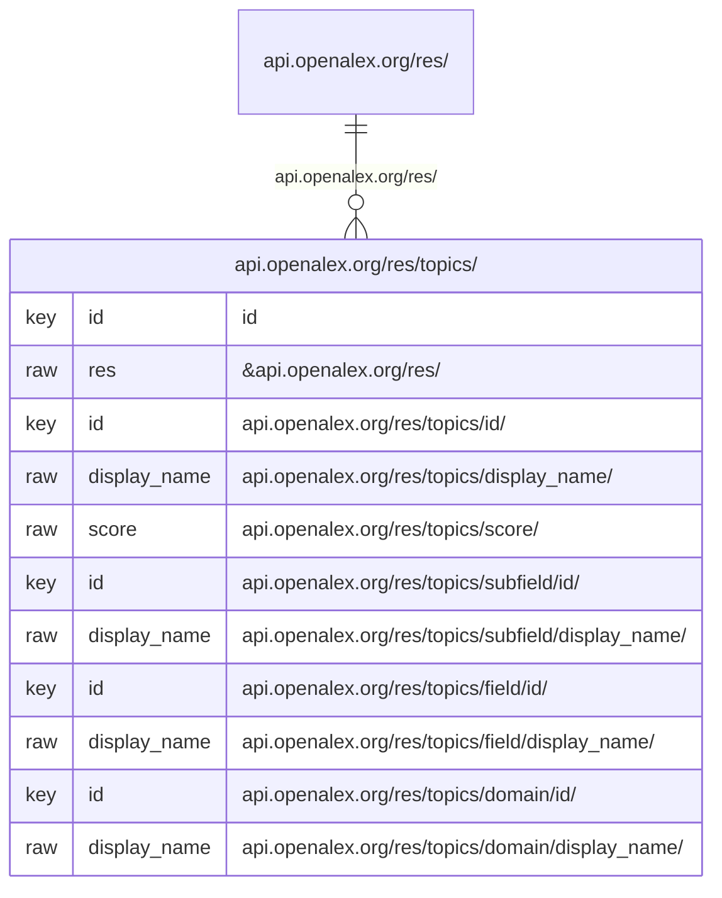
```mermaid
erDiagram

"api.openalex.org/res/topics/"{
  key id "id"
  raw res "&api.openalex.org/res/"
  key id "api.openalex.org/res/topics/id/"
  raw display_name "api.openalex.org/res/topics/display_name/"
  raw score "api.openalex.org/res/topics/score/"
  key id "api.openalex.org/res/topics/subfield/id/"
  raw display_name "api.openalex.org/res/topics/subfield/display_name/"
  key id "api.openalex.org/res/topics/field/id/"
  raw display_name "api.openalex.org/res/topics/field/display_name/"
  key id "api.openalex.org/res/topics/domain/id/"
  raw display_name "api.openalex.org/res/topics/domain/display_name/" }
"api.openalex.org/res/" ||--o{ "api.openalex.org/res/topics/" : "api.openalex.org/res/"

```

<!-- end:profile.py -->