Dane UPRP
=========

Pozyskiwanie danych z API.UPRP.GOV.PL
-------------------------------------

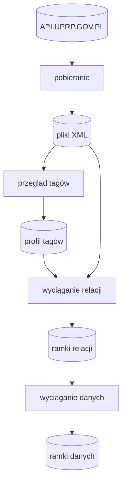
```mermaid
graph TB
API[(API.UPRP.GOV.PL)]
raw/*.xml[(pliki XML)]
XML.profile.json[(profil tagów)]
frames/**/*.csv[(ramki relacji)]
*.csv[(ramki danych)]

scrap.R[pobieranie]
XML.profile.py[przegląd tagów]
relations.py[wyciąganie relacji]
frame.py[wyciaganie danych]

API --> scrap.R
    --> raw/*.xml
    --> XML.profile.py
    --> XML.profile.json
    --> relations.py
    --> frames/**/*.csv
    --> frame.py
    --> *.csv

raw/*.xml --> relations.py
```

<!-- gen:profile.py -->

```mermaid
erDiagram

"api.uprp.gov.pl/raw/"{
  key id "id"
  attr lang "api.uprp.gov.pl/raw/root/pl-patent-document/@lang/"
  attr country "api.uprp.gov.pl/raw/root/pl-patent-document/@country/"
  attr doc-number "api.uprp.gov.pl/raw/root/pl-patent-document/@doc-number/"
  attr kind "api.uprp.gov.pl/raw/root/pl-patent-document/@kind/"
  attr date-publ "api.uprp.gov.pl/raw/root/pl-patent-document/@date-publ/"
  raw edition "api.uprp.gov.pl/raw/root/pl-patent-document/bibliographic-data/classification-ipc/edition/"
  raw main-classification "api.uprp.gov.pl/raw/root/pl-patent-document/bibliographic-data/classification-ipc/main-classification/"
  raw country "api.uprp.gov.pl/raw/root/pl-patent-document/bibliographic-data/application-reference/document-id/country/"
  raw doc-number "api.uprp.gov.pl/raw/root/pl-patent-document/bibliographic-data/application-reference/document-id/doc-number/"
  raw kind "api.uprp.gov.pl/raw/root/pl-patent-document/bibliographic-data/application-reference/document-id/kind/"
  raw date "api.uprp.gov.pl/raw/root/pl-patent-document/bibliographic-data/application-reference/document-id/date/"
  raw country "api.uprp.gov.pl/raw/root/pl-patent-document/bibliographic-data/dates-of-public-availability/unexamined-printed-without-grant/document-id/country/"
  raw doc-number "api.uprp.gov.pl/raw/root/pl-patent-document/bibliographic-data/dates-of-public-availability/unexamined-printed-without-grant/document-id/doc-number/"
  raw date "api.uprp.gov.pl/raw/root/pl-patent-document/bibliographic-data/dates-of-public-availability/unexamined-printed-without-grant/document-id/date/"
  attr lang "api.uprp.gov.pl/raw/root/pl-patent-document/description/@lang/"
  attr num "api.uprp.gov.pl/raw/root/pl-patent-document/description/p/@num/"
  val text "api.uprp.gov.pl/raw/root/pl-patent-document/description/p/#text/"
  attr lang "api.uprp.gov.pl/raw/root/pl-patent-document/claims/@lang/"
  attr num "api.uprp.gov.pl/raw/root/pl-patent-document/claims/claim/@num/"
  raw claim-text "api.uprp.gov.pl/raw/root/pl-patent-document/claims/claim/claim-text/"
  attr lang "api.uprp.gov.pl/raw/root/pl-patent-document/abstract/@lang/"
  attr num "api.uprp.gov.pl/raw/root/pl-patent-document/abstract/p/@num/"
  val text "api.uprp.gov.pl/raw/root/pl-patent-document/abstract/p/#text/"
  raw source "api.uprp.gov.pl/raw/root/pl-patent-document/pl-office-specific-data/source/"
  raw timestamp "api.uprp.gov.pl/raw/root/pl-patent-document/pl-office-specific-data/timestamp/"
  raw begin-date "api.uprp.gov.pl/raw/root/pl-patent-document/pl-office-specific-data/begin-date/"
  raw end-date "api.uprp.gov.pl/raw/root/pl-patent-document/pl-office-specific-data/end-date/"
  raw status-id "api.uprp.gov.pl/raw/root/pl-patent-document/pl-office-specific-data/status/status-id/"
  raw status-description "api.uprp.gov.pl/raw/root/pl-patent-document/pl-office-specific-data/status/status-description/"
  raw decision-date "api.uprp.gov.pl/raw/root/pl-patent-document/pl-office-specific-data/status/decision-date/"
  raw decision-name "api.uprp.gov.pl/raw/root/pl-patent-document/pl-office-specific-data/status/decision-name/"
  raw extidappli "api.uprp.gov.pl/raw/root/pl-patent-document/pl-office-specific-data/extidappli/"
  raw extidpatent "api.uprp.gov.pl/raw/root/pl-patent-document/pl-office-specific-data/extidpatent/"
  raw dtptexpi "api.uprp.gov.pl/raw/root/pl-patent-document/pl-office-specific-data/dtptexpi/"
  raw cntrenew "api.uprp.gov.pl/raw/root/pl-patent-document/pl-office-specific-data/cntrenew/"
  raw pendingfee-mtftocol "api.uprp.gov.pl/raw/root/pl-patent-document/pl-office-specific-data/pendingfee-mtftocol/"
  raw pendingfee-dtdupay "api.uprp.gov.pl/raw/root/pl-patent-document/pl-office-specific-data/pendingfee-dtdupay/"
  raw date-of-grant "api.uprp.gov.pl/raw/root/pl-patent-document/pl-office-specific-data/date-of-grant/"
  raw further-classification "api.uprp.gov.pl/raw/root/pl-patent-document/bibliographic-data/classification-ipc/further-classification/"
  raw code "api.uprp.gov.pl/raw/root/pl-patent-document/pl-office-specific-data/status/code/"
  raw main-classification "api.uprp.gov.pl/raw/root/pl-patent-document/bibliographic-data/classification-cpc/main-classification/"
  raw further-classification "api.uprp.gov.pl/raw/root/pl-patent-document/bibliographic-data/classification-cpc/further-classification/"
  raw country "api.uprp.gov.pl/raw/root/pl-patent-document/bibliographic-data/pct-or-regional-filing-data/document-id/country/"
  raw doc-number "api.uprp.gov.pl/raw/root/pl-patent-document/bibliographic-data/pct-or-regional-filing-data/document-id/doc-number/"
  raw date "api.uprp.gov.pl/raw/root/pl-patent-document/bibliographic-data/pct-or-regional-filing-data/document-id/date/"
  raw country "api.uprp.gov.pl/raw/root/pl-patent-document/bibliographic-data/pct-or-regional-publishing-data/document-id/country/"
  raw doc-number "api.uprp.gov.pl/raw/root/pl-patent-document/bibliographic-data/pct-or-regional-publishing-data/document-id/doc-number/"
  raw date "api.uprp.gov.pl/raw/root/pl-patent-document/bibliographic-data/pct-or-regional-publishing-data/document-id/date/"
  raw gazette-num "api.uprp.gov.pl/raw/root/pl-patent-document/bibliographic-data/pct-or-regional-publishing-data/gazette-reference/gazette-num/"
  raw date "api.uprp.gov.pl/raw/root/pl-patent-document/bibliographic-data/pct-or-regional-publishing-data/gazette-reference/date/"
  raw country "api.uprp.gov.pl/raw/root/pl-patent-document/bibliographic-data/related-documents/division/relation/parent-doc/document-id/country/"
  raw doc-number "api.uprp.gov.pl/raw/root/pl-patent-document/bibliographic-data/related-documents/division/relation/parent-doc/document-id/doc-number/"
  raw kind "api.uprp.gov.pl/raw/root/pl-patent-document/bibliographic-data/related-documents/division/relation/parent-doc/document-id/kind/"
  raw date "api.uprp.gov.pl/raw/root/pl-patent-document/bibliographic-data/related-documents/division/relation/parent-doc/document-id/date/"
  raw country "api.uprp.gov.pl/raw/root/pl-patent-document/bibliographic-data/related-documents/division/relation/child-doc/document-id/country/"
  raw doc-number "api.uprp.gov.pl/raw/root/pl-patent-document/bibliographic-data/related-documents/division/relation/child-doc/document-id/doc-number/"
  raw kind "api.uprp.gov.pl/raw/root/pl-patent-document/bibliographic-data/related-documents/division/relation/child-doc/document-id/kind/"
  raw date "api.uprp.gov.pl/raw/root/pl-patent-document/bibliographic-data/related-documents/division/relation/child-doc/document-id/date/"
  raw country "api.uprp.gov.pl/raw/root/pl-patent-document/bibliographic-data/related-documents/addition/relation/parent-doc/document-id/country/"
  raw doc-number "api.uprp.gov.pl/raw/root/pl-patent-document/bibliographic-data/related-documents/addition/relation/parent-doc/document-id/doc-number/"
  raw kind "api.uprp.gov.pl/raw/root/pl-patent-document/bibliographic-data/related-documents/addition/relation/parent-doc/document-id/kind/"
  raw date "api.uprp.gov.pl/raw/root/pl-patent-document/bibliographic-data/related-documents/addition/relation/parent-doc/document-id/date/"
  raw country "api.uprp.gov.pl/raw/root/pl-patent-document/bibliographic-data/related-documents/addition/relation/child-doc/document-id/country/"
  raw doc-number "api.uprp.gov.pl/raw/root/pl-patent-document/bibliographic-data/related-documents/addition/relation/child-doc/document-id/doc-number/"
  raw kind "api.uprp.gov.pl/raw/root/pl-patent-document/bibliographic-data/related-documents/addition/relation/child-doc/document-id/kind/"
  raw date "api.uprp.gov.pl/raw/root/pl-patent-document/bibliographic-data/related-documents/addition/relation/child-doc/document-id/date/"
  raw date "api.uprp.gov.pl/raw/root/pl-patent-document/bibliographic-data/date-exhibition-filed/date/"
  val text "api.uprp.gov.pl/raw/root/pl-patent-document/bibliographic-data/date-exhibition-filed/#text/" }

```

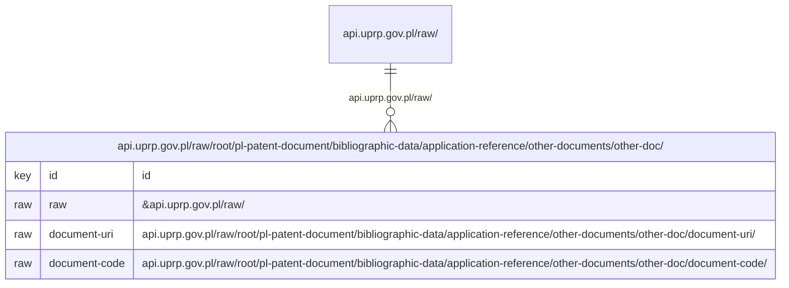
```mermaid
erDiagram

"api.uprp.gov.pl/raw/root/pl-patent-document/bibliographic-data/application-reference/other-documents/other-doc/"{
  key id "id"
  raw raw "&api.uprp.gov.pl/raw/"
  raw document-uri "api.uprp.gov.pl/raw/root/pl-patent-document/bibliographic-data/application-reference/other-documents/other-doc/document-uri/"
  raw document-code "api.uprp.gov.pl/raw/root/pl-patent-document/bibliographic-data/application-reference/other-documents/other-doc/document-code/" }
"api.uprp.gov.pl/raw/" ||--o{ "api.uprp.gov.pl/raw/root/pl-patent-document/bibliographic-data/application-reference/other-documents/other-doc/" : "api.uprp.gov.pl/raw/"

```

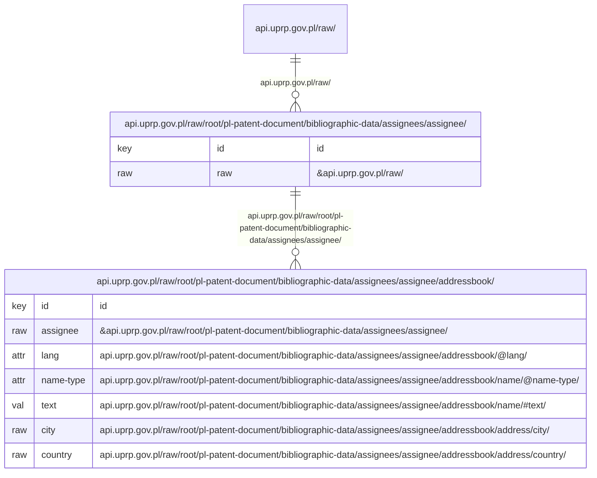
```mermaid
erDiagram

"api.uprp.gov.pl/raw/root/pl-patent-document/bibliographic-data/assignees/assignee/addressbook/"{
  key id "id"
  raw assignee "&api.uprp.gov.pl/raw/root/pl-patent-document/bibliographic-data/assignees/assignee/"
  attr lang "api.uprp.gov.pl/raw/root/pl-patent-document/bibliographic-data/assignees/assignee/addressbook/@lang/"
  attr name-type "api.uprp.gov.pl/raw/root/pl-patent-document/bibliographic-data/assignees/assignee/addressbook/name/@name-type/"
  val text "api.uprp.gov.pl/raw/root/pl-patent-document/bibliographic-data/assignees/assignee/addressbook/name/#text/"
  raw city "api.uprp.gov.pl/raw/root/pl-patent-document/bibliographic-data/assignees/assignee/addressbook/address/city/"
  raw country "api.uprp.gov.pl/raw/root/pl-patent-document/bibliographic-data/assignees/assignee/addressbook/address/country/" }
"api.uprp.gov.pl/raw/root/pl-patent-document/bibliographic-data/assignees/assignee/"{
  key id "id"
  raw raw "&api.uprp.gov.pl/raw/" }
"api.uprp.gov.pl/raw/root/pl-patent-document/bibliographic-data/assignees/assignee/" ||--o{ "api.uprp.gov.pl/raw/root/pl-patent-document/bibliographic-data/assignees/assignee/addressbook/" : "api.uprp.gov.pl/raw/root/pl-patent-document/bibliographic-data/assignees/assignee/"
"api.uprp.gov.pl/raw/" ||--o{ "api.uprp.gov.pl/raw/root/pl-patent-document/bibliographic-data/assignees/assignee/" : "api.uprp.gov.pl/raw/"

```

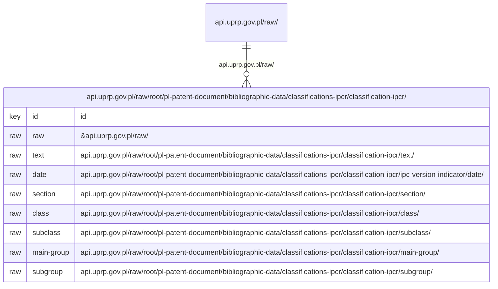
```mermaid
erDiagram

"api.uprp.gov.pl/raw/root/pl-patent-document/bibliographic-data/classifications-ipcr/classification-ipcr/"{
  key id "id"
  raw raw "&api.uprp.gov.pl/raw/"
  raw text "api.uprp.gov.pl/raw/root/pl-patent-document/bibliographic-data/classifications-ipcr/classification-ipcr/text/"
  raw date "api.uprp.gov.pl/raw/root/pl-patent-document/bibliographic-data/classifications-ipcr/classification-ipcr/ipc-version-indicator/date/"
  raw section "api.uprp.gov.pl/raw/root/pl-patent-document/bibliographic-data/classifications-ipcr/classification-ipcr/section/"
  raw class "api.uprp.gov.pl/raw/root/pl-patent-document/bibliographic-data/classifications-ipcr/classification-ipcr/class/"
  raw subclass "api.uprp.gov.pl/raw/root/pl-patent-document/bibliographic-data/classifications-ipcr/classification-ipcr/subclass/"
  raw main-group "api.uprp.gov.pl/raw/root/pl-patent-document/bibliographic-data/classifications-ipcr/classification-ipcr/main-group/"
  raw subgroup "api.uprp.gov.pl/raw/root/pl-patent-document/bibliographic-data/classifications-ipcr/classification-ipcr/subgroup/" }
"api.uprp.gov.pl/raw/" ||--o{ "api.uprp.gov.pl/raw/root/pl-patent-document/bibliographic-data/classifications-ipcr/classification-ipcr/" : "api.uprp.gov.pl/raw/"

```

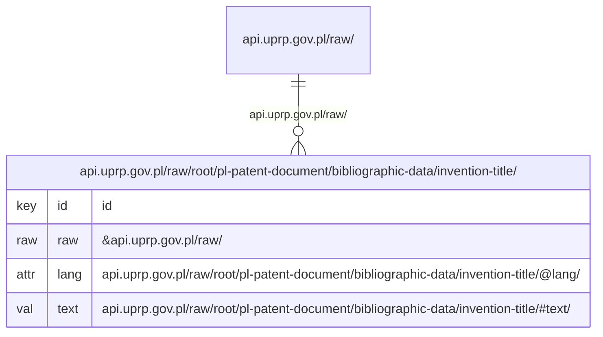
```mermaid
erDiagram

"api.uprp.gov.pl/raw/root/pl-patent-document/bibliographic-data/invention-title/"{
  key id "id"
  raw raw "&api.uprp.gov.pl/raw/"
  attr lang "api.uprp.gov.pl/raw/root/pl-patent-document/bibliographic-data/invention-title/@lang/"
  val text "api.uprp.gov.pl/raw/root/pl-patent-document/bibliographic-data/invention-title/#text/" }
"api.uprp.gov.pl/raw/" ||--o{ "api.uprp.gov.pl/raw/root/pl-patent-document/bibliographic-data/invention-title/" : "api.uprp.gov.pl/raw/"

```

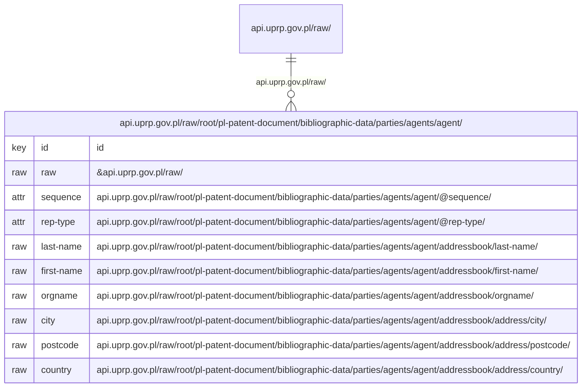
```mermaid
erDiagram

"api.uprp.gov.pl/raw/root/pl-patent-document/bibliographic-data/parties/agents/agent/"{
  key id "id"
  raw raw "&api.uprp.gov.pl/raw/"
  attr sequence "api.uprp.gov.pl/raw/root/pl-patent-document/bibliographic-data/parties/agents/agent/@sequence/"
  attr rep-type "api.uprp.gov.pl/raw/root/pl-patent-document/bibliographic-data/parties/agents/agent/@rep-type/"
  raw last-name "api.uprp.gov.pl/raw/root/pl-patent-document/bibliographic-data/parties/agents/agent/addressbook/last-name/"
  raw first-name "api.uprp.gov.pl/raw/root/pl-patent-document/bibliographic-data/parties/agents/agent/addressbook/first-name/"
  raw orgname "api.uprp.gov.pl/raw/root/pl-patent-document/bibliographic-data/parties/agents/agent/addressbook/orgname/"
  raw city "api.uprp.gov.pl/raw/root/pl-patent-document/bibliographic-data/parties/agents/agent/addressbook/address/city/"
  raw postcode "api.uprp.gov.pl/raw/root/pl-patent-document/bibliographic-data/parties/agents/agent/addressbook/address/postcode/"
  raw country "api.uprp.gov.pl/raw/root/pl-patent-document/bibliographic-data/parties/agents/agent/addressbook/address/country/" }
"api.uprp.gov.pl/raw/" ||--o{ "api.uprp.gov.pl/raw/root/pl-patent-document/bibliographic-data/parties/agents/agent/" : "api.uprp.gov.pl/raw/"

```

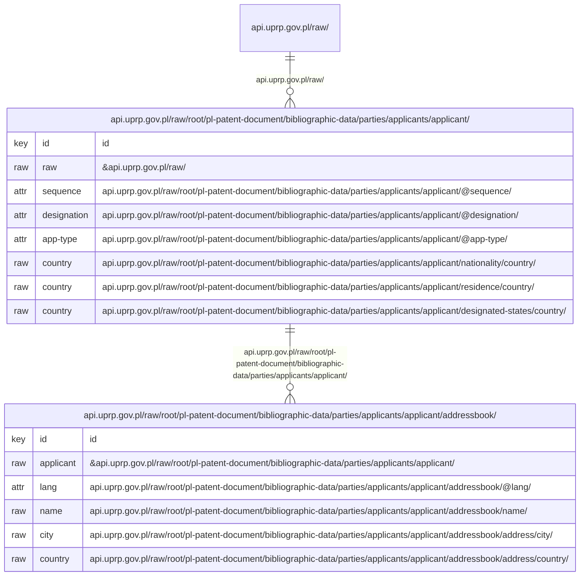
```mermaid
erDiagram

"api.uprp.gov.pl/raw/root/pl-patent-document/bibliographic-data/parties/applicants/applicant/addressbook/"{
  key id "id"
  raw applicant "&api.uprp.gov.pl/raw/root/pl-patent-document/bibliographic-data/parties/applicants/applicant/"
  attr lang "api.uprp.gov.pl/raw/root/pl-patent-document/bibliographic-data/parties/applicants/applicant/addressbook/@lang/"
  raw name "api.uprp.gov.pl/raw/root/pl-patent-document/bibliographic-data/parties/applicants/applicant/addressbook/name/"
  raw city "api.uprp.gov.pl/raw/root/pl-patent-document/bibliographic-data/parties/applicants/applicant/addressbook/address/city/"
  raw country "api.uprp.gov.pl/raw/root/pl-patent-document/bibliographic-data/parties/applicants/applicant/addressbook/address/country/" }
"api.uprp.gov.pl/raw/root/pl-patent-document/bibliographic-data/parties/applicants/applicant/"{
  key id "id"
  raw raw "&api.uprp.gov.pl/raw/"
  attr sequence "api.uprp.gov.pl/raw/root/pl-patent-document/bibliographic-data/parties/applicants/applicant/@sequence/"
  attr designation "api.uprp.gov.pl/raw/root/pl-patent-document/bibliographic-data/parties/applicants/applicant/@designation/"
  attr app-type "api.uprp.gov.pl/raw/root/pl-patent-document/bibliographic-data/parties/applicants/applicant/@app-type/"
  raw country "api.uprp.gov.pl/raw/root/pl-patent-document/bibliographic-data/parties/applicants/applicant/nationality/country/"
  raw country "api.uprp.gov.pl/raw/root/pl-patent-document/bibliographic-data/parties/applicants/applicant/residence/country/"
  raw country "api.uprp.gov.pl/raw/root/pl-patent-document/bibliographic-data/parties/applicants/applicant/designated-states/country/" }
"api.uprp.gov.pl/raw/root/pl-patent-document/bibliographic-data/parties/applicants/applicant/" ||--o{ "api.uprp.gov.pl/raw/root/pl-patent-document/bibliographic-data/parties/applicants/applicant/addressbook/" : "api.uprp.gov.pl/raw/root/pl-patent-document/bibliographic-data/parties/applicants/applicant/"
"api.uprp.gov.pl/raw/" ||--o{ "api.uprp.gov.pl/raw/root/pl-patent-document/bibliographic-data/parties/applicants/applicant/" : "api.uprp.gov.pl/raw/"

```

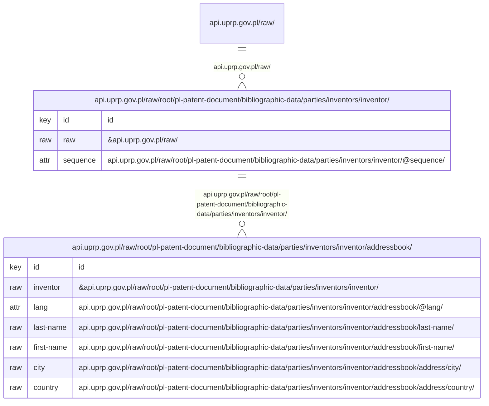
```mermaid
erDiagram

"api.uprp.gov.pl/raw/root/pl-patent-document/bibliographic-data/parties/inventors/inventor/addressbook/"{
  key id "id"
  raw inventor "&api.uprp.gov.pl/raw/root/pl-patent-document/bibliographic-data/parties/inventors/inventor/"
  attr lang "api.uprp.gov.pl/raw/root/pl-patent-document/bibliographic-data/parties/inventors/inventor/addressbook/@lang/"
  raw last-name "api.uprp.gov.pl/raw/root/pl-patent-document/bibliographic-data/parties/inventors/inventor/addressbook/last-name/"
  raw first-name "api.uprp.gov.pl/raw/root/pl-patent-document/bibliographic-data/parties/inventors/inventor/addressbook/first-name/"
  raw city "api.uprp.gov.pl/raw/root/pl-patent-document/bibliographic-data/parties/inventors/inventor/addressbook/address/city/"
  raw country "api.uprp.gov.pl/raw/root/pl-patent-document/bibliographic-data/parties/inventors/inventor/addressbook/address/country/" }
"api.uprp.gov.pl/raw/root/pl-patent-document/bibliographic-data/parties/inventors/inventor/"{
  key id "id"
  raw raw "&api.uprp.gov.pl/raw/"
  attr sequence "api.uprp.gov.pl/raw/root/pl-patent-document/bibliographic-data/parties/inventors/inventor/@sequence/" }
"api.uprp.gov.pl/raw/root/pl-patent-document/bibliographic-data/parties/inventors/inventor/" ||--o{ "api.uprp.gov.pl/raw/root/pl-patent-document/bibliographic-data/parties/inventors/inventor/addressbook/" : "api.uprp.gov.pl/raw/root/pl-patent-document/bibliographic-data/parties/inventors/inventor/"
"api.uprp.gov.pl/raw/" ||--o{ "api.uprp.gov.pl/raw/root/pl-patent-document/bibliographic-data/parties/inventors/inventor/" : "api.uprp.gov.pl/raw/"

```

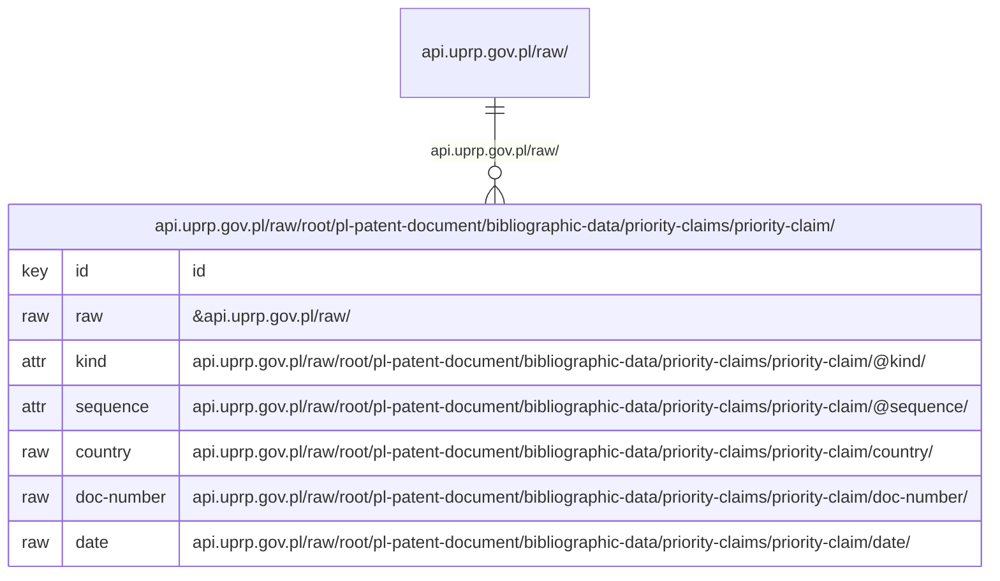
```mermaid
erDiagram

"api.uprp.gov.pl/raw/root/pl-patent-document/bibliographic-data/priority-claims/priority-claim/"{
  key id "id"
  raw raw "&api.uprp.gov.pl/raw/"
  attr kind "api.uprp.gov.pl/raw/root/pl-patent-document/bibliographic-data/priority-claims/priority-claim/@kind/"
  attr sequence "api.uprp.gov.pl/raw/root/pl-patent-document/bibliographic-data/priority-claims/priority-claim/@sequence/"
  raw country "api.uprp.gov.pl/raw/root/pl-patent-document/bibliographic-data/priority-claims/priority-claim/country/"
  raw doc-number "api.uprp.gov.pl/raw/root/pl-patent-document/bibliographic-data/priority-claims/priority-claim/doc-number/"
  raw date "api.uprp.gov.pl/raw/root/pl-patent-document/bibliographic-data/priority-claims/priority-claim/date/" }
"api.uprp.gov.pl/raw/" ||--o{ "api.uprp.gov.pl/raw/root/pl-patent-document/bibliographic-data/priority-claims/priority-claim/" : "api.uprp.gov.pl/raw/"

```

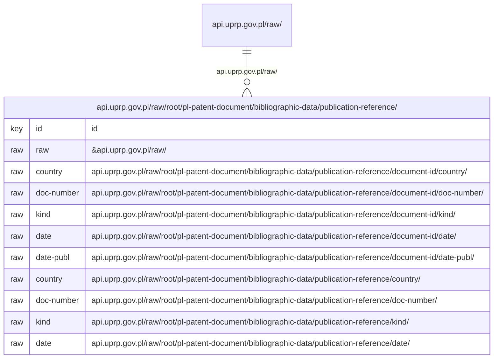
```mermaid
erDiagram

"api.uprp.gov.pl/raw/root/pl-patent-document/bibliographic-data/publication-reference/"{
  key id "id"
  raw raw "&api.uprp.gov.pl/raw/"
  raw country "api.uprp.gov.pl/raw/root/pl-patent-document/bibliographic-data/publication-reference/document-id/country/"
  raw doc-number "api.uprp.gov.pl/raw/root/pl-patent-document/bibliographic-data/publication-reference/document-id/doc-number/"
  raw kind "api.uprp.gov.pl/raw/root/pl-patent-document/bibliographic-data/publication-reference/document-id/kind/"
  raw date "api.uprp.gov.pl/raw/root/pl-patent-document/bibliographic-data/publication-reference/document-id/date/"
  raw date-publ "api.uprp.gov.pl/raw/root/pl-patent-document/bibliographic-data/publication-reference/document-id/date-publ/"
  raw country "api.uprp.gov.pl/raw/root/pl-patent-document/bibliographic-data/publication-reference/country/"
  raw doc-number "api.uprp.gov.pl/raw/root/pl-patent-document/bibliographic-data/publication-reference/doc-number/"
  raw kind "api.uprp.gov.pl/raw/root/pl-patent-document/bibliographic-data/publication-reference/kind/"
  raw date "api.uprp.gov.pl/raw/root/pl-patent-document/bibliographic-data/publication-reference/date/" }
"api.uprp.gov.pl/raw/" ||--o{ "api.uprp.gov.pl/raw/root/pl-patent-document/bibliographic-data/publication-reference/" : "api.uprp.gov.pl/raw/"

```

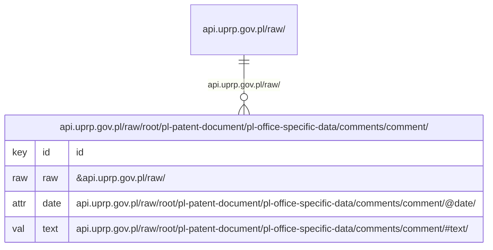
```mermaid
erDiagram

"api.uprp.gov.pl/raw/root/pl-patent-document/pl-office-specific-data/comments/comment/"{
  key id "id"
  raw raw "&api.uprp.gov.pl/raw/"
  attr date "api.uprp.gov.pl/raw/root/pl-patent-document/pl-office-specific-data/comments/comment/@date/"
  val text "api.uprp.gov.pl/raw/root/pl-patent-document/pl-office-specific-data/comments/comment/#text/" }
"api.uprp.gov.pl/raw/" ||--o{ "api.uprp.gov.pl/raw/root/pl-patent-document/pl-office-specific-data/comments/comment/" : "api.uprp.gov.pl/raw/"

```

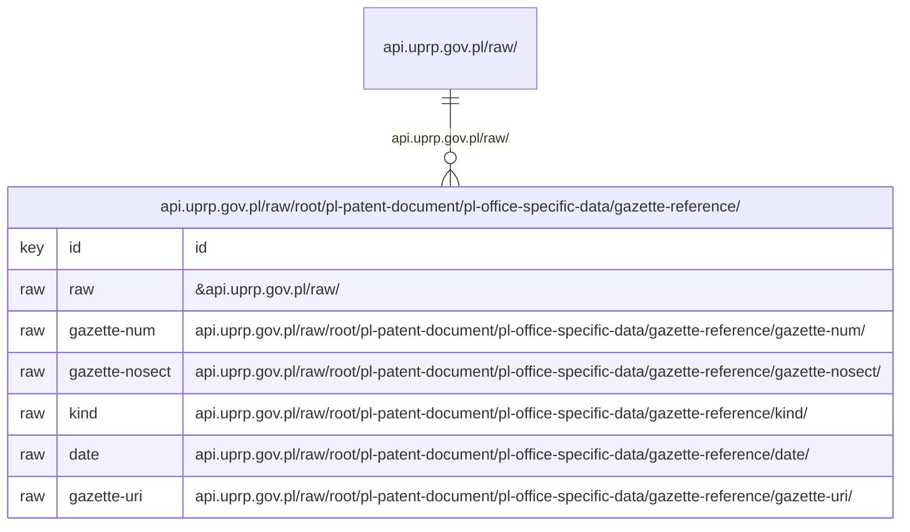
```mermaid
erDiagram

"api.uprp.gov.pl/raw/root/pl-patent-document/pl-office-specific-data/gazette-reference/"{
  key id "id"
  raw raw "&api.uprp.gov.pl/raw/"
  raw gazette-num "api.uprp.gov.pl/raw/root/pl-patent-document/pl-office-specific-data/gazette-reference/gazette-num/"
  raw gazette-nosect "api.uprp.gov.pl/raw/root/pl-patent-document/pl-office-specific-data/gazette-reference/gazette-nosect/"
  raw kind "api.uprp.gov.pl/raw/root/pl-patent-document/pl-office-specific-data/gazette-reference/kind/"
  raw date "api.uprp.gov.pl/raw/root/pl-patent-document/pl-office-specific-data/gazette-reference/date/"
  raw gazette-uri "api.uprp.gov.pl/raw/root/pl-patent-document/pl-office-specific-data/gazette-reference/gazette-uri/" }
"api.uprp.gov.pl/raw/" ||--o{ "api.uprp.gov.pl/raw/root/pl-patent-document/pl-office-specific-data/gazette-reference/" : "api.uprp.gov.pl/raw/"

```

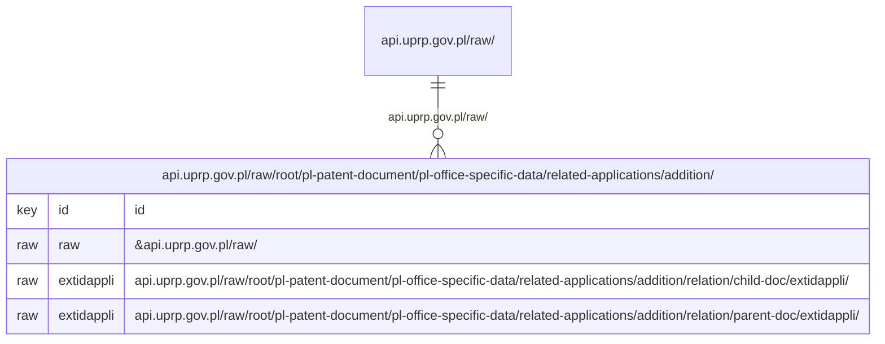
```mermaid
erDiagram

"api.uprp.gov.pl/raw/root/pl-patent-document/pl-office-specific-data/related-applications/addition/"{
  key id "id"
  raw raw "&api.uprp.gov.pl/raw/"
  raw extidappli "api.uprp.gov.pl/raw/root/pl-patent-document/pl-office-specific-data/related-applications/addition/relation/child-doc/extidappli/"
  raw extidappli "api.uprp.gov.pl/raw/root/pl-patent-document/pl-office-specific-data/related-applications/addition/relation/parent-doc/extidappli/" }
"api.uprp.gov.pl/raw/" ||--o{ "api.uprp.gov.pl/raw/root/pl-patent-document/pl-office-specific-data/related-applications/addition/" : "api.uprp.gov.pl/raw/"

```

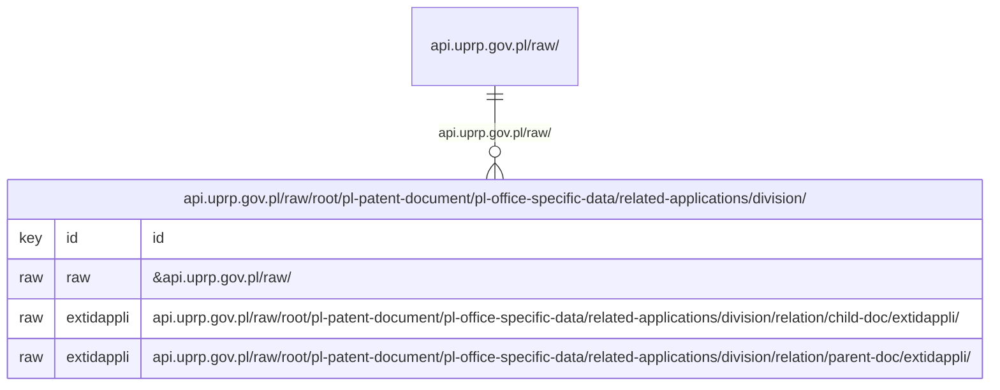
```mermaid
erDiagram

"api.uprp.gov.pl/raw/root/pl-patent-document/pl-office-specific-data/related-applications/division/"{
  key id "id"
  raw raw "&api.uprp.gov.pl/raw/"
  raw extidappli "api.uprp.gov.pl/raw/root/pl-patent-document/pl-office-specific-data/related-applications/division/relation/child-doc/extidappli/"
  raw extidappli "api.uprp.gov.pl/raw/root/pl-patent-document/pl-office-specific-data/related-applications/division/relation/parent-doc/extidappli/" }
"api.uprp.gov.pl/raw/" ||--o{ "api.uprp.gov.pl/raw/root/pl-patent-document/pl-office-specific-data/related-applications/division/" : "api.uprp.gov.pl/raw/"

```

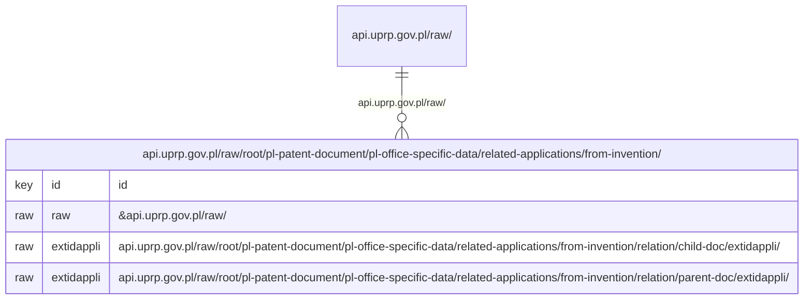
```mermaid
erDiagram

"api.uprp.gov.pl/raw/root/pl-patent-document/pl-office-specific-data/related-applications/from-invention/"{
  key id "id"
  raw raw "&api.uprp.gov.pl/raw/"
  raw extidappli "api.uprp.gov.pl/raw/root/pl-patent-document/pl-office-specific-data/related-applications/from-invention/relation/child-doc/extidappli/"
  raw extidappli "api.uprp.gov.pl/raw/root/pl-patent-document/pl-office-specific-data/related-applications/from-invention/relation/parent-doc/extidappli/" }
"api.uprp.gov.pl/raw/" ||--o{ "api.uprp.gov.pl/raw/root/pl-patent-document/pl-office-specific-data/related-applications/from-invention/" : "api.uprp.gov.pl/raw/"

```

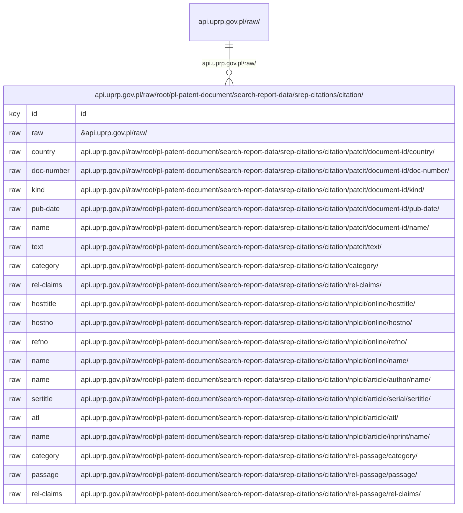
```mermaid
erDiagram

"api.uprp.gov.pl/raw/root/pl-patent-document/search-report-data/srep-citations/citation/"{
  key id "id"
  raw raw "&api.uprp.gov.pl/raw/"
  raw country "api.uprp.gov.pl/raw/root/pl-patent-document/search-report-data/srep-citations/citation/patcit/document-id/country/"
  raw doc-number "api.uprp.gov.pl/raw/root/pl-patent-document/search-report-data/srep-citations/citation/patcit/document-id/doc-number/"
  raw kind "api.uprp.gov.pl/raw/root/pl-patent-document/search-report-data/srep-citations/citation/patcit/document-id/kind/"
  raw pub-date "api.uprp.gov.pl/raw/root/pl-patent-document/search-report-data/srep-citations/citation/patcit/document-id/pub-date/"
  raw name "api.uprp.gov.pl/raw/root/pl-patent-document/search-report-data/srep-citations/citation/patcit/document-id/name/"
  raw text "api.uprp.gov.pl/raw/root/pl-patent-document/search-report-data/srep-citations/citation/patcit/text/"
  raw category "api.uprp.gov.pl/raw/root/pl-patent-document/search-report-data/srep-citations/citation/category/"
  raw rel-claims "api.uprp.gov.pl/raw/root/pl-patent-document/search-report-data/srep-citations/citation/rel-claims/"
  raw hosttitle "api.uprp.gov.pl/raw/root/pl-patent-document/search-report-data/srep-citations/citation/nplcit/online/hosttitle/"
  raw hostno "api.uprp.gov.pl/raw/root/pl-patent-document/search-report-data/srep-citations/citation/nplcit/online/hostno/"
  raw refno "api.uprp.gov.pl/raw/root/pl-patent-document/search-report-data/srep-citations/citation/nplcit/online/refno/"
  raw name "api.uprp.gov.pl/raw/root/pl-patent-document/search-report-data/srep-citations/citation/nplcit/online/name/"
  raw name "api.uprp.gov.pl/raw/root/pl-patent-document/search-report-data/srep-citations/citation/nplcit/article/author/name/"
  raw sertitle "api.uprp.gov.pl/raw/root/pl-patent-document/search-report-data/srep-citations/citation/nplcit/article/serial/sertitle/"
  raw atl "api.uprp.gov.pl/raw/root/pl-patent-document/search-report-data/srep-citations/citation/nplcit/article/atl/"
  raw name "api.uprp.gov.pl/raw/root/pl-patent-document/search-report-data/srep-citations/citation/nplcit/article/inprint/name/"
  raw category "api.uprp.gov.pl/raw/root/pl-patent-document/search-report-data/srep-citations/citation/rel-passage/category/"
  raw passage "api.uprp.gov.pl/raw/root/pl-patent-document/search-report-data/srep-citations/citation/rel-passage/passage/"
  raw rel-claims "api.uprp.gov.pl/raw/root/pl-patent-document/search-report-data/srep-citations/citation/rel-passage/rel-claims/" }
"api.uprp.gov.pl/raw/" ||--o{ "api.uprp.gov.pl/raw/root/pl-patent-document/search-report-data/srep-citations/citation/" : "api.uprp.gov.pl/raw/"

```

<!-- end:profile.py -->