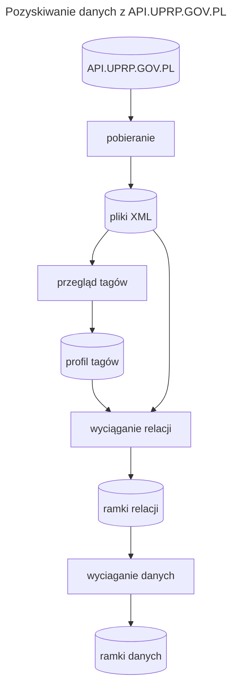

Dane UPRP
=========

```mermaid
---
title: Pozyskiwanie danych z API.UPRP.GOV.PL
---
graph TB
API[(API.UPRP.GOV.PL)]
raw/*.xml[(pliki XML)]
XML.profile.json[(profil tagów)]
frames/**/*.csv[(ramki relacji)]
*.csv[(ramki danych)]

scrap.R[pobieranie]
XML.profile.py[przegląd tagów]
relations.py[wyciąganie relacji]
frame.py[wyciaganie danych]

API --> scrap.R
    --> raw/*.xml
    --> XML.profile.py
    --> XML.profile.json
    --> relations.py
    --> frames/**/*.csv
    --> frame.py
    --> *.csv

raw/*.xml --> relations.py
```