Wierzchołki
===========

Wygenerowany schemat danych
---------------------------

<!-- gen:profile.py -->

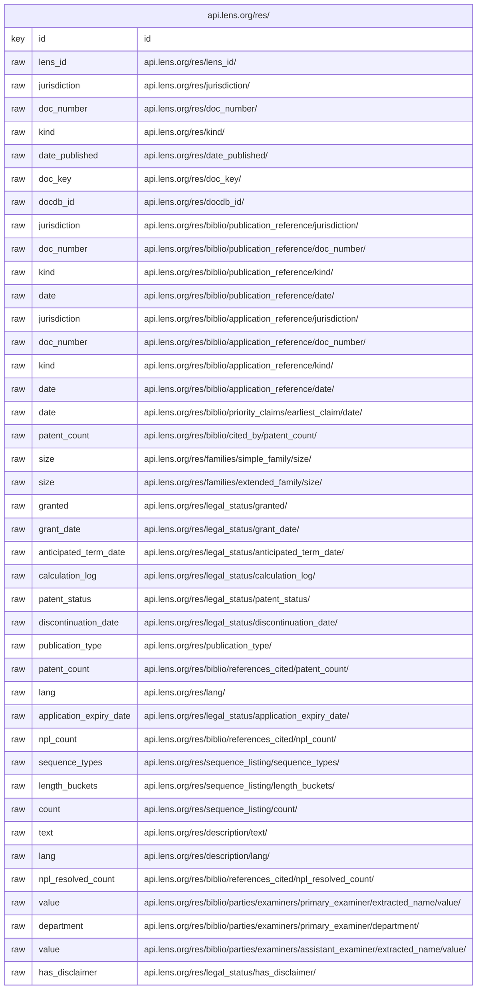
```mermaid
erDiagram

"api.lens.org/res/"{
  key id "id"
  raw lens_id "api.lens.org/res/lens_id/"
  raw jurisdiction "api.lens.org/res/jurisdiction/"
  raw doc_number "api.lens.org/res/doc_number/"
  raw kind "api.lens.org/res/kind/"
  raw date_published "api.lens.org/res/date_published/"
  raw doc_key "api.lens.org/res/doc_key/"
  raw docdb_id "api.lens.org/res/docdb_id/"
  raw jurisdiction "api.lens.org/res/biblio/publication_reference/jurisdiction/"
  raw doc_number "api.lens.org/res/biblio/publication_reference/doc_number/"
  raw kind "api.lens.org/res/biblio/publication_reference/kind/"
  raw date "api.lens.org/res/biblio/publication_reference/date/"
  raw jurisdiction "api.lens.org/res/biblio/application_reference/jurisdiction/"
  raw doc_number "api.lens.org/res/biblio/application_reference/doc_number/"
  raw kind "api.lens.org/res/biblio/application_reference/kind/"
  raw date "api.lens.org/res/biblio/application_reference/date/"
  raw date "api.lens.org/res/biblio/priority_claims/earliest_claim/date/"
  raw patent_count "api.lens.org/res/biblio/cited_by/patent_count/"
  raw size "api.lens.org/res/families/simple_family/size/"
  raw size "api.lens.org/res/families/extended_family/size/"
  raw granted "api.lens.org/res/legal_status/granted/"
  raw grant_date "api.lens.org/res/legal_status/grant_date/"
  raw anticipated_term_date "api.lens.org/res/legal_status/anticipated_term_date/"
  raw calculation_log "api.lens.org/res/legal_status/calculation_log/"
  raw patent_status "api.lens.org/res/legal_status/patent_status/"
  raw discontinuation_date "api.lens.org/res/legal_status/discontinuation_date/"
  raw publication_type "api.lens.org/res/publication_type/"
  raw patent_count "api.lens.org/res/biblio/references_cited/patent_count/"
  raw lang "api.lens.org/res/lang/"
  raw application_expiry_date "api.lens.org/res/legal_status/application_expiry_date/"
  raw npl_count "api.lens.org/res/biblio/references_cited/npl_count/"
  raw sequence_types "api.lens.org/res/sequence_listing/sequence_types/"
  raw length_buckets "api.lens.org/res/sequence_listing/length_buckets/"
  raw count "api.lens.org/res/sequence_listing/count/"
  raw text "api.lens.org/res/description/text/"
  raw lang "api.lens.org/res/description/lang/"
  raw npl_resolved_count "api.lens.org/res/biblio/references_cited/npl_resolved_count/"
  raw value "api.lens.org/res/biblio/parties/examiners/primary_examiner/extracted_name/value/"
  raw department "api.lens.org/res/biblio/parties/examiners/primary_examiner/department/"
  raw value "api.lens.org/res/biblio/parties/examiners/assistant_examiner/extracted_name/value/"
  raw has_disclaimer "api.lens.org/res/legal_status/has_disclaimer/" }

```

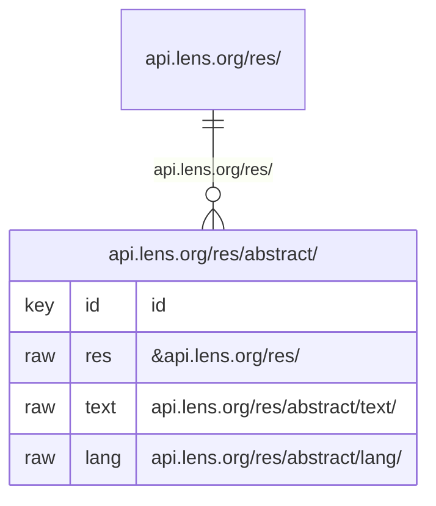
```mermaid
erDiagram

"api.lens.org/res/abstract/"{
  key id "id"
  raw res "&api.lens.org/res/"
  raw text "api.lens.org/res/abstract/text/"
  raw lang "api.lens.org/res/abstract/lang/" }
"api.lens.org/res/" ||--o{ "api.lens.org/res/abstract/" : "api.lens.org/res/"

```

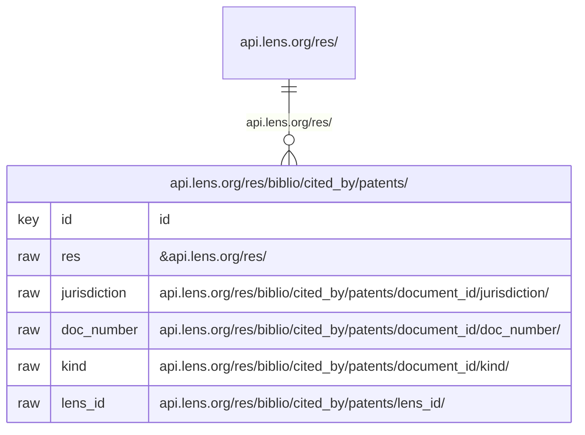
```mermaid
erDiagram

"api.lens.org/res/biblio/cited_by/patents/"{
  key id "id"
  raw res "&api.lens.org/res/"
  raw jurisdiction "api.lens.org/res/biblio/cited_by/patents/document_id/jurisdiction/"
  raw doc_number "api.lens.org/res/biblio/cited_by/patents/document_id/doc_number/"
  raw kind "api.lens.org/res/biblio/cited_by/patents/document_id/kind/"
  raw lens_id "api.lens.org/res/biblio/cited_by/patents/lens_id/" }
"api.lens.org/res/" ||--o{ "api.lens.org/res/biblio/cited_by/patents/" : "api.lens.org/res/"

```

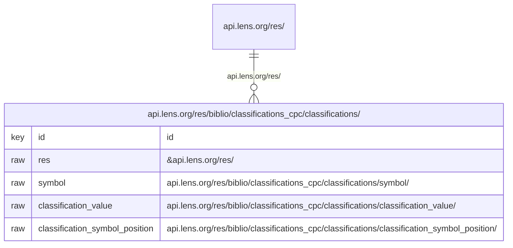
```mermaid
erDiagram

"api.lens.org/res/biblio/classifications_cpc/classifications/"{
  key id "id"
  raw res "&api.lens.org/res/"
  raw symbol "api.lens.org/res/biblio/classifications_cpc/classifications/symbol/"
  raw classification_value "api.lens.org/res/biblio/classifications_cpc/classifications/classification_value/"
  raw classification_symbol_position "api.lens.org/res/biblio/classifications_cpc/classifications/classification_symbol_position/" }
"api.lens.org/res/" ||--o{ "api.lens.org/res/biblio/classifications_cpc/classifications/" : "api.lens.org/res/"

```

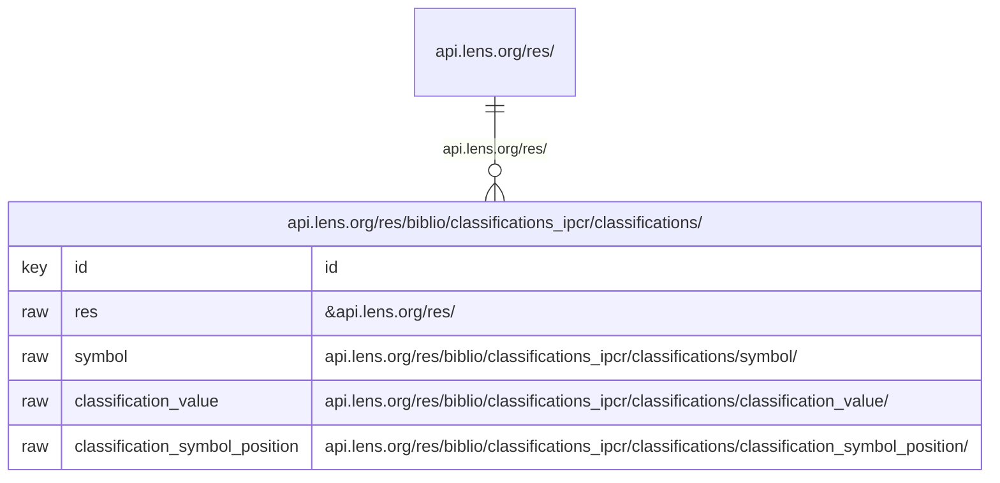
```mermaid
erDiagram

"api.lens.org/res/biblio/classifications_ipcr/classifications/"{
  key id "id"
  raw res "&api.lens.org/res/"
  raw symbol "api.lens.org/res/biblio/classifications_ipcr/classifications/symbol/"
  raw classification_value "api.lens.org/res/biblio/classifications_ipcr/classifications/classification_value/"
  raw classification_symbol_position "api.lens.org/res/biblio/classifications_ipcr/classifications/classification_symbol_position/" }
"api.lens.org/res/" ||--o{ "api.lens.org/res/biblio/classifications_ipcr/classifications/" : "api.lens.org/res/"

```

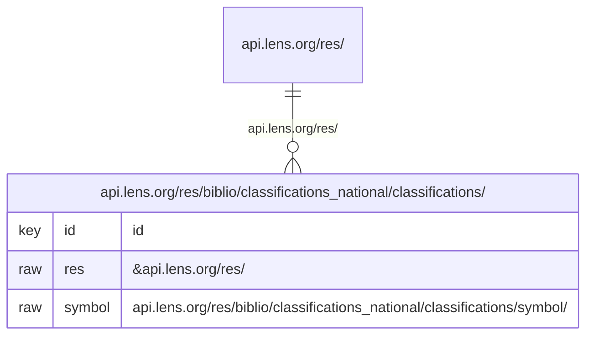
```mermaid
erDiagram

"api.lens.org/res/biblio/classifications_national/classifications/"{
  key id "id"
  raw res "&api.lens.org/res/"
  raw symbol "api.lens.org/res/biblio/classifications_national/classifications/symbol/" }
"api.lens.org/res/" ||--o{ "api.lens.org/res/biblio/classifications_national/classifications/" : "api.lens.org/res/"

```

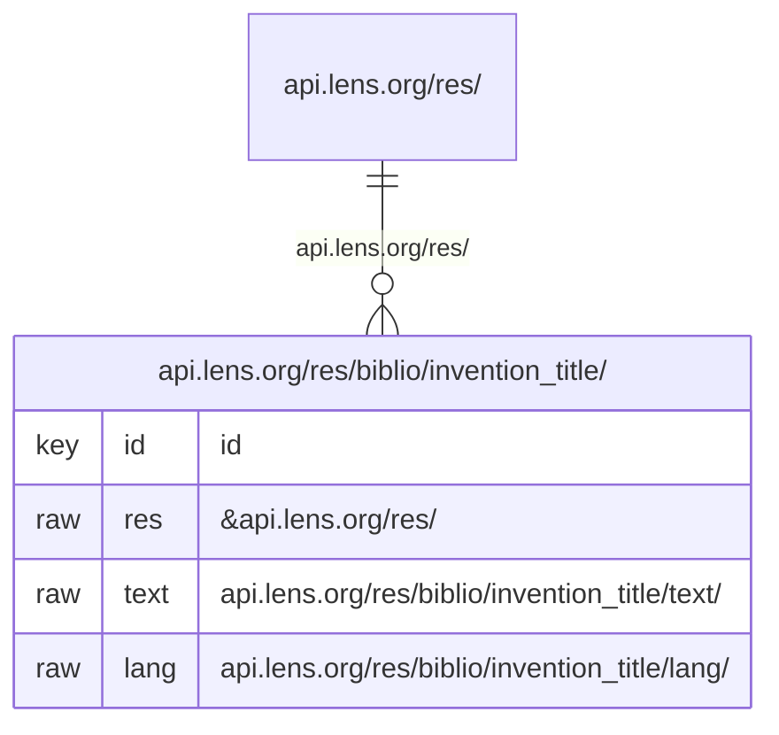
```mermaid
erDiagram

"api.lens.org/res/biblio/invention_title/"{
  key id "id"
  raw res "&api.lens.org/res/"
  raw text "api.lens.org/res/biblio/invention_title/text/"
  raw lang "api.lens.org/res/biblio/invention_title/lang/" }
"api.lens.org/res/" ||--o{ "api.lens.org/res/biblio/invention_title/" : "api.lens.org/res/"

```

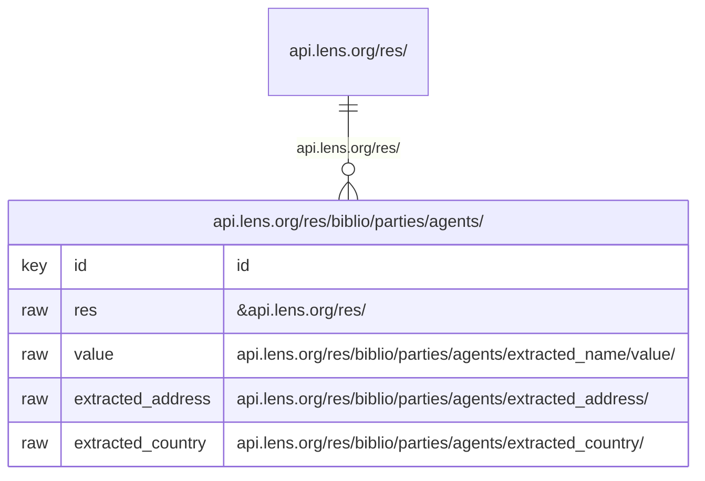
```mermaid
erDiagram

"api.lens.org/res/biblio/parties/agents/"{
  key id "id"
  raw res "&api.lens.org/res/"
  raw value "api.lens.org/res/biblio/parties/agents/extracted_name/value/"
  raw extracted_address "api.lens.org/res/biblio/parties/agents/extracted_address/"
  raw extracted_country "api.lens.org/res/biblio/parties/agents/extracted_country/" }
"api.lens.org/res/" ||--o{ "api.lens.org/res/biblio/parties/agents/" : "api.lens.org/res/"

```

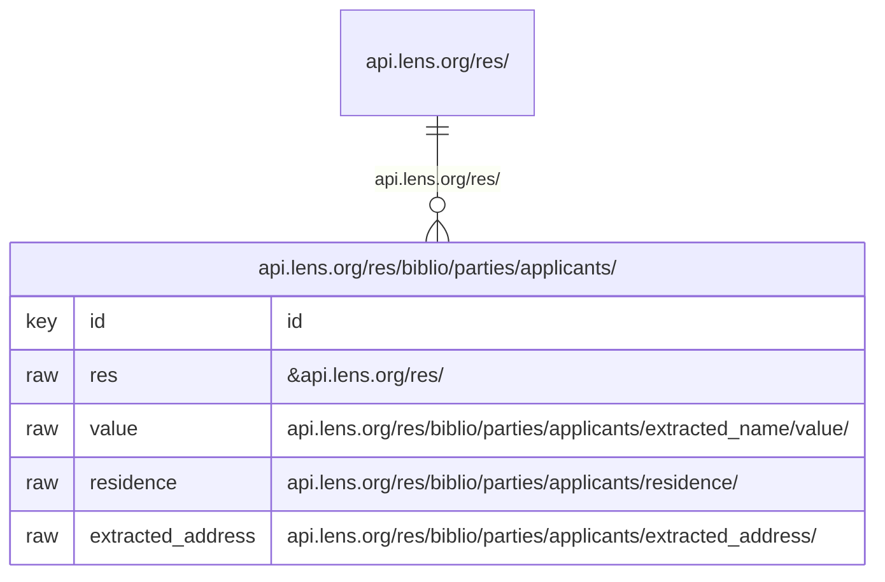
```mermaid
erDiagram

"api.lens.org/res/biblio/parties/applicants/"{
  key id "id"
  raw res "&api.lens.org/res/"
  raw value "api.lens.org/res/biblio/parties/applicants/extracted_name/value/"
  raw residence "api.lens.org/res/biblio/parties/applicants/residence/"
  raw extracted_address "api.lens.org/res/biblio/parties/applicants/extracted_address/" }
"api.lens.org/res/" ||--o{ "api.lens.org/res/biblio/parties/applicants/" : "api.lens.org/res/"

```

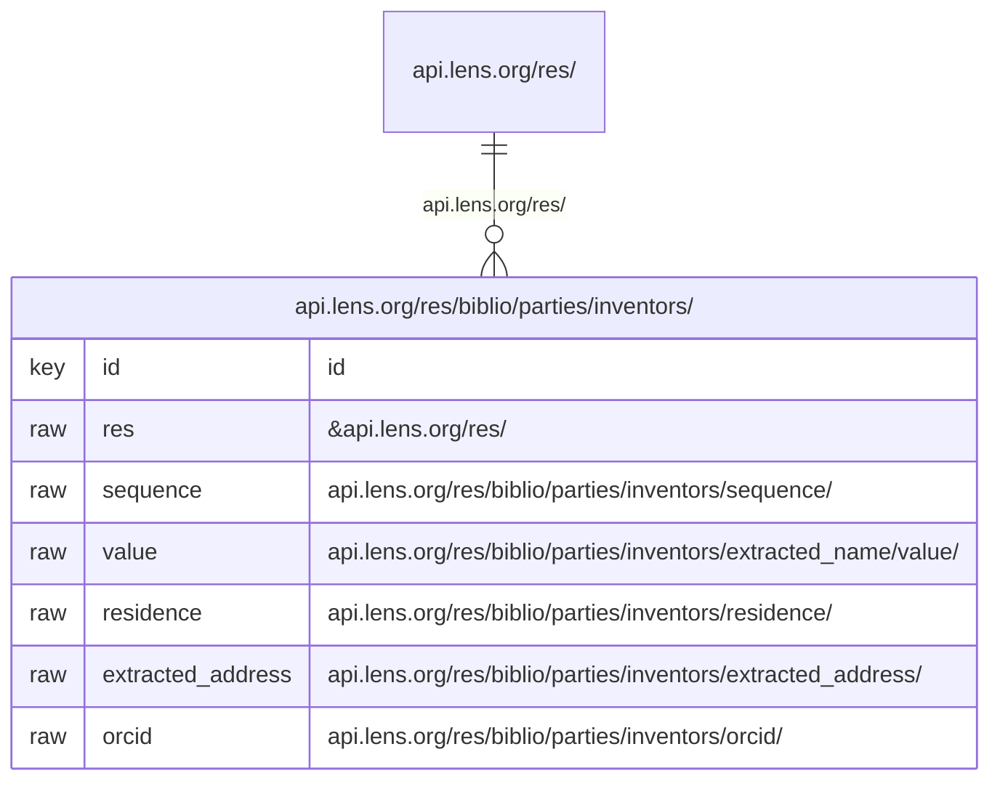
```mermaid
erDiagram

"api.lens.org/res/biblio/parties/inventors/"{
  key id "id"
  raw res "&api.lens.org/res/"
  raw sequence "api.lens.org/res/biblio/parties/inventors/sequence/"
  raw value "api.lens.org/res/biblio/parties/inventors/extracted_name/value/"
  raw residence "api.lens.org/res/biblio/parties/inventors/residence/"
  raw extracted_address "api.lens.org/res/biblio/parties/inventors/extracted_address/"
  raw orcid "api.lens.org/res/biblio/parties/inventors/orcid/" }
"api.lens.org/res/" ||--o{ "api.lens.org/res/biblio/parties/inventors/" : "api.lens.org/res/"

```

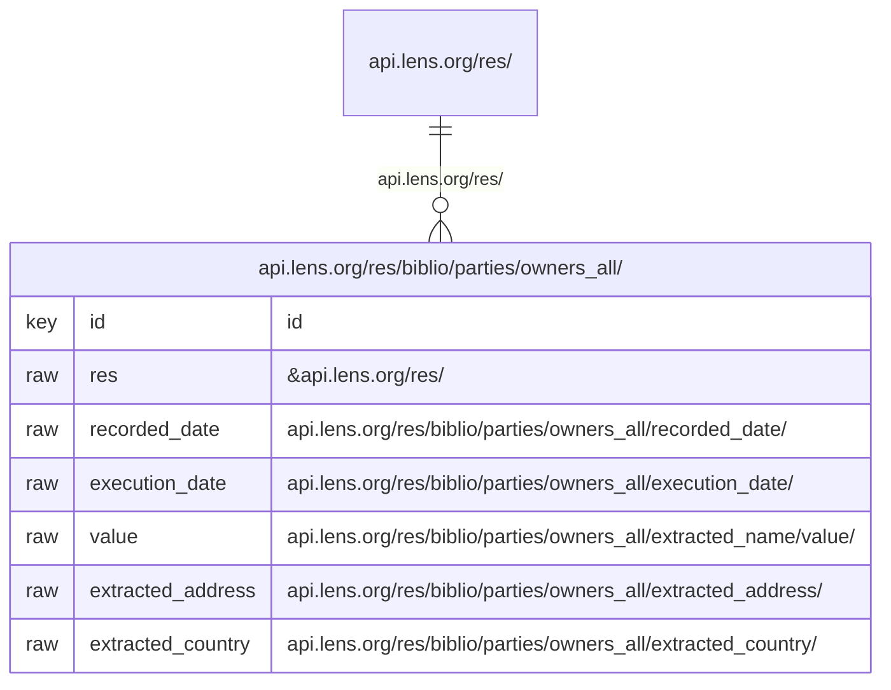
```mermaid
erDiagram

"api.lens.org/res/biblio/parties/owners_all/"{
  key id "id"
  raw res "&api.lens.org/res/"
  raw recorded_date "api.lens.org/res/biblio/parties/owners_all/recorded_date/"
  raw execution_date "api.lens.org/res/biblio/parties/owners_all/execution_date/"
  raw value "api.lens.org/res/biblio/parties/owners_all/extracted_name/value/"
  raw extracted_address "api.lens.org/res/biblio/parties/owners_all/extracted_address/"
  raw extracted_country "api.lens.org/res/biblio/parties/owners_all/extracted_country/" }
"api.lens.org/res/" ||--o{ "api.lens.org/res/biblio/parties/owners_all/" : "api.lens.org/res/"

```

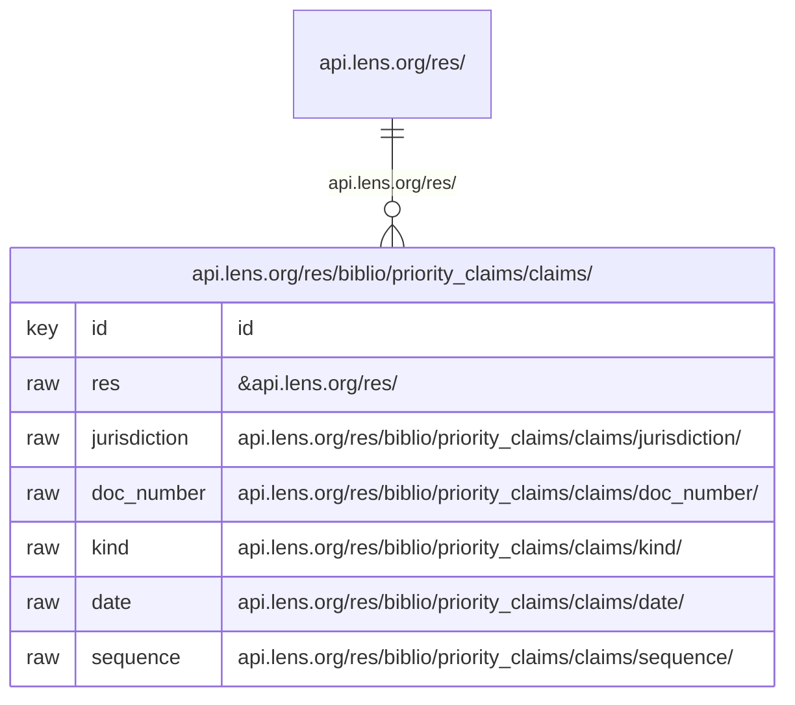
```mermaid
erDiagram

"api.lens.org/res/biblio/priority_claims/claims/"{
  key id "id"
  raw res "&api.lens.org/res/"
  raw jurisdiction "api.lens.org/res/biblio/priority_claims/claims/jurisdiction/"
  raw doc_number "api.lens.org/res/biblio/priority_claims/claims/doc_number/"
  raw kind "api.lens.org/res/biblio/priority_claims/claims/kind/"
  raw date "api.lens.org/res/biblio/priority_claims/claims/date/"
  raw sequence "api.lens.org/res/biblio/priority_claims/claims/sequence/" }
"api.lens.org/res/" ||--o{ "api.lens.org/res/biblio/priority_claims/claims/" : "api.lens.org/res/"

```

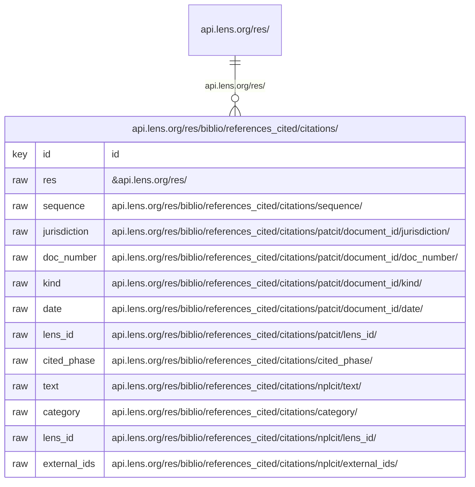
```mermaid
erDiagram

"api.lens.org/res/biblio/references_cited/citations/"{
  key id "id"
  raw res "&api.lens.org/res/"
  raw sequence "api.lens.org/res/biblio/references_cited/citations/sequence/"
  raw jurisdiction "api.lens.org/res/biblio/references_cited/citations/patcit/document_id/jurisdiction/"
  raw doc_number "api.lens.org/res/biblio/references_cited/citations/patcit/document_id/doc_number/"
  raw kind "api.lens.org/res/biblio/references_cited/citations/patcit/document_id/kind/"
  raw date "api.lens.org/res/biblio/references_cited/citations/patcit/document_id/date/"
  raw lens_id "api.lens.org/res/biblio/references_cited/citations/patcit/lens_id/"
  raw cited_phase "api.lens.org/res/biblio/references_cited/citations/cited_phase/"
  raw text "api.lens.org/res/biblio/references_cited/citations/nplcit/text/"
  raw category "api.lens.org/res/biblio/references_cited/citations/category/"
  raw lens_id "api.lens.org/res/biblio/references_cited/citations/nplcit/lens_id/"
  raw external_ids "api.lens.org/res/biblio/references_cited/citations/nplcit/external_ids/" }
"api.lens.org/res/" ||--o{ "api.lens.org/res/biblio/references_cited/citations/" : "api.lens.org/res/"

```

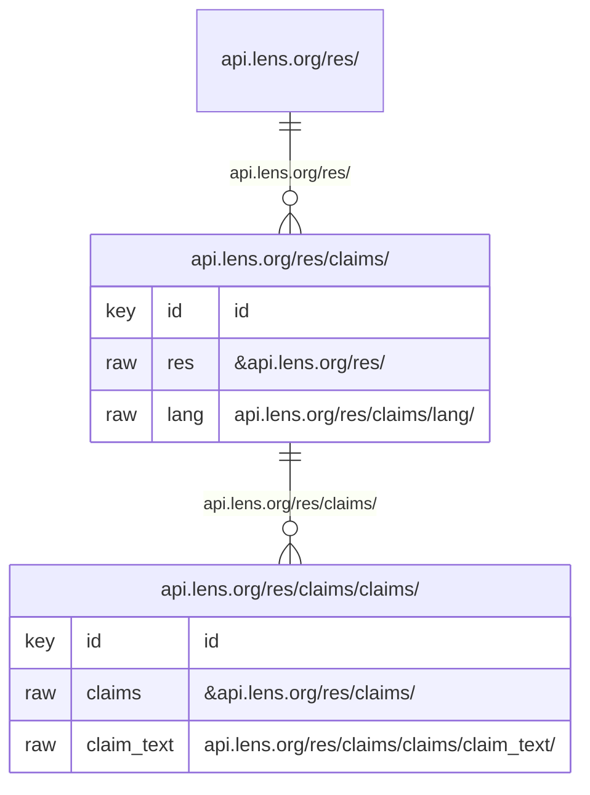
```mermaid
erDiagram

"api.lens.org/res/claims/claims/"{
  key id "id"
  raw claims "&api.lens.org/res/claims/"
  raw claim_text "api.lens.org/res/claims/claims/claim_text/" }
"api.lens.org/res/claims/"{
  key id "id"
  raw res "&api.lens.org/res/"
  raw lang "api.lens.org/res/claims/lang/" }
"api.lens.org/res/claims/" ||--o{ "api.lens.org/res/claims/claims/" : "api.lens.org/res/claims/"
"api.lens.org/res/" ||--o{ "api.lens.org/res/claims/" : "api.lens.org/res/"

```

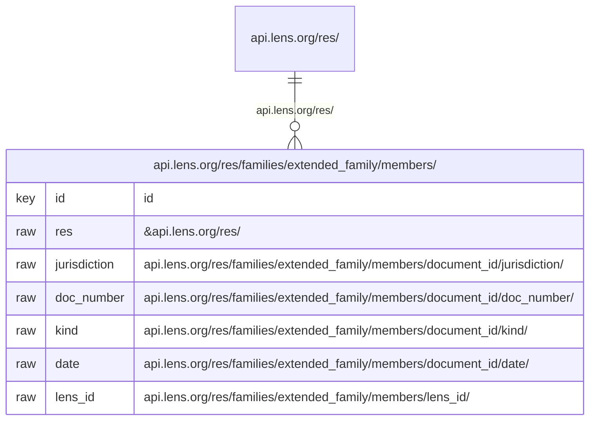
```mermaid
erDiagram

"api.lens.org/res/families/extended_family/members/"{
  key id "id"
  raw res "&api.lens.org/res/"
  raw jurisdiction "api.lens.org/res/families/extended_family/members/document_id/jurisdiction/"
  raw doc_number "api.lens.org/res/families/extended_family/members/document_id/doc_number/"
  raw kind "api.lens.org/res/families/extended_family/members/document_id/kind/"
  raw date "api.lens.org/res/families/extended_family/members/document_id/date/"
  raw lens_id "api.lens.org/res/families/extended_family/members/lens_id/" }
"api.lens.org/res/" ||--o{ "api.lens.org/res/families/extended_family/members/" : "api.lens.org/res/"

```

```mermaid
erDiagram

"api.lens.org/res/families/simple_family/members/"{
  key id "id"
  raw res "&api.lens.org/res/"
  raw jurisdiction "api.lens.org/res/families/simple_family/members/document_id/jurisdiction/"
  raw doc_number "api.lens.org/res/families/simple_family/members/document_id/doc_number/"
  raw kind "api.lens.org/res/families/simple_family/members/document_id/kind/"
  raw date "api.lens.org/res/families/simple_family/members/document_id/date/"
  raw lens_id "api.lens.org/res/families/simple_family/members/lens_id/" }
"api.lens.org/res/" ||--o{ "api.lens.org/res/families/simple_family/members/" : "api.lens.org/res/"

```

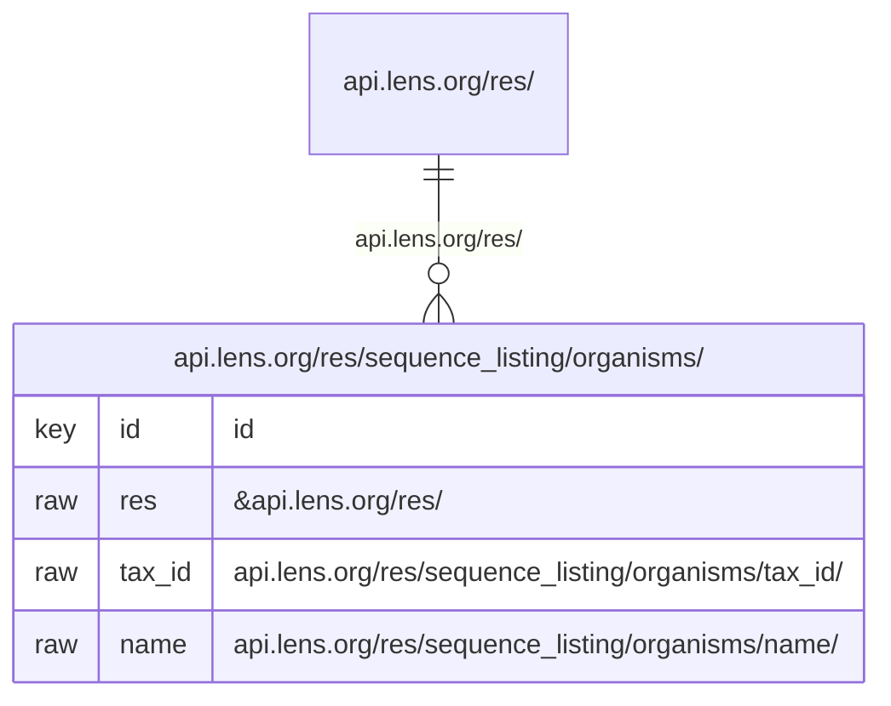
```mermaid
erDiagram

"api.lens.org/res/sequence_listing/organisms/"{
  key id "id"
  raw res "&api.lens.org/res/"
  raw tax_id "api.lens.org/res/sequence_listing/organisms/tax_id/"
  raw name "api.lens.org/res/sequence_listing/organisms/name/" }
"api.lens.org/res/" ||--o{ "api.lens.org/res/sequence_listing/organisms/" : "api.lens.org/res/"

```

```mermaid
erDiagram

"api.uprp.gov.pl/raw/"{
  key id "id"
  attr lang "api.uprp.gov.pl/raw/root/pl-patent-document/@lang/"
  attr country "api.uprp.gov.pl/raw/root/pl-patent-document/@country/"
  attr doc-number "api.uprp.gov.pl/raw/root/pl-patent-document/@doc-number/"
  attr kind "api.uprp.gov.pl/raw/root/pl-patent-document/@kind/"
  attr date-publ "api.uprp.gov.pl/raw/root/pl-patent-document/@date-publ/"
  raw edition "api.uprp.gov.pl/raw/root/pl-patent-document/bibliographic-data/classification-ipc/edition/"
  raw main-classification "api.uprp.gov.pl/raw/root/pl-patent-document/bibliographic-data/classification-ipc/main-classification/"
  raw country "api.uprp.gov.pl/raw/root/pl-patent-document/bibliographic-data/application-reference/document-id/country/"
  raw doc-number "api.uprp.gov.pl/raw/root/pl-patent-document/bibliographic-data/application-reference/document-id/doc-number/"
  raw kind "api.uprp.gov.pl/raw/root/pl-patent-document/bibliographic-data/application-reference/document-id/kind/"
  raw date "api.uprp.gov.pl/raw/root/pl-patent-document/bibliographic-data/application-reference/document-id/date/"
  raw country "api.uprp.gov.pl/raw/root/pl-patent-document/bibliographic-data/dates-of-public-availability/unexamined-printed-without-grant/document-id/country/"
  raw doc-number "api.uprp.gov.pl/raw/root/pl-patent-document/bibliographic-data/dates-of-public-availability/unexamined-printed-without-grant/document-id/doc-number/"
  raw date "api.uprp.gov.pl/raw/root/pl-patent-document/bibliographic-data/dates-of-public-availability/unexamined-printed-without-grant/document-id/date/"
  attr lang "api.uprp.gov.pl/raw/root/pl-patent-document/description/@lang/"
  attr num "api.uprp.gov.pl/raw/root/pl-patent-document/description/p/@num/"
  val text "api.uprp.gov.pl/raw/root/pl-patent-document/description/p/#text/"
  attr lang "api.uprp.gov.pl/raw/root/pl-patent-document/claims/@lang/"
  attr num "api.uprp.gov.pl/raw/root/pl-patent-document/claims/claim/@num/"
  raw claim-text "api.uprp.gov.pl/raw/root/pl-patent-document/claims/claim/claim-text/"
  attr lang "api.uprp.gov.pl/raw/root/pl-patent-document/abstract/@lang/"
  attr num "api.uprp.gov.pl/raw/root/pl-patent-document/abstract/p/@num/"
  val text "api.uprp.gov.pl/raw/root/pl-patent-document/abstract/p/#text/"
  raw source "api.uprp.gov.pl/raw/root/pl-patent-document/pl-office-specific-data/source/"
  raw timestamp "api.uprp.gov.pl/raw/root/pl-patent-document/pl-office-specific-data/timestamp/"
  raw begin-date "api.uprp.gov.pl/raw/root/pl-patent-document/pl-office-specific-data/begin-date/"
  raw end-date "api.uprp.gov.pl/raw/root/pl-patent-document/pl-office-specific-data/end-date/"
  raw status-id "api.uprp.gov.pl/raw/root/pl-patent-document/pl-office-specific-data/status/status-id/"
  raw status-description "api.uprp.gov.pl/raw/root/pl-patent-document/pl-office-specific-data/status/status-description/"
  raw decision-date "api.uprp.gov.pl/raw/root/pl-patent-document/pl-office-specific-data/status/decision-date/"
  raw decision-name "api.uprp.gov.pl/raw/root/pl-patent-document/pl-office-specific-data/status/decision-name/"
  raw extidappli "api.uprp.gov.pl/raw/root/pl-patent-document/pl-office-specific-data/extidappli/"
  raw extidpatent "api.uprp.gov.pl/raw/root/pl-patent-document/pl-office-specific-data/extidpatent/"
  raw dtptexpi "api.uprp.gov.pl/raw/root/pl-patent-document/pl-office-specific-data/dtptexpi/"
  raw cntrenew "api.uprp.gov.pl/raw/root/pl-patent-document/pl-office-specific-data/cntrenew/"
  raw pendingfee-mtftocol "api.uprp.gov.pl/raw/root/pl-patent-document/pl-office-specific-data/pendingfee-mtftocol/"
  raw pendingfee-dtdupay "api.uprp.gov.pl/raw/root/pl-patent-document/pl-office-specific-data/pendingfee-dtdupay/"
  raw date-of-grant "api.uprp.gov.pl/raw/root/pl-patent-document/pl-office-specific-data/date-of-grant/"
  raw further-classification "api.uprp.gov.pl/raw/root/pl-patent-document/bibliographic-data/classification-ipc/further-classification/"
  raw code "api.uprp.gov.pl/raw/root/pl-patent-document/pl-office-specific-data/status/code/"
  raw main-classification "api.uprp.gov.pl/raw/root/pl-patent-document/bibliographic-data/classification-cpc/main-classification/"
  raw further-classification "api.uprp.gov.pl/raw/root/pl-patent-document/bibliographic-data/classification-cpc/further-classification/"
  raw country "api.uprp.gov.pl/raw/root/pl-patent-document/bibliographic-data/pct-or-regional-filing-data/document-id/country/"
  raw doc-number "api.uprp.gov.pl/raw/root/pl-patent-document/bibliographic-data/pct-or-regional-filing-data/document-id/doc-number/"
  raw date "api.uprp.gov.pl/raw/root/pl-patent-document/bibliographic-data/pct-or-regional-filing-data/document-id/date/"
  raw country "api.uprp.gov.pl/raw/root/pl-patent-document/bibliographic-data/pct-or-regional-publishing-data/document-id/country/"
  raw doc-number "api.uprp.gov.pl/raw/root/pl-patent-document/bibliographic-data/pct-or-regional-publishing-data/document-id/doc-number/"
  raw date "api.uprp.gov.pl/raw/root/pl-patent-document/bibliographic-data/pct-or-regional-publishing-data/document-id/date/"
  raw gazette-num "api.uprp.gov.pl/raw/root/pl-patent-document/bibliographic-data/pct-or-regional-publishing-data/gazette-reference/gazette-num/"
  raw date "api.uprp.gov.pl/raw/root/pl-patent-document/bibliographic-data/pct-or-regional-publishing-data/gazette-reference/date/"
  raw country "api.uprp.gov.pl/raw/root/pl-patent-document/bibliographic-data/related-documents/division/relation/parent-doc/document-id/country/"
  raw doc-number "api.uprp.gov.pl/raw/root/pl-patent-document/bibliographic-data/related-documents/division/relation/parent-doc/document-id/doc-number/"
  raw kind "api.uprp.gov.pl/raw/root/pl-patent-document/bibliographic-data/related-documents/division/relation/parent-doc/document-id/kind/"
  raw date "api.uprp.gov.pl/raw/root/pl-patent-document/bibliographic-data/related-documents/division/relation/parent-doc/document-id/date/"
  raw country "api.uprp.gov.pl/raw/root/pl-patent-document/bibliographic-data/related-documents/division/relation/child-doc/document-id/country/"
  raw doc-number "api.uprp.gov.pl/raw/root/pl-patent-document/bibliographic-data/related-documents/division/relation/child-doc/document-id/doc-number/"
  raw kind "api.uprp.gov.pl/raw/root/pl-patent-document/bibliographic-data/related-documents/division/relation/child-doc/document-id/kind/"
  raw date "api.uprp.gov.pl/raw/root/pl-patent-document/bibliographic-data/related-documents/division/relation/child-doc/document-id/date/"
  raw country "api.uprp.gov.pl/raw/root/pl-patent-document/bibliographic-data/related-documents/addition/relation/parent-doc/document-id/country/"
  raw doc-number "api.uprp.gov.pl/raw/root/pl-patent-document/bibliographic-data/related-documents/addition/relation/parent-doc/document-id/doc-number/"
  raw kind "api.uprp.gov.pl/raw/root/pl-patent-document/bibliographic-data/related-documents/addition/relation/parent-doc/document-id/kind/"
  raw date "api.uprp.gov.pl/raw/root/pl-patent-document/bibliographic-data/related-documents/addition/relation/parent-doc/document-id/date/"
  raw country "api.uprp.gov.pl/raw/root/pl-patent-document/bibliographic-data/related-documents/addition/relation/child-doc/document-id/country/"
  raw doc-number "api.uprp.gov.pl/raw/root/pl-patent-document/bibliographic-data/related-documents/addition/relation/child-doc/document-id/doc-number/"
  raw kind "api.uprp.gov.pl/raw/root/pl-patent-document/bibliographic-data/related-documents/addition/relation/child-doc/document-id/kind/"
  raw date "api.uprp.gov.pl/raw/root/pl-patent-document/bibliographic-data/related-documents/addition/relation/child-doc/document-id/date/"
  raw date "api.uprp.gov.pl/raw/root/pl-patent-document/bibliographic-data/date-exhibition-filed/date/"
  val text "api.uprp.gov.pl/raw/root/pl-patent-document/bibliographic-data/date-exhibition-filed/#text/" }

```

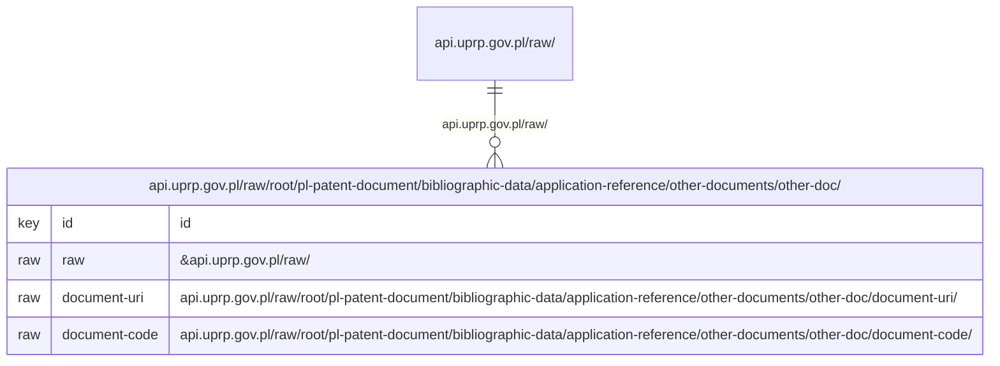
```mermaid
erDiagram

"api.uprp.gov.pl/raw/root/pl-patent-document/bibliographic-data/application-reference/other-documents/other-doc/"{
  key id "id"
  raw raw "&api.uprp.gov.pl/raw/"
  raw document-uri "api.uprp.gov.pl/raw/root/pl-patent-document/bibliographic-data/application-reference/other-documents/other-doc/document-uri/"
  raw document-code "api.uprp.gov.pl/raw/root/pl-patent-document/bibliographic-data/application-reference/other-documents/other-doc/document-code/" }
"api.uprp.gov.pl/raw/" ||--o{ "api.uprp.gov.pl/raw/root/pl-patent-document/bibliographic-data/application-reference/other-documents/other-doc/" : "api.uprp.gov.pl/raw/"

```

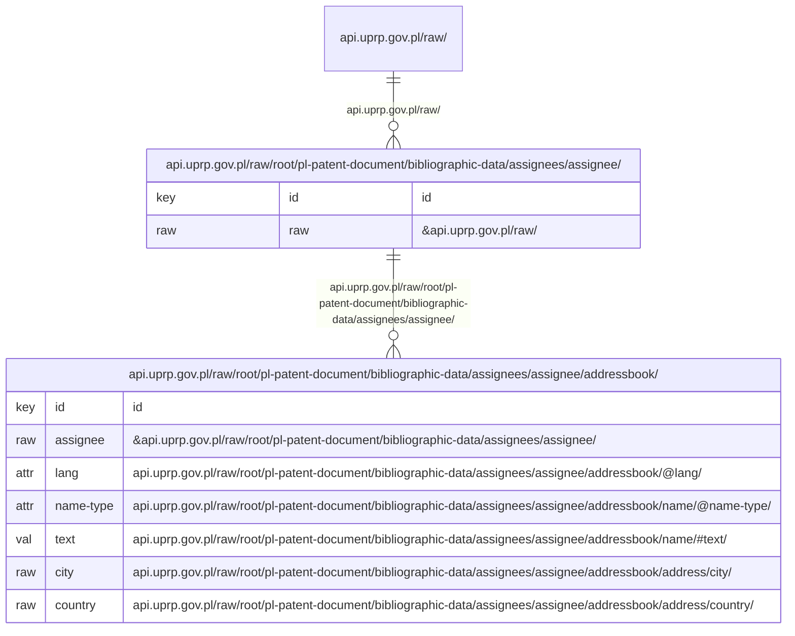
```mermaid
erDiagram

"api.uprp.gov.pl/raw/root/pl-patent-document/bibliographic-data/assignees/assignee/addressbook/"{
  key id "id"
  raw assignee "&api.uprp.gov.pl/raw/root/pl-patent-document/bibliographic-data/assignees/assignee/"
  attr lang "api.uprp.gov.pl/raw/root/pl-patent-document/bibliographic-data/assignees/assignee/addressbook/@lang/"
  attr name-type "api.uprp.gov.pl/raw/root/pl-patent-document/bibliographic-data/assignees/assignee/addressbook/name/@name-type/"
  val text "api.uprp.gov.pl/raw/root/pl-patent-document/bibliographic-data/assignees/assignee/addressbook/name/#text/"
  raw city "api.uprp.gov.pl/raw/root/pl-patent-document/bibliographic-data/assignees/assignee/addressbook/address/city/"
  raw country "api.uprp.gov.pl/raw/root/pl-patent-document/bibliographic-data/assignees/assignee/addressbook/address/country/" }
"api.uprp.gov.pl/raw/root/pl-patent-document/bibliographic-data/assignees/assignee/"{
  key id "id"
  raw raw "&api.uprp.gov.pl/raw/" }
"api.uprp.gov.pl/raw/root/pl-patent-document/bibliographic-data/assignees/assignee/" ||--o{ "api.uprp.gov.pl/raw/root/pl-patent-document/bibliographic-data/assignees/assignee/addressbook/" : "api.uprp.gov.pl/raw/root/pl-patent-document/bibliographic-data/assignees/assignee/"
"api.uprp.gov.pl/raw/" ||--o{ "api.uprp.gov.pl/raw/root/pl-patent-document/bibliographic-data/assignees/assignee/" : "api.uprp.gov.pl/raw/"

```

```mermaid
erDiagram

"api.uprp.gov.pl/raw/root/pl-patent-document/bibliographic-data/classifications-ipcr/classification-ipcr/"{
  key id "id"
  raw raw "&api.uprp.gov.pl/raw/"
  raw text "api.uprp.gov.pl/raw/root/pl-patent-document/bibliographic-data/classifications-ipcr/classification-ipcr/text/"
  raw date "api.uprp.gov.pl/raw/root/pl-patent-document/bibliographic-data/classifications-ipcr/classification-ipcr/ipc-version-indicator/date/"
  raw section "api.uprp.gov.pl/raw/root/pl-patent-document/bibliographic-data/classifications-ipcr/classification-ipcr/section/"
  raw class "api.uprp.gov.pl/raw/root/pl-patent-document/bibliographic-data/classifications-ipcr/classification-ipcr/class/"
  raw subclass "api.uprp.gov.pl/raw/root/pl-patent-document/bibliographic-data/classifications-ipcr/classification-ipcr/subclass/"
  raw main-group "api.uprp.gov.pl/raw/root/pl-patent-document/bibliographic-data/classifications-ipcr/classification-ipcr/main-group/"
  raw subgroup "api.uprp.gov.pl/raw/root/pl-patent-document/bibliographic-data/classifications-ipcr/classification-ipcr/subgroup/" }
"api.uprp.gov.pl/raw/" ||--o{ "api.uprp.gov.pl/raw/root/pl-patent-document/bibliographic-data/classifications-ipcr/classification-ipcr/" : "api.uprp.gov.pl/raw/"

```

```mermaid
erDiagram

"api.uprp.gov.pl/raw/root/pl-patent-document/bibliographic-data/invention-title/"{
  key id "id"
  raw raw "&api.uprp.gov.pl/raw/"
  attr lang "api.uprp.gov.pl/raw/root/pl-patent-document/bibliographic-data/invention-title/@lang/"
  val text "api.uprp.gov.pl/raw/root/pl-patent-document/bibliographic-data/invention-title/#text/" }
"api.uprp.gov.pl/raw/" ||--o{ "api.uprp.gov.pl/raw/root/pl-patent-document/bibliographic-data/invention-title/" : "api.uprp.gov.pl/raw/"

```

```mermaid
erDiagram

"api.uprp.gov.pl/raw/root/pl-patent-document/bibliographic-data/parties/agents/agent/"{
  key id "id"
  raw raw "&api.uprp.gov.pl/raw/"
  attr sequence "api.uprp.gov.pl/raw/root/pl-patent-document/bibliographic-data/parties/agents/agent/@sequence/"
  attr rep-type "api.uprp.gov.pl/raw/root/pl-patent-document/bibliographic-data/parties/agents/agent/@rep-type/"
  raw last-name "api.uprp.gov.pl/raw/root/pl-patent-document/bibliographic-data/parties/agents/agent/addressbook/last-name/"
  raw first-name "api.uprp.gov.pl/raw/root/pl-patent-document/bibliographic-data/parties/agents/agent/addressbook/first-name/"
  raw orgname "api.uprp.gov.pl/raw/root/pl-patent-document/bibliographic-data/parties/agents/agent/addressbook/orgname/"
  raw city "api.uprp.gov.pl/raw/root/pl-patent-document/bibliographic-data/parties/agents/agent/addressbook/address/city/"
  raw postcode "api.uprp.gov.pl/raw/root/pl-patent-document/bibliographic-data/parties/agents/agent/addressbook/address/postcode/"
  raw country "api.uprp.gov.pl/raw/root/pl-patent-document/bibliographic-data/parties/agents/agent/addressbook/address/country/" }
"api.uprp.gov.pl/raw/" ||--o{ "api.uprp.gov.pl/raw/root/pl-patent-document/bibliographic-data/parties/agents/agent/" : "api.uprp.gov.pl/raw/"

```

```mermaid
erDiagram

"api.uprp.gov.pl/raw/root/pl-patent-document/bibliographic-data/parties/applicants/applicant/addressbook/"{
  key id "id"
  raw applicant "&api.uprp.gov.pl/raw/root/pl-patent-document/bibliographic-data/parties/applicants/applicant/"
  attr lang "api.uprp.gov.pl/raw/root/pl-patent-document/bibliographic-data/parties/applicants/applicant/addressbook/@lang/"
  raw name "api.uprp.gov.pl/raw/root/pl-patent-document/bibliographic-data/parties/applicants/applicant/addressbook/name/"
  raw city "api.uprp.gov.pl/raw/root/pl-patent-document/bibliographic-data/parties/applicants/applicant/addressbook/address/city/"
  raw country "api.uprp.gov.pl/raw/root/pl-patent-document/bibliographic-data/parties/applicants/applicant/addressbook/address/country/" }
"api.uprp.gov.pl/raw/root/pl-patent-document/bibliographic-data/parties/applicants/applicant/"{
  key id "id"
  raw raw "&api.uprp.gov.pl/raw/"
  attr sequence "api.uprp.gov.pl/raw/root/pl-patent-document/bibliographic-data/parties/applicants/applicant/@sequence/"
  attr designation "api.uprp.gov.pl/raw/root/pl-patent-document/bibliographic-data/parties/applicants/applicant/@designation/"
  attr app-type "api.uprp.gov.pl/raw/root/pl-patent-document/bibliographic-data/parties/applicants/applicant/@app-type/"
  raw country "api.uprp.gov.pl/raw/root/pl-patent-document/bibliographic-data/parties/applicants/applicant/nationality/country/"
  raw country "api.uprp.gov.pl/raw/root/pl-patent-document/bibliographic-data/parties/applicants/applicant/residence/country/"
  raw country "api.uprp.gov.pl/raw/root/pl-patent-document/bibliographic-data/parties/applicants/applicant/designated-states/country/" }
"api.uprp.gov.pl/raw/root/pl-patent-document/bibliographic-data/parties/applicants/applicant/" ||--o{ "api.uprp.gov.pl/raw/root/pl-patent-document/bibliographic-data/parties/applicants/applicant/addressbook/" : "api.uprp.gov.pl/raw/root/pl-patent-document/bibliographic-data/parties/applicants/applicant/"
"api.uprp.gov.pl/raw/" ||--o{ "api.uprp.gov.pl/raw/root/pl-patent-document/bibliographic-data/parties/applicants/applicant/" : "api.uprp.gov.pl/raw/"

```

```mermaid
erDiagram

"api.uprp.gov.pl/raw/root/pl-patent-document/bibliographic-data/parties/inventors/inventor/addressbook/"{
  key id "id"
  raw inventor "&api.uprp.gov.pl/raw/root/pl-patent-document/bibliographic-data/parties/inventors/inventor/"
  attr lang "api.uprp.gov.pl/raw/root/pl-patent-document/bibliographic-data/parties/inventors/inventor/addressbook/@lang/"
  raw last-name "api.uprp.gov.pl/raw/root/pl-patent-document/bibliographic-data/parties/inventors/inventor/addressbook/last-name/"
  raw first-name "api.uprp.gov.pl/raw/root/pl-patent-document/bibliographic-data/parties/inventors/inventor/addressbook/first-name/"
  raw city "api.uprp.gov.pl/raw/root/pl-patent-document/bibliographic-data/parties/inventors/inventor/addressbook/address/city/"
  raw country "api.uprp.gov.pl/raw/root/pl-patent-document/bibliographic-data/parties/inventors/inventor/addressbook/address/country/" }
"api.uprp.gov.pl/raw/root/pl-patent-document/bibliographic-data/parties/inventors/inventor/"{
  key id "id"
  raw raw "&api.uprp.gov.pl/raw/"
  attr sequence "api.uprp.gov.pl/raw/root/pl-patent-document/bibliographic-data/parties/inventors/inventor/@sequence/" }
"api.uprp.gov.pl/raw/root/pl-patent-document/bibliographic-data/parties/inventors/inventor/" ||--o{ "api.uprp.gov.pl/raw/root/pl-patent-document/bibliographic-data/parties/inventors/inventor/addressbook/" : "api.uprp.gov.pl/raw/root/pl-patent-document/bibliographic-data/parties/inventors/inventor/"
"api.uprp.gov.pl/raw/" ||--o{ "api.uprp.gov.pl/raw/root/pl-patent-document/bibliographic-data/parties/inventors/inventor/" : "api.uprp.gov.pl/raw/"

```

```mermaid
erDiagram

"api.uprp.gov.pl/raw/root/pl-patent-document/bibliographic-data/priority-claims/priority-claim/"{
  key id "id"
  raw raw "&api.uprp.gov.pl/raw/"
  attr kind "api.uprp.gov.pl/raw/root/pl-patent-document/bibliographic-data/priority-claims/priority-claim/@kind/"
  attr sequence "api.uprp.gov.pl/raw/root/pl-patent-document/bibliographic-data/priority-claims/priority-claim/@sequence/"
  raw country "api.uprp.gov.pl/raw/root/pl-patent-document/bibliographic-data/priority-claims/priority-claim/country/"
  raw doc-number "api.uprp.gov.pl/raw/root/pl-patent-document/bibliographic-data/priority-claims/priority-claim/doc-number/"
  raw date "api.uprp.gov.pl/raw/root/pl-patent-document/bibliographic-data/priority-claims/priority-claim/date/" }
"api.uprp.gov.pl/raw/" ||--o{ "api.uprp.gov.pl/raw/root/pl-patent-document/bibliographic-data/priority-claims/priority-claim/" : "api.uprp.gov.pl/raw/"

```

```mermaid
erDiagram

"api.uprp.gov.pl/raw/root/pl-patent-document/bibliographic-data/publication-reference/"{
  key id "id"
  raw raw "&api.uprp.gov.pl/raw/"
  raw country "api.uprp.gov.pl/raw/root/pl-patent-document/bibliographic-data/publication-reference/document-id/country/"
  raw doc-number "api.uprp.gov.pl/raw/root/pl-patent-document/bibliographic-data/publication-reference/document-id/doc-number/"
  raw kind "api.uprp.gov.pl/raw/root/pl-patent-document/bibliographic-data/publication-reference/document-id/kind/"
  raw date "api.uprp.gov.pl/raw/root/pl-patent-document/bibliographic-data/publication-reference/document-id/date/"
  raw date-publ "api.uprp.gov.pl/raw/root/pl-patent-document/bibliographic-data/publication-reference/document-id/date-publ/"
  raw country "api.uprp.gov.pl/raw/root/pl-patent-document/bibliographic-data/publication-reference/country/"
  raw doc-number "api.uprp.gov.pl/raw/root/pl-patent-document/bibliographic-data/publication-reference/doc-number/"
  raw kind "api.uprp.gov.pl/raw/root/pl-patent-document/bibliographic-data/publication-reference/kind/"
  raw date "api.uprp.gov.pl/raw/root/pl-patent-document/bibliographic-data/publication-reference/date/" }
"api.uprp.gov.pl/raw/" ||--o{ "api.uprp.gov.pl/raw/root/pl-patent-document/bibliographic-data/publication-reference/" : "api.uprp.gov.pl/raw/"

```

```mermaid
erDiagram

"api.uprp.gov.pl/raw/root/pl-patent-document/pl-office-specific-data/comments/comment/"{
  key id "id"
  raw raw "&api.uprp.gov.pl/raw/"
  attr date "api.uprp.gov.pl/raw/root/pl-patent-document/pl-office-specific-data/comments/comment/@date/"
  val text "api.uprp.gov.pl/raw/root/pl-patent-document/pl-office-specific-data/comments/comment/#text/" }
"api.uprp.gov.pl/raw/" ||--o{ "api.uprp.gov.pl/raw/root/pl-patent-document/pl-office-specific-data/comments/comment/" : "api.uprp.gov.pl/raw/"

```

```mermaid
erDiagram

"api.uprp.gov.pl/raw/root/pl-patent-document/pl-office-specific-data/gazette-reference/"{
  key id "id"
  raw raw "&api.uprp.gov.pl/raw/"
  raw gazette-num "api.uprp.gov.pl/raw/root/pl-patent-document/pl-office-specific-data/gazette-reference/gazette-num/"
  raw gazette-nosect "api.uprp.gov.pl/raw/root/pl-patent-document/pl-office-specific-data/gazette-reference/gazette-nosect/"
  raw kind "api.uprp.gov.pl/raw/root/pl-patent-document/pl-office-specific-data/gazette-reference/kind/"
  raw date "api.uprp.gov.pl/raw/root/pl-patent-document/pl-office-specific-data/gazette-reference/date/"
  raw gazette-uri "api.uprp.gov.pl/raw/root/pl-patent-document/pl-office-specific-data/gazette-reference/gazette-uri/" }
"api.uprp.gov.pl/raw/" ||--o{ "api.uprp.gov.pl/raw/root/pl-patent-document/pl-office-specific-data/gazette-reference/" : "api.uprp.gov.pl/raw/"

```

```mermaid
erDiagram

"api.uprp.gov.pl/raw/root/pl-patent-document/pl-office-specific-data/related-applications/addition/"{
  key id "id"
  raw raw "&api.uprp.gov.pl/raw/"
  raw extidappli "api.uprp.gov.pl/raw/root/pl-patent-document/pl-office-specific-data/related-applications/addition/relation/child-doc/extidappli/"
  raw extidappli "api.uprp.gov.pl/raw/root/pl-patent-document/pl-office-specific-data/related-applications/addition/relation/parent-doc/extidappli/" }
"api.uprp.gov.pl/raw/" ||--o{ "api.uprp.gov.pl/raw/root/pl-patent-document/pl-office-specific-data/related-applications/addition/" : "api.uprp.gov.pl/raw/"

```

```mermaid
erDiagram

"api.uprp.gov.pl/raw/root/pl-patent-document/pl-office-specific-data/related-applications/division/"{
  key id "id"
  raw raw "&api.uprp.gov.pl/raw/"
  raw extidappli "api.uprp.gov.pl/raw/root/pl-patent-document/pl-office-specific-data/related-applications/division/relation/child-doc/extidappli/"
  raw extidappli "api.uprp.gov.pl/raw/root/pl-patent-document/pl-office-specific-data/related-applications/division/relation/parent-doc/extidappli/" }
"api.uprp.gov.pl/raw/" ||--o{ "api.uprp.gov.pl/raw/root/pl-patent-document/pl-office-specific-data/related-applications/division/" : "api.uprp.gov.pl/raw/"

```

```mermaid
erDiagram

"api.uprp.gov.pl/raw/root/pl-patent-document/pl-office-specific-data/related-applications/from-invention/"{
  key id "id"
  raw raw "&api.uprp.gov.pl/raw/"
  raw extidappli "api.uprp.gov.pl/raw/root/pl-patent-document/pl-office-specific-data/related-applications/from-invention/relation/child-doc/extidappli/"
  raw extidappli "api.uprp.gov.pl/raw/root/pl-patent-document/pl-office-specific-data/related-applications/from-invention/relation/parent-doc/extidappli/" }
"api.uprp.gov.pl/raw/" ||--o{ "api.uprp.gov.pl/raw/root/pl-patent-document/pl-office-specific-data/related-applications/from-invention/" : "api.uprp.gov.pl/raw/"

```

```mermaid
erDiagram

"api.uprp.gov.pl/raw/root/pl-patent-document/search-report-data/srep-citations/citation/"{
  key id "id"
  raw raw "&api.uprp.gov.pl/raw/"
  raw country "api.uprp.gov.pl/raw/root/pl-patent-document/search-report-data/srep-citations/citation/patcit/document-id/country/"
  raw doc-number "api.uprp.gov.pl/raw/root/pl-patent-document/search-report-data/srep-citations/citation/patcit/document-id/doc-number/"
  raw kind "api.uprp.gov.pl/raw/root/pl-patent-document/search-report-data/srep-citations/citation/patcit/document-id/kind/"
  raw pub-date "api.uprp.gov.pl/raw/root/pl-patent-document/search-report-data/srep-citations/citation/patcit/document-id/pub-date/"
  raw name "api.uprp.gov.pl/raw/root/pl-patent-document/search-report-data/srep-citations/citation/patcit/document-id/name/"
  raw text "api.uprp.gov.pl/raw/root/pl-patent-document/search-report-data/srep-citations/citation/patcit/text/"
  raw category "api.uprp.gov.pl/raw/root/pl-patent-document/search-report-data/srep-citations/citation/category/"
  raw rel-claims "api.uprp.gov.pl/raw/root/pl-patent-document/search-report-data/srep-citations/citation/rel-claims/"
  raw hosttitle "api.uprp.gov.pl/raw/root/pl-patent-document/search-report-data/srep-citations/citation/nplcit/online/hosttitle/"
  raw hostno "api.uprp.gov.pl/raw/root/pl-patent-document/search-report-data/srep-citations/citation/nplcit/online/hostno/"
  raw refno "api.uprp.gov.pl/raw/root/pl-patent-document/search-report-data/srep-citations/citation/nplcit/online/refno/"
  raw name "api.uprp.gov.pl/raw/root/pl-patent-document/search-report-data/srep-citations/citation/nplcit/online/name/"
  raw name "api.uprp.gov.pl/raw/root/pl-patent-document/search-report-data/srep-citations/citation/nplcit/article/author/name/"
  raw sertitle "api.uprp.gov.pl/raw/root/pl-patent-document/search-report-data/srep-citations/citation/nplcit/article/serial/sertitle/"
  raw atl "api.uprp.gov.pl/raw/root/pl-patent-document/search-report-data/srep-citations/citation/nplcit/article/atl/"
  raw name "api.uprp.gov.pl/raw/root/pl-patent-document/search-report-data/srep-citations/citation/nplcit/article/inprint/name/"
  raw category "api.uprp.gov.pl/raw/root/pl-patent-document/search-report-data/srep-citations/citation/rel-passage/category/"
  raw passage "api.uprp.gov.pl/raw/root/pl-patent-document/search-report-data/srep-citations/citation/rel-passage/passage/"
  raw rel-claims "api.uprp.gov.pl/raw/root/pl-patent-document/search-report-data/srep-citations/citation/rel-passage/rel-claims/" }
"api.uprp.gov.pl/raw/" ||--o{ "api.uprp.gov.pl/raw/root/pl-patent-document/search-report-data/srep-citations/citation/" : "api.uprp.gov.pl/raw/"

```

<!-- end:profile.py -->