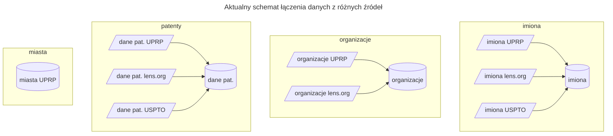
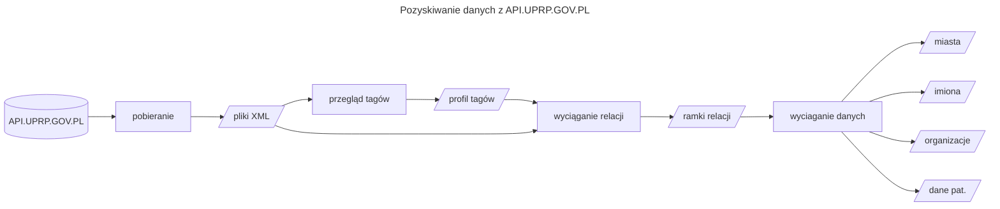
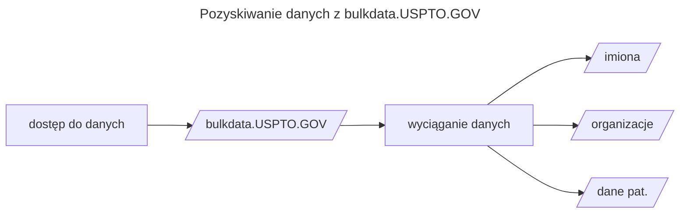
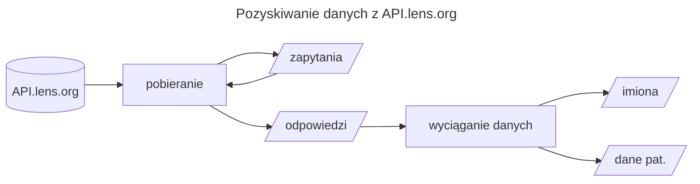

Wierzchołki
===========

```mermaid
---
title: Aktualny schemat łączenia danych z różnych źródeł
---
graph BT
subgraph imiona
direction LR
names.UPRP[/imiona UPRP/];          click names.UPRP "./api.uprp.gov.pl/names.UPRP"
names.org[/imiona lens.org/];       click names.org "./api.uprp.gov.pl/names.org"
names.USO[/imiona USPTO/];          click names.USO "./api.uprp.gov.pl/names.USO"
names[(imiona)];                    click names "./api.uprp.gov.pl/names"
names.UPRP --> names
names.org --> names
names.USO --> names
end
subgraph organizacje
direction LR
org.UPRP[/organizacje UPRP/];       click org.UPRP "./api.uprp.gov.pl/org.UPRP"
org.org[/organizacje lens.org/];    click org.org "./api.uprp.gov.pl/org.org"
org[(organizacje)];                 click org "./api.uprp.gov.pl/org"
org.UPRP --> org
org.org --> org
end
subgraph patenty
direction LR
patents.UPRP[/dane pat. UPRP/];     click patents.UPRP "./api.uprp.gov.pl/patents.UPRP"
patents.org[/dane pat. lens.org/];  click patents.org "./api.uprp.gov.pl/patents.org"
patents.USO[/dane pat. USPTO/];     click patents.USO "./api.uprp.gov.pl/patents.USO"
patents[(dane pat.)];               click patents "./api.uprp.gov.pl/patents"
patents.UPRP --> patents
patents.org --> patents
patents.USO --> patents
end
subgraph miasta
cities.UPRP[(miasta UPRP)];         click cities.UPRP "./api.uprp.gov.pl/cities.UPRP"
end
```

Pozyskiwanie danych
-------------------

```mermaid
---
title: Pozyskiwanie danych z API.UPRP.GOV.PL
---
graph LR
API[(API.UPRP.GOV.PL)];           click API "https://api.uprp.gov.pl"
raw/*.xml[/pliki XML/];           click raw/*.xml "./api.uprp.gov.pl/raw"

XML.profile.json[/profil tagów/]; click XML.profile.json "./api.uprp.gov.pl/XML.profile.json"
frames/**/*.csv[/ramki relacji/]; click frames/**/*.csv "./api.uprp.gov.pl/frames"

scrap.R[pobieranie];              click scrap.R "./api.uprp.gov.pl/scrap.R"
XML.profile.py[przegląd tagów];   click XML.profile.py "./api.uprp.gov.pl/XML.profile.py"
relations.py[wyciąganie relacji]; click relations.py "./api.uprp.gov.pl/relations.py"
frame.py[wyciaganie danych];      click frame.py "./api.uprp.gov.pl/frame.py"

API 
--> scrap.R
--> raw/*.xml
--> XML.profile.py
--> XML.profile.json
--> relations.py
--> frames/**/*.csv
--> frame.py
raw/*.xml --> relations.py

cities.csv[/miasta/];             click cities.csv "./api.uprp.gov.pl/cities.csv"
names.csv[/imiona/];              click names.csv "./api.uprp.gov.pl/names.csv"
org.csv[/organizacje/];           click org.csv "./api.uprp.gov.pl/org.csv"
patents.csv[/dane pat./];         click patents.csv "./api.uprp.gov.pl/patents.csv"

frame.py --> cities.csv
frame.py --> names.csv
frame.py --> org.csv
frame.py --> patents.csv
```

```mermaid
---
title: Pozyskiwanie danych z bulkdata.USPTO.GOV
---
graph LR
bulk[/bulkdata.USPTO.GOV/];       click bulk "https://bulkdata.uspto.gov"
frame.py[wyciąganie danych];      click frame.py "./bulkdata.uspto.gov/frame.py"

0[dostęp do danych] --> bulk --> frame.py

names.csv[/imiona/];              click names.csv "./api.uprp.gov.pl/names.csv"
org.csv[/organizacje/];           click org.csv "./api.uprp.gov.pl/org.csv"
patents.csv[/dane pat./];         click patents.csv "./api.uprp.gov.pl/patents.csv"

frame.py --> names.csv
frame.py --> org.csv
frame.py --> patents.csv
```

```mermaid
---
title: Pozyskiwanie danych z API.lens.org
---
graph LR
API[(API.lens.org)];              click API "https://api.lens.org"
fetch.py[pobieranie];             click fetch.py "./api.lens.org/fetch.py"
req/*.json[/zapytania/];          click req/*.json "./api.lens.org/req"
res/*.json[/odpowiedzi/];         click res/*.json "./api.lens.org/res"
frame.py[wyciąganie danych];      click frame.py "./api.lens.org/frame.py"

API --> fetch.py --> res/*.json --> frame.py
fetch.py --> req/*.json --> fetch.py

names.csv[/imiona/];              click names.csv "./api.uprp.gov.pl/names.csv"
patents.csv[/dane pat./];         click patents.csv "./api.uprp.gov.pl/patents.csv"

frame.py --> names.csv
frame.py --> patents.csv
```