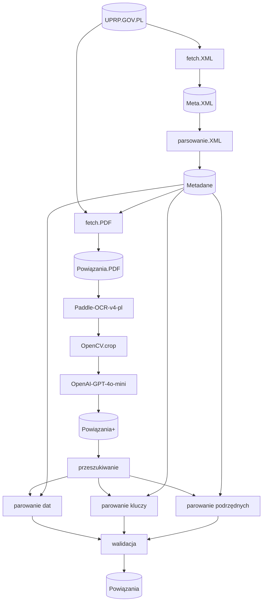
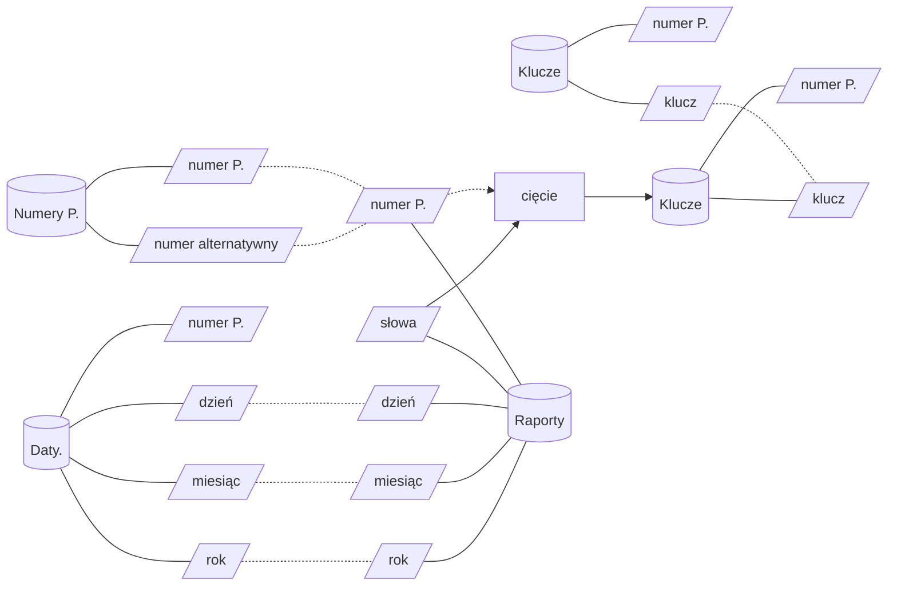

Raporty
-------

Dane z raportów w formacie *PDF* zostają wyciągnięte, za pomocą
multimodalnego modelu językowego, do postaci obserwacji tekstowych.
Wyrażenia regularne wyciągają kody i daty, reszta jest dzielona
na słowa. Późniejsze parowanie w.w. ma na celu walidację 
samych kodów.

Schemat procesu wyciagania danych
=================================

Definicje
=========

- **Stan faktyczny** - eksperci rozpoznają powiązania między
patentami, a innymi pracami wynalazczymi, albo świadczącymi
o wcześniejszym istnieniu czegoś podobnego do wynalazku; 
zapisują je w tabeli raportowej. Część z nich to numery
patentów - istnienie numeru patentu jest jednoznaczne
ze stwierdzeniem przez eksperta, że istnieje relacja między
patentem a innym dokumentem tego typu.

- **Dane poprawne** - odniesienia na kartkach raportów
(tutaj zdjęcia tych kartek), które zawierają numer patentu, 
który miał na myśli ekspert. Zakładając kompletność danych
UPRP.GOV.PL, każdy numer patentu odnosi się do pojedynczego
wpisu w bazie danych.

- **Dane pominięte** - kody niepożądanie pominięte na różnych 
etapach prcesu.

- **Dane niepoprawne** - błędnie rozpoznane numery patentów,
w wyniku błędów modelu, albo wyciągania tekstu.

Uwaga dot. numerów patentów: numery są niejednoznaczne - 
nie wszystkie odnoszą się do numerów patentowych, część wpisów
opiera się na innych numerach, które są unikalne, ale pokrywają 
się z numerami patentowymi.

PS. Analiza ogranicza się wyłącznie do patentów rejestrowanych
w Polskim Urzędzie Patentowym.

Walidacja przez łączenie
========================

Walidacja polega na łączeniu danych rozpoznanych z raportów 
z danymi pobranymi na temat samych patentów.

Przyjmujemy założenie, że patenty różnią się na tyle, 
że można je w pewnym wystarczajacym stopniu odróżnić 
na postawie dat albo imion, czy innych słów kluczowych - 
dalej *klucze*.

Dzięki niemu możemy wnioskować, że duża zbieżność kluczy z raportów
z kluczami z metadanych świadczy o relacji między nimi. Dalej: 
jeśli kod rozpoznany pasuje do patentu o dużej zbieżności 
kluczy, to brak jest przesłanek do odrzucenia takiej relacji
jako błędnej.

